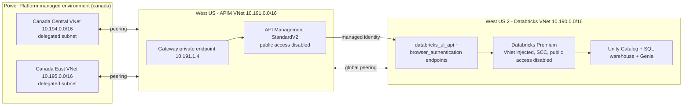

# Caldova-Env

Private Azure Databricks + API Management + Power Platform environment.

Every resource is deployed into
`/subscriptions/cf824570-a8ba-497a-a184-0a52f1830aa9/resourceGroups/m365-myaacoub`
(tenant `12a4b86b-e64c-43f9-af05-d9130a72dfd2`).

## Topology



VNet peering is not transitive, so each Power Platform VNet peers directly with
the APIM VNet. APIM is the only application proxy in front of Databricks.

## Address plan

| Purpose | Region | VNet | Subnets |
|---|---|---|---|
| Databricks | West US 2 | `10.190.0.0/16` | host `10.190.1.0/24`, container `10.190.2.0/24`, private endpoints `10.190.3.0/24` |
| API Management | West US | `10.191.0.0/16` | integration `10.191.0.0/24`, private endpoints `10.191.1.0/24` |
| Power Platform | Canada Central | `10.194.0.0/16` | delegated `10.194.0.0/24` |
| Power Platform | Canada East | `10.195.0.0/16` | delegated `10.195.0.0/24` |

Both Power Platform subnets are `/24` because the enterprise policy requires
each regional subnet to expose the same usable address count. The region pair
must match the environment geo: environment `52456fcd-1d20-ecdb-aa2e-8979e3f794f5`
is `canada`, so the VNets are `canadacentral` and `canadaeast`.

## Layout

| Path | Purpose |
|---|---|
| [terraform](terraform) | VNet-injected Databricks workspace, NSGs, private DNS zone, private endpoints |
| [bicep/apim-private](bicep/apim-private) | APIM StandardV2, VNet, gateway private endpoint, peering to Databricks |
| [bicep/power-platform-private](bicep/power-platform-private) | Regional VNets, delegated subnets, peering, network-injection policy |
| [scripts/deploy.ps1](scripts/deploy.ps1) | Step orchestrator |
| [scripts/load-catalog-data.ps1](scripts/load-catalog-data.ps1) | Creates the Unity Catalog schema and loads the dataset |
| [scripts/link-power-platform-environment.ps1](scripts/link-power-platform-environment.ps1) | Binds the enterprise policy to the managed environment |
| [scripts/smoke-test.ps1](scripts/smoke-test.ps1) | End-to-end check of the SQL, Genie, and MCP paths |

## Deployment order

```powershell
az login --tenant Caldova37587778.onmicrosoft.com
./Caldova-Env/scripts/deploy.ps1 -Step all
```

Individual steps run with `-Step <name>`:

| Step | What it does |
|---|---|
| `providers` | Registers the required resource providers |
| `databricks` | Terraform apply with `lockdown=false` |
| `data` | Creates the schema and loads the dataset over the public control plane |
| `apim` | APIM with `publicNetworkAccess=Enabled`, plus both peerings |
| `powerplatform` | Power Platform VNets, peerings, DNS links, enterprise policy |
| `link` | `Enable-SubnetInjection` against environment `d35d1518-b911-ec93-b145-aec5290161f0` |
| `lockdown` | Terraform `lockdown=true` and APIM `publicNetworkAccess=Disabled` |

### Why two stages

Data loading and private-endpoint validation both need the control planes to be
reachable from the deployment host. Stage 1 leaves public ingress on; stage 2
disables it. After `lockdown`, the Databricks and APIM control planes are only
reachable from inside the peered VNets, so any later data work must run from a
host in one of those VNets.

`NoAzureDatabricksRules` is only accepted by Azure after the back-end
`databricks_ui_api` private endpoint exists, which is another reason the
lockdown flip is a separate apply.

## Deployed resources

Subscription `cf824570-a8ba-497a-a184-0a52f1830aa9` · resource group `m365-myaacoub` · tenant `12a4b86b-e64c-43f9-af05-d9130a72dfd2`.

### Power Platform

| Resource | Link |
|---|---|
| Enterprise policy `caldova-pp-network-injection-canada` | [Azure portal](https://portal.azure.com/#@Caldova37587778.onmicrosoft.com/resource/subscriptions/cf824570-a8ba-497a-a184-0a52f1830aa9/resourceGroups/m365-myaacoub/providers/Microsoft.PowerPlatform/enterprisePolicies/caldova-pp-network-injection-canada/overview) |
| Environment `Caldova Private` (`52456fcd-1d20-ecdb-aa2e-8979e3f794f5`) | [Power Platform admin center](https://admin.powerplatform.microsoft.com/environments/environment/52456fcd-1d20-ecdb-aa2e-8979e3f794f5/hub) |
| VNet `caldova-pp-vnet-canadacentral` | [Azure portal](https://portal.azure.com/#@Caldova37587778.onmicrosoft.com/resource/subscriptions/cf824570-a8ba-497a-a184-0a52f1830aa9/resourceGroups/m365-myaacoub/providers/Microsoft.Network/virtualNetworks/caldova-pp-vnet-canadacentral/overview) |
| VNet `caldova-pp-vnet-canadaeast` | [Azure portal](https://portal.azure.com/#@Caldova37587778.onmicrosoft.com/resource/subscriptions/cf824570-a8ba-497a-a184-0a52f1830aa9/resourceGroups/m365-myaacoub/providers/Microsoft.Network/virtualNetworks/caldova-pp-vnet-canadaeast/overview) |
| Copilot Studio | [copilotstudio.microsoft.com](https://copilotstudio.microsoft.com/) |

Policy resource ID:

```text
/subscriptions/cf824570-a8ba-497a-a184-0a52f1830aa9/resourceGroups/m365-myaacoub/providers/Microsoft.PowerPlatform/enterprisePolicies/caldova-pp-network-injection-canada
```

### API Management

| Resource | Link |
|---|---|
| Service `caldova-apim-westus` | [Azure portal](https://portal.azure.com/#@Caldova37587778.onmicrosoft.com/resource/subscriptions/cf824570-a8ba-497a-a184-0a52f1830aa9/resourceGroups/m365-myaacoub/providers/Microsoft.ApiManagement/service/caldova-apim-westus/overview) |
| VNet `caldova-apim-westus-vnet` | [Azure portal](https://portal.azure.com/#@Caldova37587778.onmicrosoft.com/resource/subscriptions/cf824570-a8ba-497a-a184-0a52f1830aa9/resourceGroups/m365-myaacoub/providers/Microsoft.Network/virtualNetworks/caldova-apim-westus-vnet/overview) |
| Gateway private endpoint (`10.191.1.4`) | [Azure portal](https://portal.azure.com/#@Caldova37587778.onmicrosoft.com/resource/subscriptions/cf824570-a8ba-497a-a184-0a52f1830aa9/resourceGroups/m365-myaacoub/providers/Microsoft.Network/privateEndpoints/caldova-apim-westus-gateway-pe/overview) |

Gateway endpoints (resolvable only from the peered VNets after lockdown):

| Endpoint | URL |
|---|---|
| Gateway | `https://caldova-apim-westus.azure-api.net` |
| SQL REST | `https://caldova-apim-westus.azure-api.net/databricks` |
| SQL query | `https://caldova-apim-westus.azure-api.net/databricks/query` |
| SQL tables | `https://caldova-apim-westus.azure-api.net/databricks/tables` |
| Genie REST | `https://caldova-apim-westus.azure-api.net/databricks-genie/genie/ask` |
| **SQL MCP** | `https://caldova-apim-westus.azure-api.net/databricks-mcp/mcp` |
| **Genie MCP** | `https://caldova-apim-westus.azure-api.net/databricks-genie-mcp/mcp` |

Both MCP servers require the `Ocp-Apim-Subscription-Key` header from the
`databricks-agents` product. APIM generates a single `body` string input per
tool, so an agent calling the Genie `ask` tool must set `body` to
`{"content":"<question>"}`, not to the bare question text.

### Databricks

| Resource | Link |
|---|---|
| Workspace `caldova-dbx-westus2` | [Azure portal](https://portal.azure.com/#@Caldova37587778.onmicrosoft.com/resource/subscriptions/cf824570-a8ba-497a-a184-0a52f1830aa9/resourceGroups/m365-myaacoub/providers/Microsoft.Databricks/workspaces/caldova-dbx-westus2/overview) |
| VNet `caldova-dbx-vnet-westus2` | [Azure portal](https://portal.azure.com/#@Caldova37587778.onmicrosoft.com/resource/subscriptions/cf824570-a8ba-497a-a184-0a52f1830aa9/resourceGroups/m365-myaacoub/providers/Microsoft.Network/virtualNetworks/caldova-dbx-vnet-westus2/overview) |
| Workspace URL | `https://adb-7405616934814750.10.azuredatabricks.net` |
| Genie space `Arrow Semiconductor Analytics` | `https://adb-7405616934814750.10.azuredatabricks.net/genie/rooms/01f1abe9e51e19ddbb15297aee9a5850` |

| Setting | Value |
|---|---|
| Catalog / schema | `caldova_dbx_westus2.arrow_semiconductor` (6 tables) |
| SQL warehouse | `a3c7c9526aa58992` (serverless 2X-Small, auto-stop 5 min) |
| Genie space ID | `01f1abe9e51e19ddbb15297aee9a5850` |
| APIM managed identity | principal `3d1a5999-c8d9-47be-8ee4-6aad2b2b3cb3`, app `8f7e8889-3159-4a37-b816-1500a2e476ef` |

### Private DNS

| Zone | Records | Linked VNets |
|---|---|---|
| [`privatelink.azure-api.net`](https://portal.azure.com/#@Caldova37587778.onmicrosoft.com/resource/subscriptions/cf824570-a8ba-497a-a184-0a52f1830aa9/resourceGroups/m365-myaacoub/providers/Microsoft.Network/privateDnsZones/privatelink.azure-api.net/overview) | `caldova-apim-westus` → `10.191.1.4` | APIM, Databricks, both Canada VNets |
| [`privatelink.azuredatabricks.net`](https://portal.azure.com/#@Caldova37587778.onmicrosoft.com/resource/subscriptions/cf824570-a8ba-497a-a184-0a52f1830aa9/resourceGroups/m365-myaacoub/providers/Microsoft.Network/privateDnsZones/privatelink.azuredatabricks.net/overview) | workspace → `10.190.3.6`, browser auth → `10.190.3.4` / `10.190.3.5` | APIM, Databricks |

## Copilot Studio agent

`Databricks Genie Deck Builder` turns natural-language questions into
executive-ready PowerPoint decks sourced entirely from the private Databricks
workspace.

| Property | Value |
|---|---|
| Agent | `Databricks Genie Deck Builder` |
| Agent ID | `b5dd7db7-f0ab-f111-aaab-70a8a50cc161` |
| Environment | `Caldova Private` (`52456fcd-1d20-ecdb-aa2e-8979e3f794f5`) |
| Open in Copilot Studio | [agent overview](https://copilotstudio.microsoft.com/environments/52456fcd-1d20-ecdb-aa2e-8979e3f794f5/bots/b5dd7db7-f0ab-f111-aaab-70a8a50cc161/overview) |
| Data tool | Custom connector `Databricks Genie (Private APIM)` |
| Backend | `https://caldova-apim-westus.azure-api.net/databricks-genie` |
| Auth | API key header `Ocp-Apim-Subscription-Key` (product `databricks-agents`) |

### Why a custom connector and not an MCP server

Power Platform virtual network support only routes traffic for an explicit set
of components. Per
[VNet support overview](https://learn.microsoft.com/power-platform/admin/vnet-support-overview),
the supported list covers Dataverse plugins and connectors — SQL Server,
Azure Queues, Key Vault, Blob and File Storage, Snowflake, Databricks, AI
Search, HTTP with Microsoft Entra ID, and **custom connectors**.

Copilot Studio **MCP servers are not on that list**. An MCP tool pointed at a
private APIM gateway fails twice:

1. **Authoring** — Copilot Studio discovers the tool schema from its own
   service over the public internet, so the tool list comes back empty and the
   tool page shows `No tools available.`
2. **Runtime** — the agent reports `that tool is not available in this chat
   environment` because no tools were ever registered.

Both were reproduced on this deployment while APIM had
`publicNetworkAccess=Disabled`. Projecting the same APIM REST API as a custom
connector is the supported private path, because connector traffic executes in
the delegated subnet.

### Deck specification enforced by the agent instructions

Minimum nine slides, in order:

| # | Slide | Content |
|---|---|---|
| 1 | Title | Deck title, question asked, date, source `Azure Databricks Unity Catalog (private)` |
| 2 | Executive summary | 3–5 bullets, each with a specific number |
| 3 | Key stats | 4–6 KPI tiles with value, unit and period |
| 4 | Trend chart | Line or area over time |
| 5 | Comparison chart | Bar or column across a categorical dimension |
| 6 | Composition chart | Stacked bar, pie, or treemap for share of total |
| 7 | Data table | Underlying rows, max 12 rows and 6 columns, units in headers |
| 8 | Diagram | Process or relationship view as Mermaid |
| 9 | Findings | Recommendations, each tied to a number from the data |

Fidelity rules: every number traceable to a tool result, no estimation or
extrapolation, currency labelled USD, yields and margins labelled percent,
period always stated, and slide titles written as assertions
("3nm yield trails 5nm by 8 points") rather than labels ("Yield").

### Rebuild the connector

```powershell
./Caldova-Env/scripts/create-genie-connector.ps1
```

The script exports nothing secret. It reads
[connector/genie-swagger2.json](connector/genie-swagger2.json) (exported from
APIM), injects the `api_key` security definition and connection parameter, and
creates the connector in the environment. The APIM subscription key is supplied
by the maker when the connection is created, never by the script.

> `connectionParameters` is only honoured on create. A `PATCH` returns 200 but
> silently drops it, and `displayName` is immutable after creation — delete and
> recreate the connector rather than trying to update those fields.

### Private connectivity is proven

The first successful agent invocation returned:

```text
The connector 'Databricks Genie (Private APIM)' returned an HTTP error with code 400.
Inner Error: Field 'content' is required, expected non-default value (not "")!
```

A `400` **from Databricks** — not a `403` or timeout from APIM — confirms the
whole chain works while both control planes have public access disabled:

```text
Copilot Studio -> delegated subnet (canadacentral) -> peering -> private APIM
    -> managed identity -> private Databricks -> Genie
```

### Request body schema

APIM exports a `body` parameter carrying only an `example`, with no `type`,
`properties`, or `required`. Copilot Studio has nothing to bind the question
to, so it posts an empty body and Genie rejects it. The connector definition
must declare the schema explicitly:

```json
{
  "name": "body",
  "in": "body",
  "required": true,
  "schema": {
    "type": "object",
    "required": ["content"],
    "properties": {
      "content": {
        "type": "string",
        "description": "The natural-language question to ask Genie.",
        "x-ms-summary": "Question"
      }
    }
  }
}
```

[create-genie-connector.ps1](scripts/create-genie-connector.ps1) injects this
for `/genie/ask` and the follow-up path. Because the update APIs are
unreliable — `PATCH` on the standard endpoint returns `500` and the admin
endpoint rejects `PATCH`/`PUT` with `405` — apply it by deleting and
recreating the connector, or by editing the request body of the **Ask Genie**
action in the maker portal.

## Microsoft Learn references

### Azure Databricks networking

- [Private Link concepts](https://learn.microsoft.com/azure/databricks/security/network/concepts/privatelink-concepts) — the "complete private isolation" row defines the combination used here: public access disabled, `NoAzureDatabricksRules`, front-end + back-end + browser-auth endpoints.
- [Deploy Azure Databricks in your Azure virtual network (VNet injection)](https://learn.microsoft.com/azure/databricks/security/network/classic/vnet-inject)
- [Configure inbound Private Link for workspaces](https://learn.microsoft.com/azure/databricks/security/network/front-end/front-end-private-connect)
- [Configure inbound Private Link for account-level resources](https://learn.microsoft.com/azure/databricks/security/network/front-end/front-end-private-connect-account)
- [Users to Azure Databricks networking](https://learn.microsoft.com/azure/databricks/security/network/front-end/)
- [Secure your Azure Private Link deployment](https://learn.microsoft.com/azure/private-link/secure-private-link)

### Azure Databricks data and Genie

- [Unity Catalog privilege management](https://learn.microsoft.com/azure/databricks/data-governance/unity-catalog/manage-privileges/)
- [Unity Catalog permissions](https://learn.microsoft.com/azure/databricks/data-governance/unity-catalog/access-control/permissions-concepts)
- [SQL Statement Execution API tutorial](https://learn.microsoft.com/azure/databricks/dev-tools/sql-execution-tutorial)
- [Set up an AI/BI Genie Agent](https://learn.microsoft.com/azure/databricks/genie-agents/set-up)

### API Management

- [Use a virtual network to secure inbound or outbound traffic](https://learn.microsoft.com/azure/api-management/virtual-network-concepts)
- [Integrate an API Management instance with a private virtual network for outbound connections](https://learn.microsoft.com/azure/api-management/integrate-vnet-outbound)
- [Connect privately to API Management by using an inbound private endpoint](https://learn.microsoft.com/azure/api-management/private-endpoint)
- [Optionally disable public network access](https://learn.microsoft.com/azure/api-management/private-endpoint#optionally-disable-public-network-access)
- [Azure API Management v2 tiers — networking options](https://learn.microsoft.com/azure/api-management/v2-service-tiers-overview#networking-options)
- [Authenticate to a backend with a managed identity](https://learn.microsoft.com/azure/api-management/authentication-managed-identity-policy)
- [Security considerations for managed identities](https://learn.microsoft.com/azure/api-management/api-management-howto-use-managed-service-identity#security-considerations-for-managed-identities)
- [Expose a REST API as an MCP server](https://learn.microsoft.com/azure/api-management/mcp-server-overview)
- [Policies in Azure API Management](https://learn.microsoft.com/azure/api-management/api-management-howto-policies)

### Core networking and DNS

- [Virtual network peering overview](https://learn.microsoft.com/azure/virtual-network/virtual-network-peering-overview)
- [Azure Private DNS overview](https://learn.microsoft.com/azure/dns/private-dns-overview)
- [Azure Private Endpoint DNS integration scenarios](https://learn.microsoft.com/azure/private-link/private-endpoint-dns-integration-scenarios)
- [What is Azure Private Link?](https://learn.microsoft.com/azure/private-link/private-link-overview)

### Power Platform virtual network support

- [Virtual network support overview](https://learn.microsoft.com/power-platform/admin/vnet-support-overview)
- [Set up virtual network support](https://learn.microsoft.com/power-platform/admin/vnet-support-setup-configure)
- [Managed Environments overview](https://learn.microsoft.com/power-platform/admin/managed-environment-overview)
- [`Enable-SubnetInjection`](https://learn.microsoft.com/powershell/module/microsoft.powerplatform.enterprisepolicies/enable-subnetinjection)

### Copilot Studio and M365 Copilot

- [Connect an agent to an existing MCP server](https://learn.microsoft.com/microsoft-copilot-studio/mcp-add-existing-server-to-agent)
- [Add MCP tools and resources to an agent](https://learn.microsoft.com/microsoft-copilot-studio/mcp-add-components-to-agent)
