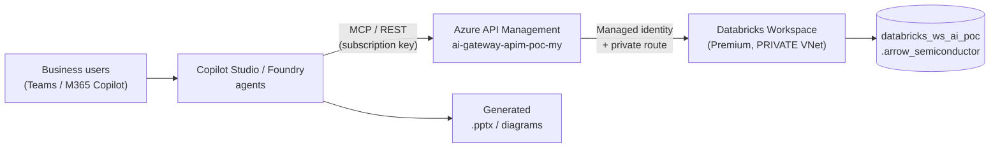
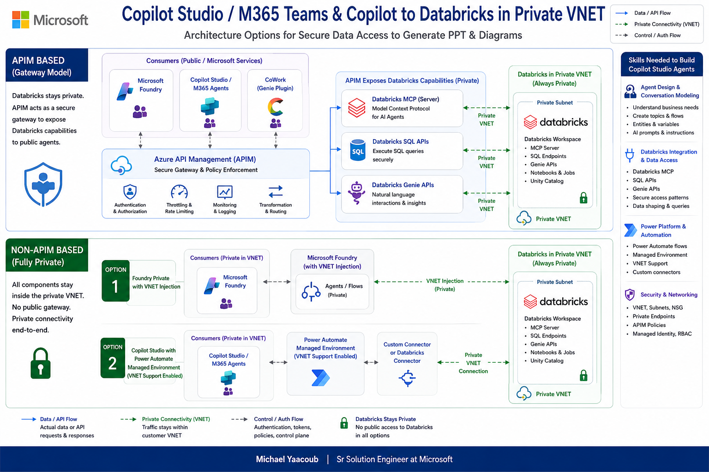

# Azure Databricks (Private VNet) → APIM → Foundry / Copilot Studio Agents

> Secure, lowest-cost POC that lets **business users generate PowerPoint decks and
> diagrams from Databricks data** using Copilot Studio agents, Microsoft Foundry
> agents, or CoWork — while Databricks stays **fully private** inside an Azure VNet.
>
> Sample dataset: a chip-manufacturing / semiconductor company (Arrow-style).

[](infra/terraform)
[](apim)
[](databricks)
[](LICENSE)

---

## Table of contents
1. [Overview & goal](#1-overview--goal)
2. [Architecture diagrams](#2-architecture-diagrams)
3. [Four alternative architectures (design doc summary)](#3-four-alternative-architectures-design-doc-summary)
4. [Folder structure](#4-folder-structure)
5. [What gets deployed](#5-what-gets-deployed)
6. [Prerequisites](#6-prerequisites)
7. [Quick start](#7-quick-start)
8. [Live URLs & endpoints](#8-live-urls--endpoints)
9. [Sample data & how to query it](#9-sample-data--how-to-query-it)
10. [Sample APIM calls](#10-sample-apim-calls)
11. [Visualization prompts and agent integration choices](#11-visualization-prompts-and-agent-integration-choices)
12. [Cost — keeping it lowest-cost](#12-cost--keeping-it-lowest-cost)
13. [Security & networking](#13-security--networking)
14. [Genie agent & MCP server enablement](#14-genie-agent--mcp-server-enablement)
15. [CI/CD — GitHub Actions](#15-cicd--github-actions)
16. [References](#16-references)
17. [License](#17-license)

---

## 1. Overview & goal

Business users want to *"make me a deck of last quarter's yield and revenue"* in
Teams / M365 Copilot. The data lives in **Azure Databricks**, which — for security
and compliance — must **never be exposed publicly**. This POC implements the
pattern where **Azure API Management (APIM)** is the single, governed front door
that exposes Databricks as:

- a **REST API** (run SQL, list tables),
- an **AI/BI Genie** natural-language API, and
- an **MCP server** that Foundry / Copilot Studio agents consume as tools.

Databricks is deployed with **VNet injection + Secure Cluster Connectivity (no
public IP) + back-end Private Link**, so all compute and data-plane traffic stays
inside the customer VNet. This is **Option 2** of the four architectures below.



---

## 2. Architecture diagrams

### 2.1 Four architecture options — Copilot/Teams to Databricks in a private VNet


This diagram compares **four secure ways** for M365 Copilot / Teams / Copilot
Studio to reach a **private** Databricks workspace to generate PPT & diagrams. In
every option **Databricks stays private** (no public access); the options differ
only in *what sits between the agent and the VNet* (Power Platform managed
environment, APIM, Foundry VNet injection, or CoWork + Genie via APIM). The right
rail lists the **skills needed** to build the Copilot Studio agents (agent design,
Databricks integration, Power Platform, security/networking, content generation,
DevOps).

### 2.2 APIM operational process & policy enforcement


This diagram shows **how an API is onboarded and governed** in APIM: an app team
requests exposure, the enterprise team creates the API and grants **managed
identity** access, ownership is handed to the app team who adds project-specific
policies, and the API is consumed by internal teams. At runtime, requests pass
through **global (enterprise) policies → APIM → project-specific policies →
backend**, which is exactly how this POC secures the Databricks/Genie APIs
(managed-identity auth, rate-limiting, subscription keys).

---

## 3. Four alternative architectures (design doc summary)

📄 **Design document:** [docs/Agents-Databricks-Private.pdf](docs/Agents-Databricks-Private.pdf)

The PDF is the source design deck (by *Michael Yaacoub — Sr Solution Engineer,
Microsoft*). It evaluates four ways to let Copilot Studio / M365 agents securely
read a **private** Databricks workspace and turn the results into PowerPoint decks
and diagrams. The common principle: **Databricks never gets a public endpoint** —
only the connectivity layer changes. Summary of the four options it compares:

| # | Option | Connectivity layer | Agent surface | Best for | Trade-offs |
|---|--------|--------------------|--------------|----------|------------|
| 1 | **Managed Environment with VNet support (No APIM)** | Power Platform **Managed Environment** + Power Automate VNet integration | Copilot Studio | Power Platform-centric orgs already licensed for Managed Environment | Requires Managed Environment licensing; no central API governance; per-connector security |
| 2 | **No Managed Environment — APIM exposes Databricks APIs / MCP** ⟵ *this POC* | **Azure API Management** → private VNet | Copilot Studio / Foundry via REST + **MCP** | Central governance, reuse across many agents, MCP tools | You run/patch APIM policies; APIM cost |
| 3 | **Foundry with Private VNet Injection** | **Microsoft Foundry** agents/flows with VNet injection | Foundry (fronted by Copilot Studio) | Teams standardizing on Foundry agents/flows | Foundry networking setup; less API reuse outside Foundry |
| 4 | **CoWork with Genie Plugin via APIM** | **CoWork** Genie/Databricks connector → **APIM** → private VNet | CoWork + Genie | Natural-language "chat with your data" for business users | Depends on CoWork + Genie availability; APIM still required |

**Why this POC picks Option 2:** APIM gives one **governed, reusable** front door
(rate-limits, managed-identity auth, subscription keys, observability) that can be
consumed by *both* Copilot Studio and Foundry agents as REST **and** MCP — without
storing any Databricks secrets in the agent. Options 3 and 4 can layer on top
(Foundry/CoWork simply call the same APIM endpoints).

---

## 4. Folder structure

```
Azure-Databricks-Private-Agent-APIM/
├─ .github/workflows/
│  └─ provision-databricks.yml     # CI: Terraform provision (+ optional data load)
├─ infra/terraform/                # Private VNet + Databricks Premium (VNet injection, NPIP, Private Link)
│  ├─ providers.tf  variables.tf  network.tf  databricks.tf
│  ├─ private-endpoint.tf  outputs.tf  terraform.tfvars.example
├─ databricks/
│  ├─ sql/
│  │  ├─ 01_create_and_load.sql    # Creates catalog/schema + 6 tables + sample data
│  │  └─ 02_sample_queries.sql     # PPT-ready analytics queries (Q1–Q10)
│  └─ notebooks/
│     └─ 01_explore_and_visualize.py  # Interactive charts in Databricks
├─ apim/
│  ├─ main.bicep                   # Databricks SQL + Genie APIs, product, policies
│  ├─ policies/                    # Managed-identity auth + request-shaping XML
│  ├─ deploy-apim.ps1  enable-mcp.ps1
├─ scripts/
│  ├─ deploy.ps1                   # terraform init/plan/apply wrapper
│  ├─ load-sample-data.ps1         # Serverless warehouse + SQL Statement Execution API
│  └─ test-endpoints.ps1           # Workspace + SQL + APIM smoke tests
├─ docs/
│  ├─ Agents-DataBricks-Private-Architecture-Alternatives.png
│  ├─ APIM - Operational Process.png
│  ├─ Agents-Databricks-Private.pdf   # Design doc (4 architectures)
│  ├─ sample-data.md  api-calls.md  Prompts.txt
├─ LICENSE   README.md   .gitignore
```

---

## 5. What gets deployed

| Resource | Name | Notes |
|----------|------|-------|
| Virtual network | `databricks-vnet-ai-poc` (10.179.0.0/16) | Host + container delegated subnets, PE subnet |
| NSG | `databricks-ws-ai-poc-nsg` | Databricks-managed rules |
| Databricks workspace | `databricks-ws-ai-poc` | **Premium**, VNet injection, `no_public_ip=true` |
| Managed RG | `databricks-ws-ai-poc-managed-rg` | Auto-created data plane |
| Private DNS + endpoint | `privatelink.azuredatabricks.net`, `*-pe-uiapi` | Back-end Private Link (`databricks_ui_api`) |
| SQL warehouse | `poc-serverless-2xs` | Serverless 2X-Small, auto-stop 5 min |
| Unity Catalog | `databricks_ws_ai_poc.arrow_semiconductor` | 6 sample tables |
| APIM APIs | `Databricks SQL`, `Databricks Genie` | On existing `ai-gateway-apim-poc-my` |
| APIM MCP server | `databricks-mcp` (preview) | Tools for Foundry / Copilot Studio |

---

## 6. Prerequisites

- **Azure CLI** logged in to subscription `86b37969-9445-49cf-b03f-d8866235171c`
  (`az login`), with Contributor on RG `ai-myaacoub`.
- **Terraform ≥ 1.5**.
- **PowerShell 7+** (scripts) — Windows PowerShell 5.1 also works.
- Databricks account has **Unity Catalog** auto-enabled (default for new workspaces).
- For Genie/serverless: **serverless SQL** enabled for the account/region.

---

## 7. Quick start

```powershell
# 1) Provision the private Databricks + VNet (live)
./scripts/deploy.ps1                       # add -LoadData to also load sample data

# 2) Load the semiconductor sample data (if not done above)
$ws = terraform -chdir="infra/terraform" output -raw workspace_url
./scripts/load-sample-data.ps1 -WorkspaceUrl $ws -UseAzureCli   # prints warehouse id

# 3) Expose Databricks + Genie through APIM
./apim/deploy-apim.ps1 -WorkspaceUrl $ws -WarehouseId "<warehouse-id>" -GenieSpaceId "<genie-space-id>"

# 4) Expose the API as an MCP server (preview)
./apim/enable-mcp.ps1

# 5) Smoke-test everything
./scripts/test-endpoints.ps1 -WorkspaceUrl $ws -WarehouseId "<id>" -UseAzureCli `
    -ApimBaseUrl "https://ai-gateway-apim-poc-my.azure-api.net/databricks" -ApimKey "<subscription-key>"
```

Or provision from CI: run the **Provision Databricks (Private VNet)** GitHub
workflow (see [§15](#15-cicd--github-actions)).

---

## 8. Live URLs & endpoints

> **Live** — deployed to subscription `86b37969-9445-49cf-b03f-d8866235171c`,
> resource group `ai-myaacoub`, region `westus`. Endpoints marked ✅ were tested end-to-end.

| What | URL |
|------|-----|
| **Databricks workspace** | `https://adb-7405608662655754.14.azuredatabricks.net` |
| Databricks workspace (portal) | [Azure Portal → workspace](https://portal.azure.com/#@MngEnvMCAP829495.onmicrosoft.com/resource/subscriptions/86b37969-9445-49cf-b03f-d8866235171c/resourceGroups/ai-myaacoub/providers/Microsoft.Databricks/workspaces/databricks-ws-ai-poc/overview) |
| SQL warehouse (`poc-serverless-2xs`, id `64777231f8249fdb`) | `https://adb-7405608662655754.14.azuredatabricks.net/sql/warehouses/64777231f8249fdb` |
| **Genie space** (create in UI, then set id) | `https://adb-7405608662655754.14.azuredatabricks.net/genie/rooms/<space_id>` |
| **APIM — Databricks SQL API** | `https://ai-gateway-apim-poc-my.azure-api.net/databricks` |
| APIM — `POST /query` | `https://ai-gateway-apim-poc-my.azure-api.net/databricks/query` ✅ |
| APIM — `GET /tables` | `https://ai-gateway-apim-poc-my.azure-api.net/databricks/tables` ✅ |
| **APIM — Genie API** | `https://ai-gateway-apim-poc-my.azure-api.net/databricks-genie` (set Genie space id) |
| APIM — `POST /genie/ask` | `https://ai-gateway-apim-poc-my.azure-api.net/databricks-genie/genie/ask` |
| **APIM — MCP server** | `https://ai-gateway-apim-poc-my.azure-api.net/databricks-mcp/mcp` ✅ |
| APIM instance (portal) | [Azure Portal → APIM](https://portal.azure.com/#@MngEnvMCAP829495.onmicrosoft.com/resource/subscriptions/86b37969-9445-49cf-b03f-d8866235171c/resourceGroups/ai-myaacoub/providers/Microsoft.ApiManagement/service/ai-gateway-apim-poc-my/apim-apis) |

**APIM managed identity** granted access in Databricks: appId `49ff6000-cfb2-4b1c-94cc-4de99251d5d6`
(added as workspace service principal, `CAN_USE` on the warehouse, `SELECT` on the schema).

---

## 9. Sample data & how to query it

Full reference: **[docs/sample-data.md](docs/sample-data.md)**.

- Catalog/schema: `databricks_ws_ai_poc.arrow_semiconductor`
- 6 tables: `fab_production`, `wafer_yield`, `defect_analysis`, `product_sales`,
  `inventory`, `supply_chain`
- 10 PPT-ready analytics queries in
  [databricks/sql/02_sample_queries.sql](databricks/sql/02_sample_queries.sql)
  (yield trends, revenue by region, defect Pareto, gross margin, supplier risk, KPIs).

---

## 10. Sample APIM calls

Full reference: **[docs/api-calls.md](docs/api-calls.md)**.

```bash
curl -X POST "https://ai-gateway-apim-poc-my.azure-api.net/databricks/query" \
  -H "Ocp-Apim-Subscription-Key: $APIM_KEY" -H "Content-Type: application/json" \
  -d '{ "statement": "SELECT region, ROUND(SUM(revenue_usd)/1e6,2) AS revenue_musd FROM databricks_ws_ai_poc.arrow_semiconductor.product_sales GROUP BY region ORDER BY revenue_musd DESC" }'
```

---

## 11. Visualization prompts and agent integration choices

### 11.1 Ten example prompts for charts and presentations

These prompts work with a Copilot Studio agent, Foundry agent, or Genie Agent
that has access to the sample schema. They deliberately specify the source,
aggregation, chart encoding, and expected deliverable. For reliable results,
configure the agent to use the connected Databricks tool, return the supporting
table with the chart, and never invent missing values.

1. **Yield trend — line chart:** "Using
  `databricks_ws_ai_poc.arrow_semiconductor.wafer_yield`, plot monthly average
  yield percentage by process node as a multi-series line chart. Put month on
  the x-axis and yield percent on the y-axis, label the latest value for each
  node, and summarize the two largest month-over-month changes. Include the
  result table and the date range used."

2. **Regional revenue — clustered columns:** "Query `product_sales` and create
  a clustered column chart of revenue in USD millions by fiscal quarter and
  region. Sort quarters chronologically, use one series per region, show data
  labels, and identify the fastest-growing and largest region without
  extrapolating beyond the data."

3. **Product mix — donut chart:** "Show total revenue and revenue share by
  product family from `product_sales`. Create a donut chart ordered from
  largest to smallest, label each segment with product family and percentage,
  and group no categories into 'Other'. Add a short observation about product
  concentration."

4. **Defect Pareto — combo chart:** "From `defect_analysis`, aggregate defect
  count by category for the full available period. Build a Pareto chart with
  descending bars for defect count and a cumulative-percentage line on a
  secondary axis. Mark the point where cumulative defects first reach 80% and
  list the priority categories."

5. **Fab output — stacked area chart:** "Using `fab_production`, plot monthly
  good dies in millions by fab as a stacked area chart. Show total monthly
  output as labels, call out the highest and lowest production months, and
  include the exact aggregated values used for the graph."

6. **Margin and revenue — horizontal bars:** "Compare product families using
  average gross margin percentage and total revenue from `product_sales`.
  Create a horizontal bar chart sorted by gross margin and add revenue in USD
  millions as data labels. Highlight any family with above-median revenue but
  below-median margin."

7. **Inventory health — heatmap:** "Use only the latest snapshot in `inventory`
  and create a product-family-by-warehouse-region heatmap colored by days of
  supply. Flag stock-out and excess statuses, include on-hand units in the
  tooltip or supporting table, and state the snapshot date prominently."

8. **Supplier risk — bubble chart:** "Plot suppliers from `supply_chain` with
  lead-time days on the x-axis, on-time delivery percentage on the y-axis,
  bubble size based on quality score, and color based on risk level. Label all
  high-risk suppliers and provide a ranked table of the five suppliers needing
  the most attention."

9. **Yield versus target — variance bars:** "For the latest month in
  `wafer_yield`, compare actual average yield with target yield by process
  node. Create a diverging bar or bullet chart of percentage-point gap, use a
  zero reference line, label actual and target values, and rank nodes from
  largest shortfall to largest overperformance."

10. **Executive slide — KPI cards plus two charts:** "Create a one-slide
   executive manufacturing summary using the full available period. Show KPI
   cards for total revenue in USD millions, average production yield, total
   good dies in millions, and number of high-risk suppliers. Add a small
   quarterly revenue-by-region chart and a monthly yield trend chart. Include
   an 'As of' date, three evidence-based takeaways, and a compact source table
   suitable for validation before exporting to PowerPoint."

> **Agent instruction to append when accuracy matters:** "Use the connected
> Databricks tool for every numeric claim. If a requested field or time period is
> unavailable, say so. Return the query or tool name, filters, units, source
> table, and result rows used to build the chart. Do not estimate missing data."

### 11.2 Genie API vs direct Databricks API vs MCP server

The three choices solve different layers of the problem:

- **Genie API** is a semantic, natural-language analytics service. A curated
  Genie Agent supplies business terminology, instructions, metrics, sample
  queries, and verified answers, then Genie generates and runs the query.
- **Direct Databricks API** means a deliberately designed REST action, normally
  SQL Statement Execution or a narrow application endpoint. The caller supplies
  SQL or structured parameters and receives deterministic rows.
- **MCP server** is an agent-tool protocol, not a query engine. An MCP tool still
  invokes a backend such as Genie, Databricks SQL, or a custom API. This POC uses
  APIM to expose the `query` and `tables` REST operations as MCP tools;
  Databricks also provides managed MCP servers for services including Genie,
  Databricks SQL, and Unity Catalog functions.

| Criterion | Genie API through APIM | Direct Databricks SQL/REST API through APIM | MCP server (APIM facade or Databricks managed) |
|---|---|---|---|
| Best fit | Business users asking changing natural-language questions in a curated domain | Known reports, fixed KPIs, parameterized queries, batch extraction, and strict output schemas | Reusable tools shared by multiple Copilot Studio, Foundry, and other MCP-compatible agents |
| Answer quality | **Best for open-ended business Q&A** when the Genie Agent is well curated; quality depends on metadata, instructions, metrics, sample queries, and verified answers | **Best for deterministic accuracy** when approved SQL or typed parameters encode the business rule; poor if an LLM is allowed to invent arbitrary SQL | Depends on the backend tool and its description; MCP by itself does not improve data or SQL quality |
| Chart control | Genie returns grounded answers/data, but the calling agent should still specify and render the final chart | Highest control over columns, ordering, units, chart-ready shape, and repeatability | Good when tools return small, typed, chart-ready payloads; weaker when generic tools return large or ambiguous results |
| Variable cost | SQL/warehouse compute plus Genie usage and calling-agent usage; natural-language interpretation usually costs more than a fixed query | Usually the lowest variable cost for repeated known questions: warehouse/API work plus calling-agent usage, with no second natural-language analytics layer | Protocol has no fixed query cost, but tool discovery/planning can add model tokens and extra calls; backend, APIM, Databricks, and agent charges still apply |
| Latency | Usually highest because question interpretation, query generation/execution, and asynchronous result polling are involved | Usually lowest and most predictable for optimized parameterized queries | Adds a small protocol/gateway hop; end-to-end latency is primarily determined by tool selection and the backend |
| Scale | Good for interactive analytics; apply quotas, timeouts, polling, and concurrency controls | Best for high-volume predictable workloads; cache safe aggregates, constrain result sizes, and use warehouse autoscaling | Best organizational scalability because tools can be discovered and reused; runtime scale still depends on APIM tier, backend warehouse, quotas, and agent call patterns |
| Copilot Studio | Use a custom connector/action for the Genie REST workflow | Use a custom connector or OpenAPI action | Native MCP onboarding with generative orchestration; tools are discovered from the server |
| Microsoft Foundry | Use a custom function/OpenAPI tool that handles start, poll, result, and follow-up calls | Use an OpenAPI/custom function tool, or application code for maximum control | Native remote MCP tool integration; especially useful for portable multi-tool agents |
| Security strengths | Unity Catalog governs source data; a curated domain reduces accidental access and semantic ambiguity | Easiest to constrain to read-only, parameterized, allowlisted operations and stable response schemas | Central tool discovery and least-privilege tool exposure; APIM can add Entra auth, rate limits, logging, quotas, and backend managed identity |
| Security cautions | Do not treat generated SQL as pre-approved merely because Genie produced it; restrict the Genie identity and accessible assets | A generic `statement` endpoint is powerful: prevent write/DDL, enforce row/column controls, cap rows/time, and prefer approved parameterized operations in production | Tool descriptions and outputs are untrusted model input; guard against prompt injection, over-broad tools, excessive chaining, and accidental response-body logging |
| Main trade-off | Highest semantic quality, but requires curation and adds AI cost/latency | Lowest cost and strongest determinism, but each business capability must be designed and maintained | Best portability and reuse, but adds another abstraction and does not replace backend quality, governance, or capacity planning |

### 11.3 Recommendation by priority

| Priority | Recommended choice | Why |
|---|---|---|
| Highest business-question quality | **Genie API behind APIM** | Use a narrow, well-tuned Genie Agent with Unity Catalog governed data, business definitions, metrics, sample queries, and verified answers. |
| Lowest cost and latency at volume | **Direct parameterized Databricks API behind APIM** | Reuse approved SQL for recurring charts and KPIs, return only chart-ready aggregates, and avoid an extra NL-to-SQL step. |
| Best reuse across Copilot Studio and Foundry | **MCP through APIM** | One governed tool contract can serve multiple agent platforms; expose narrow direct-SQL tools for fixed analytics and a Genie tool for exploratory questions. |
| Strongest production security | **APIM front door + Entra OAuth + managed identity + Unity Catalog** | The protocol is secondary to identity, least privilege, data controls, policy enforcement, private networking, and auditability. Subscription keys alone are appropriate only for this POC. |

**Recommended production pattern:** use a **hybrid MCP toolset through APIM**.
Expose narrow, parameterized tools such as `revenue_by_region`,
`yield_trend`, and `supplier_risk` for common graphs, plus one separately named
`ask_genie` tool for exploratory questions. This gives Copilot Studio and Foundry
agents one reusable integration while retaining direct-API cost and determinism
for common workloads and Genie quality for the long tail. Route both paths with
Entra OAuth at the agent-to-APIM boundary, APIM managed identity to Databricks,
Unity Catalog least privilege, read-only operations, result-size limits, rate
limits, and end-to-end tracing.

Before rollout, evaluate all three paths against the same representative prompt
set. Measure answer correctness, chart correctness, p50/p95 latency, Databricks
compute, Genie usage, agent token/tool-call usage, error rate, and denied-access
tests. Pricing and preview/GA status change independently, so confirm the current
Databricks, Copilot Studio, Foundry, and APIM terms for the target region and
tenant rather than using a static cost estimate from this POC.

---

## 12. Cost — keeping it lowest-cost

- **Databricks Premium** tier is required for Unity Catalog, Genie and Private
  Link — but the *tier* only changes the **DBU rate**; you pay only for compute used.
- **Serverless SQL 2X-Small** with **`auto_stop_mins=5`** → bills per-second only
  while queries run; idles to zero within 5 minutes.
- **No always-on clusters**; the sample data is generated with a handful of SQL
  statements (seconds of warehouse time).
- **VNet, NSG, private DNS** are effectively free; a **private endpoint** is a few
  cents/day. Set `enable_private_link=false` to drop even that.
- **APIM** reuses your **existing** `ai-gateway-apim-poc-my` instance (no new cost).
- **Tear down** anytime: `terraform -chdir=infra/terraform destroy`.

---

## 13. Security & networking

- **Databricks is never public**: VNet injection + **Secure Cluster Connectivity**
  (`no_public_ip=true`) means clusters have no public IP; back-end **Private Link**
  keeps cluster↔control-plane traffic on the VNet.
- **APIM → Databricks uses managed identity** (no secrets in the gateway or agents).
- **Agents → APIM** use subscription keys + rate-limiting; add Entra ID validation
  for production.
- For a fully locked-down front end, set `public_network_access_enabled=false` and
  run data-loading from a runner inside the VNet (self-hosted GitHub runner / jumpbox).

---

## 14. Genie agent & MCP server enablement

### 14.1 Genie agent (AI/BI)

**What the POC deploys:** the Genie **Conversation API** is already wired through
APIM at `/databricks-genie/*`. Genie **spaces/agents** are created in the Databricks
UI (there is no public "create space" API), so complete these steps once:

1. Databricks → **Genie** → **New** → add tables from
   `databricks_ws_ai_poc.arrow_semiconductor` (start with `product_sales`,
   `fab_production`, `wafer_yield`).
2. Add sample instructions (e.g. *"revenue is `revenue_usd`; report in $M"*) and a
   few sample questions to ground answers.
3. Copy the **space id** from the URL: `…/genie/rooms/<space_id>`.
4. Point APIM at it — updates the `databricks-genie-space-id` named value:
   ```powershell
   ./apim/deploy-apim.ps1 -WorkspaceUrl "https://adb-7405608662655754.14.azuredatabricks.net" `
       -WarehouseId 64777231f8249fdb -GenieSpaceId <space_id>
   ```
5. Ask Genie **through APIM**:
   ```bash
   curl -X POST "https://ai-gateway-apim-poc-my.azure-api.net/databricks-genie/genie/ask" \
     -H "Ocp-Apim-Subscription-Key: $APIM_KEY" -H "Content-Type: application/json" \
     -d '{ "content": "Top 3 regions by revenue last quarter?" }'
   ```

> **Status in this POC:** the Genie API is **deployed and routed**; the
> `databricks-genie-space-id` named value holds a placeholder until a Genie space is
> created in the UI and its id is set (step 4).

### 14.2 MCP server (Foundry / Copilot Studio tools)

**Done in this POC.** The Databricks SQL API is exposed as an APIM **MCP server**
(APIM AI-gateway feature) so agents consume `query` and `tables` as MCP tools:

1. Ran [`apim/enable-mcp.ps1`](apim/enable-mcp.ps1) — creates an `mcp`-type API
   (`databricks-mcp`) whose tools map to the `query` and `tables` operations of the
   Databricks SQL API. Equivalent portal path: APIM → APIs → **MCP Servers** →
   **+ Create MCP server** → *Expose an API as an MCP server* → source
   **Databricks SQL**, operations `query`, `tables`.
2. **MCP endpoint (live):**
   `https://ai-gateway-apim-poc-my.azure-api.net/databricks-mcp/mcp`
3. **Auth:** `Ocp-Apim-Subscription-Key: <key>` header.

**Add it as a tool:**
- **Microsoft Foundry / Copilot Studio:** add an MCP (Model Context Protocol) tool →
  URL = the MCP endpoint above → header `Ocp-Apim-Subscription-Key = <key>`.
- **VS Code (GitHub Copilot agent mode):** `MCP: Add Server` → **HTTP** → paste the
  MCP endpoint → add the subscription-key header.

> APIM exposes selected REST operations as MCP **tools** only, not MCP resources
> or prompts. Global-scope policies run before MCP-server-scope policies. Avoid
> response-body logging or reading `context.Response.Body` in MCP policies because
> response buffering can interfere with streaming.

The Genie **Conversation API** is reachable through APIM at
`/databricks-genie/genie/ask` (see 13.1).

---

## 15. CI/CD — GitHub Actions

[`.github/workflows/provision-databricks.yml`](.github/workflows/provision-databricks.yml)
provisions the infra with Terraform using **OIDC** (no stored credentials).

Configure once in **Settings → Secrets and variables → Actions**:
- Secrets: `AZURE_CLIENT_ID`, `AZURE_TENANT_ID`, `AZURE_SUBSCRIPTION_ID`
  (federated credential on an Entra app with Contributor on `ai-myaacoub`).

Run **Actions → Provision Databricks (Private VNet) → Run workflow**
(`apply=true`, `load_sample_data=true`).

---

## 16. References

### Microsoft Learn
- Azure Databricks documentation — https://learn.microsoft.com/azure/databricks/
- VNet injection (deploy Databricks into your VNet) — https://learn.microsoft.com/azure/databricks/security/network/classic/vnet-inject
- Secure cluster connectivity (no public IP) — https://learn.microsoft.com/azure/databricks/security/network/classic/secure-cluster-connectivity
- Azure Private Link for Databricks — https://learn.microsoft.com/azure/databricks/security/network/classic/private-link
- Unity Catalog — https://learn.microsoft.com/azure/databricks/data-governance/unity-catalog/
- AI/BI Genie & Genie Agents — https://learn.microsoft.com/azure/databricks/genie/
- MCPs and agent tools in Azure Databricks — https://learn.microsoft.com/azure/databricks/generative-ai/mcp/
- Azure API Management — https://learn.microsoft.com/azure/api-management/
- Expose a REST API as an MCP server (APIM) — https://learn.microsoft.com/azure/api-management/export-rest-mcp-server
- APIM system-assigned managed identity — https://learn.microsoft.com/azure/api-management/api-management-howto-use-managed-service-identity
- Microsoft Copilot Studio — https://learn.microsoft.com/microsoft-copilot-studio/
- Use MCP tools in Copilot Studio — https://learn.microsoft.com/microsoft-copilot-studio/agent-extend-action-mcp
- Microsoft Foundry — https://learn.microsoft.com/azure/ai-foundry/

### Databricks references
- SQL Statement Execution API — https://docs.databricks.com/api/azure/workspace/statementexecution
- Genie Conversation API — https://docs.databricks.com/api/azure/workspace/genie
- Serverless SQL warehouses — https://learn.microsoft.com/azure/databricks/compute/sql-warehouse/
- Databricks pricing — https://www.databricks.com/product/pricing

### GitHub repositories
- This project — https://github.com/csdmichael/Azure-Databricks-Private-Agent-APIM
- Databricks Terraform provider — https://github.com/databricks/terraform-provider-databricks
- Terraform AzureRM provider — https://github.com/hashicorp/terraform-provider-azurerm
- Databricks CLI — https://github.com/databricks/cli
- Model Context Protocol (spec + SDKs) — https://github.com/modelcontextprotocol
- Azure API Management policy snippets — https://github.com/Azure-Samples/api-management-policy-snippets

---

## 17. License

[MIT](LICENSE) © 2026 **Michael Yaacoub | Sr Solution Engineer at Microsoft**.
