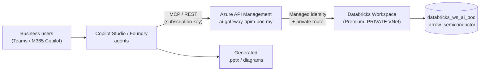

# Azure Databricks (Private VNet) → APIM → Foundry / Copilot Studio Agents

> Secure, lowest-cost POC that lets **business users generate PowerPoint decks and
> diagrams from Databricks data** using Copilot Studio agents, Microsoft Foundry
> agents, or CoWork — while Databricks stays **fully private** inside an Azure VNet.
>
> Sample dataset: a chip-manufacturing / semiconductor company (Arrow-style).

[](infra/terraform)
[](apim)
[](databricks)
[](LICENSE)

---

## Table of contents
1. [Overview & goal](#1-overview--goal)
2. [Architecture diagrams](#2-architecture-diagrams)
3. [Four alternative architectures (design doc summary)](#3-four-alternative-architectures-design-doc-summary)
4. [Folder structure](#4-folder-structure)
5. [What gets deployed](#5-what-gets-deployed)
6. [Prerequisites](#6-prerequisites)
7. [Quick start](#7-quick-start)
8. [Live URLs & endpoints](#8-live-urls--endpoints)
9. [Sample data & how to query it](#9-sample-data--how-to-query-it)
10. [Sample APIM calls](#10-sample-apim-calls)
11. [Cost — keeping it lowest-cost](#11-cost--keeping-it-lowest-cost)
12. [Security & networking](#12-security--networking)
13. [Genie agent setup](#13-genie-agent-setup)
14. [CI/CD — GitHub Actions](#14-cicd--github-actions)
15. [License](#15-license)

---

## 1. Overview & goal

Business users want to *"make me a deck of last quarter's yield and revenue"* in
Teams / M365 Copilot. The data lives in **Azure Databricks**, which — for security
and compliance — must **never be exposed publicly**. This POC implements the
pattern where **Azure API Management (APIM)** is the single, governed front door
that exposes Databricks as:

- a **REST API** (run SQL, list tables),
- an **AI/BI Genie** natural-language API, and
- an **MCP server** that Foundry / Copilot Studio agents consume as tools.

Databricks is deployed with **VNet injection + Secure Cluster Connectivity (no
public IP) + back-end Private Link**, so all compute and data-plane traffic stays
inside the customer VNet. This is **Option 2** of the four architectures below.



---

## 2. Architecture diagrams

### 2.1 Four architecture options — Copilot/Teams to Databricks in a private VNet


This diagram compares **four secure ways** for M365 Copilot / Teams / Copilot
Studio to reach a **private** Databricks workspace to generate PPT & diagrams. In
every option **Databricks stays private** (no public access); the options differ
only in *what sits between the agent and the VNet* (Power Platform managed
environment, APIM, Foundry VNet injection, or CoWork + Genie via APIM). The right
rail lists the **skills needed** to build the Copilot Studio agents (agent design,
Databricks integration, Power Platform, security/networking, content generation,
DevOps).

### 2.2 APIM operational process & policy enforcement


This diagram shows **how an API is onboarded and governed** in APIM: an app team
requests exposure, the enterprise team creates the API and grants **managed
identity** access, ownership is handed to the app team who adds project-specific
policies, and the API is consumed by internal teams. At runtime, requests pass
through **global (enterprise) policies → APIM → project-specific policies →
backend**, which is exactly how this POC secures the Databricks/Genie APIs
(managed-identity auth, rate-limiting, subscription keys).

---

## 3. Four alternative architectures (design doc summary)

📄 **Design document:** [docs/Agents-Databricks-Private.pdf](docs/Agents-Databricks-Private.pdf)

The PDF is the source design deck (by *Michael Yaacoub — Sr Solution Engineer,
Microsoft*). It evaluates four ways to let Copilot Studio / M365 agents securely
read a **private** Databricks workspace and turn the results into PowerPoint decks
and diagrams. The common principle: **Databricks never gets a public endpoint** —
only the connectivity layer changes. Summary of the four options it compares:

| # | Option | Connectivity layer | Agent surface | Best for | Trade-offs |
|---|--------|--------------------|--------------|----------|------------|
| 1 | **Managed Environment with VNet support (No APIM)** | Power Platform **Managed Environment** + Power Automate VNet integration | Copilot Studio | Power Platform-centric orgs already licensed for Managed Environment | Requires Managed Environment licensing; no central API governance; per-connector security |
| 2 | **No Managed Environment — APIM exposes Databricks APIs / MCP** ⟵ *this POC* | **Azure API Management** → private VNet | Copilot Studio / Foundry via REST + **MCP** | Central governance, reuse across many agents, MCP tools | You run/patch APIM policies; APIM cost |
| 3 | **Foundry with Private VNet Injection** | **Microsoft Foundry** agents/flows with VNet injection | Foundry (fronted by Copilot Studio) | Teams standardizing on Foundry agents/flows | Foundry networking setup; less API reuse outside Foundry |
| 4 | **CoWork with Genie Plugin via APIM** | **CoWork** Genie/Databricks connector → **APIM** → private VNet | CoWork + Genie | Natural-language "chat with your data" for business users | Depends on CoWork + Genie availability; APIM still required |

**Why this POC picks Option 2:** APIM gives one **governed, reusable** front door
(rate-limits, managed-identity auth, subscription keys, observability) that can be
consumed by *both* Copilot Studio and Foundry agents as REST **and** MCP — without
storing any Databricks secrets in the agent. Options 3 and 4 can layer on top
(Foundry/CoWork simply call the same APIM endpoints).

---

## 4. Folder structure

```
Azure-Databricks-Private-Agent-APIM/
├─ .github/workflows/
│  └─ provision-databricks.yml     # CI: Terraform provision (+ optional data load)
├─ infra/terraform/                # Private VNet + Databricks Premium (VNet injection, NPIP, Private Link)
│  ├─ providers.tf  variables.tf  network.tf  databricks.tf
│  ├─ private-endpoint.tf  outputs.tf  terraform.tfvars.example
├─ databricks/
│  ├─ sql/
│  │  ├─ 01_create_and_load.sql    # Creates catalog/schema + 6 tables + sample data
│  │  └─ 02_sample_queries.sql     # PPT-ready analytics queries (Q1–Q10)
│  └─ notebooks/
│     └─ 01_explore_and_visualize.py  # Interactive charts in Databricks
├─ apim/
│  ├─ main.bicep                   # Databricks SQL + Genie APIs, product, policies
│  ├─ policies/                    # Managed-identity auth + request-shaping XML
│  ├─ deploy-apim.ps1  enable-mcp.ps1
├─ scripts/
│  ├─ deploy.ps1                   # terraform init/plan/apply wrapper
│  ├─ load-sample-data.ps1         # Serverless warehouse + SQL Statement Execution API
│  └─ test-endpoints.ps1           # Workspace + SQL + APIM smoke tests
├─ docs/
│  ├─ Agents-DataBricks-Private-Architecture-Alternatives.png
│  ├─ APIM - Operational Process.png
│  ├─ Agents-Databricks-Private.pdf   # Design doc (4 architectures)
│  ├─ sample-data.md  api-calls.md  Prompts.txt
├─ LICENSE   README.md   .gitignore
```

---

## 5. What gets deployed

| Resource | Name | Notes |
|----------|------|-------|
| Virtual network | `databricks-vnet-ai-poc` (10.179.0.0/16) | Host + container delegated subnets, PE subnet |
| NSG | `databricks-ws-ai-poc-nsg` | Databricks-managed rules |
| Databricks workspace | `databricks-ws-ai-poc` | **Premium**, VNet injection, `no_public_ip=true` |
| Managed RG | `databricks-ws-ai-poc-managed-rg` | Auto-created data plane |
| Private DNS + endpoint | `privatelink.azuredatabricks.net`, `*-pe-uiapi` | Back-end Private Link (`databricks_ui_api`) |
| SQL warehouse | `poc-serverless-2xs` | Serverless 2X-Small, auto-stop 5 min |
| Unity Catalog | `databricks_ws_ai_poc.arrow_semiconductor` | 6 sample tables |
| APIM APIs | `Databricks SQL`, `Databricks Genie` | On existing `ai-gateway-apim-poc-my` |
| APIM MCP server | `databricks-mcp` (preview) | Tools for Foundry / Copilot Studio |

---

## 6. Prerequisites

- **Azure CLI** logged in to subscription `86b37969-9445-49cf-b03f-d8866235171c`
  (`az login`), with Contributor on RG `ai-myaacoub`.
- **Terraform ≥ 1.5**.
- **PowerShell 7+** (scripts) — Windows PowerShell 5.1 also works.
- Databricks account has **Unity Catalog** auto-enabled (default for new workspaces).
- For Genie/serverless: **serverless SQL** enabled for the account/region.

---

## 7. Quick start

```powershell
# 1) Provision the private Databricks + VNet (live)
./scripts/deploy.ps1                       # add -LoadData to also load sample data

# 2) Load the semiconductor sample data (if not done above)
$ws = terraform -chdir="infra/terraform" output -raw workspace_url
./scripts/load-sample-data.ps1 -WorkspaceUrl $ws -UseAzureCli   # prints warehouse id

# 3) Expose Databricks + Genie through APIM
./apim/deploy-apim.ps1 -WorkspaceUrl $ws -WarehouseId "<warehouse-id>" -GenieSpaceId "<genie-space-id>"

# 4) Expose the API as an MCP server (preview)
./apim/enable-mcp.ps1

# 5) Smoke-test everything
./scripts/test-endpoints.ps1 -WorkspaceUrl $ws -WarehouseId "<id>" -UseAzureCli `
    -ApimBaseUrl "https://ai-gateway-apim-poc-my.azure-api.net/databricks" -ApimKey "<subscription-key>"
```

Or provision from CI: run the **Provision Databricks (Private VNet)** GitHub
workflow (see [§14](#14-cicd--github-actions)).

---

## 8. Live URLs & endpoints

> Filled in after the live deployment completes. Replace `<...>` with your values
> (the deploy scripts print them).

| What | URL |
|------|-----|
| **Databricks workspace** | `<DATABRICKS_WORKSPACE_URL>` |
| Databricks workspace (portal) | [Azure Portal → workspace](https://portal.azure.com/#@MngEnvMCAP829495.onmicrosoft.com/resource/subscriptions/86b37969-9445-49cf-b03f-d8866235171c/resourceGroups/ai-myaacoub/providers/Microsoft.Databricks/workspaces/databricks-ws-ai-poc/overview) |
| **Genie space** | `<DATABRICKS_WORKSPACE_URL>/genie/rooms/<GENIE_SPACE_ID>` |
| SQL warehouse | `<DATABRICKS_WORKSPACE_URL>/sql/warehouses/<WAREHOUSE_ID>` |
| **APIM — Databricks SQL API** | `https://ai-gateway-apim-poc-my.azure-api.net/databricks` |
| APIM — `POST /query` | `https://ai-gateway-apim-poc-my.azure-api.net/databricks/query` |
| APIM — `GET /tables` | `https://ai-gateway-apim-poc-my.azure-api.net/databricks/tables` |
| **APIM — Genie API** | `https://ai-gateway-apim-poc-my.azure-api.net/databricks-genie` |
| APIM — `POST /genie/ask` | `https://ai-gateway-apim-poc-my.azure-api.net/databricks-genie/genie/ask` |
| **APIM — MCP server** | `https://ai-gateway-apim-poc-my.azure-api.net/databricks-mcp/mcp` |
| APIM instance (portal) | [Azure Portal → APIM](https://portal.azure.com/#@MngEnvMCAP829495.onmicrosoft.com/resource/subscriptions/86b37969-9445-49cf-b03f-d8866235171c/resourceGroups/ai-myaacoub/providers/Microsoft.ApiManagement/service/ai-gateway-apim-poc-my/apim-apis) |

---

## 9. Sample data & how to query it

Full reference: **[docs/sample-data.md](docs/sample-data.md)**.

- Catalog/schema: `databricks_ws_ai_poc.arrow_semiconductor`
- 6 tables: `fab_production`, `wafer_yield`, `defect_analysis`, `product_sales`,
  `inventory`, `supply_chain`
- 10 PPT-ready analytics queries in
  [databricks/sql/02_sample_queries.sql](databricks/sql/02_sample_queries.sql)
  (yield trends, revenue by region, defect Pareto, gross margin, supplier risk, KPIs).

---

## 10. Sample APIM calls

Full reference: **[docs/api-calls.md](docs/api-calls.md)**.

```bash
curl -X POST "https://ai-gateway-apim-poc-my.azure-api.net/databricks/query" \
  -H "Ocp-Apim-Subscription-Key: $APIM_KEY" -H "Content-Type: application/json" \
  -d '{ "statement": "SELECT region, ROUND(SUM(revenue_usd)/1e6,2) AS revenue_musd FROM databricks_ws_ai_poc.arrow_semiconductor.product_sales GROUP BY region ORDER BY revenue_musd DESC" }'
```

---

## 11. Cost — keeping it lowest-cost

- **Databricks Premium** tier is required for Unity Catalog, Genie and Private
  Link — but the *tier* only changes the **DBU rate**; you pay only for compute used.
- **Serverless SQL 2X-Small** with **`auto_stop_mins=5`** → bills per-second only
  while queries run; idles to zero within 5 minutes.
- **No always-on clusters**; the sample data is generated with a handful of SQL
  statements (seconds of warehouse time).
- **VNet, NSG, private DNS** are effectively free; a **private endpoint** is a few
  cents/day. Set `enable_private_link=false` to drop even that.
- **APIM** reuses your **existing** `ai-gateway-apim-poc-my` instance (no new cost).
- **Tear down** anytime: `terraform -chdir=infra/terraform destroy`.

---

## 12. Security & networking

- **Databricks is never public**: VNet injection + **Secure Cluster Connectivity**
  (`no_public_ip=true`) means clusters have no public IP; back-end **Private Link**
  keeps cluster↔control-plane traffic on the VNet.
- **APIM → Databricks uses managed identity** (no secrets in the gateway or agents).
- **Agents → APIM** use subscription keys + rate-limiting; add Entra ID validation
  for production.
- For a fully locked-down front end, set `public_network_access_enabled=false` and
  run data-loading from a runner inside the VNet (self-hosted GitHub runner / jumpbox).

---

## 13. Genie agent setup

Genie (AI/BI) spaces are created in the workspace UI:
1. Databricks → **Genie** → **New** → add tables from
   `databricks_ws_ai_poc.arrow_semiconductor` (start with `product_sales`,
   `fab_production`, `wafer_yield`).
2. Add sample instructions (e.g. *"revenue is `revenue_usd`; report in $M"*).
3. Copy the **space id** from the URL (`/genie/rooms/<space_id>`).
4. Pass it to `apim/deploy-apim.ps1 -GenieSpaceId <space_id>` (or update the
   `databricks-genie-space-id` named value in APIM).

The Genie **Conversation API** is then reachable through APIM at
`/databricks-genie/genie/ask`.

---

## 14. CI/CD — GitHub Actions

[`.github/workflows/provision-databricks.yml`](.github/workflows/provision-databricks.yml)
provisions the infra with Terraform using **OIDC** (no stored credentials).

Configure once in **Settings → Secrets and variables → Actions**:
- Secrets: `AZURE_CLIENT_ID`, `AZURE_TENANT_ID`, `AZURE_SUBSCRIPTION_ID`
  (federated credential on an Entra app with Contributor on `ai-myaacoub`).

Run **Actions → Provision Databricks (Private VNet) → Run workflow**
(`apply=true`, `load_sample_data=true`).

---

## 15. License

[MIT](LICENSE) © 2026 **Michael Yaacoub | Sr Solution Engineer at Microsoft**.
