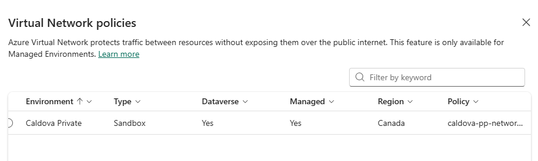
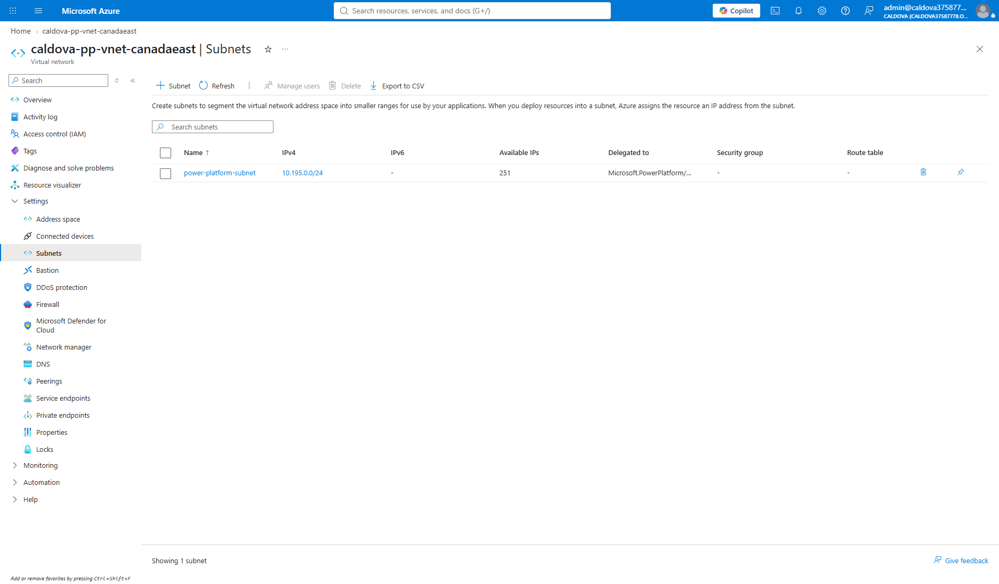
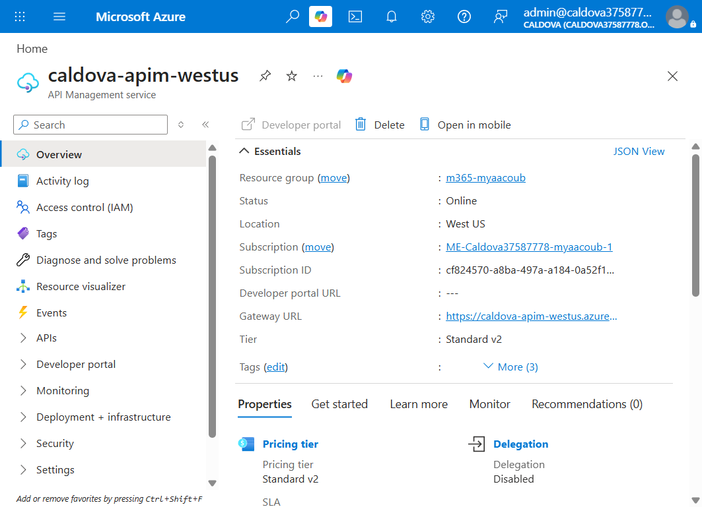
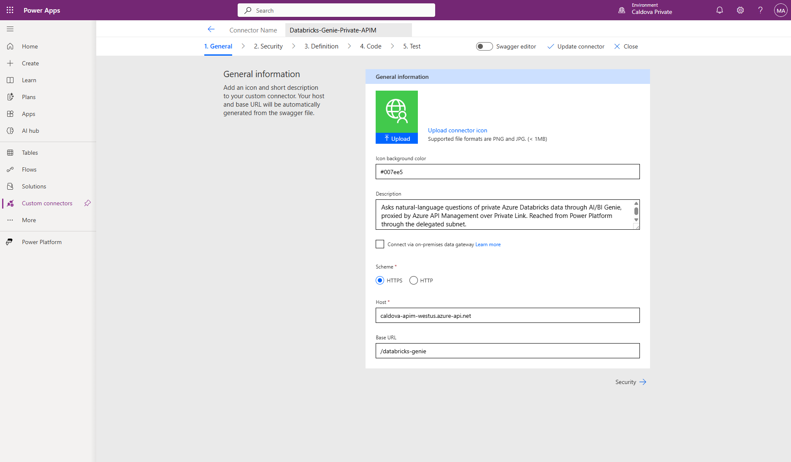

# Azure Databricks Private Agent + APIM

Private Azure Databricks fronted by API Management, surfaced to Copilot Studio and
Microsoft 365 Copilot over a fully private network path. A Copilot Studio agent asks
natural-language questions of Unity Catalog through AI/BI Genie and returns a
high-fidelity, downloadable PowerPoint deck.

Databricks and API Management both have **public network access disabled**. Nothing in
the data path traverses the public internet.

> **Live showcase:** <https://caldova-databricks-showcase.azurewebsites.net>
> — video series, business case, features, architecture, and a link into the demo app.
>
> **Business case:** $892.5K annual run-rate benefit, 243% year-one ROI, 2.4 month payback
> at 100 active users. Full model in [docs/Business Case](docs/Business%20Case).

---

## Contents

- [Architecture](#architecture)
- [How it works](#how-it-works)
- [Technologies used](#technologies-used)
- [Portals and URLs](#portals-and-urls)
- [Current environment](#current-environment)
- [Address plan](#address-plan)
- [Repository layout](#repository-layout)
- [Deploy](#deploy)
- [Setup walkthrough](#setup-walkthrough)
  - [1. Power Platform managed environment](#1-power-platform-managed-environment)
  - [2. Delegated virtual networks](#2-delegated-virtual-networks)
  - [3. Virtual network peerings](#3-virtual-network-peerings)
  - [4. Private DNS](#4-private-dns)
  - [5. Enterprise policy](#5-enterprise-policy)
  - [6. Lock down API Management](#6-lock-down-api-management)
  - [7. Publish the Databricks APIs](#7-publish-the-databricks-apis)
  - [8. Import the custom connector](#8-import-the-custom-connector)
  - [9. Build the Copilot Studio agent](#9-build-the-copilot-studio-agent)
  - [10. Generate the deck](#10-generate-the-deck)
  - [11. Final resource group](#11-final-resource-group)
- [Why a custom connector and not an MCP server](#why-a-custom-connector-and-not-an-mcp-server)
- [The deck skill](#the-deck-skill)
- [Observability](#observability)
- [Key design decisions](#key-design-decisions)
- [Setup guide](#setup-guide)
- [Archived environment](#archived-environment)
- [Provide feedback](#provide-feedback)
- [Responsible AI Transparency FAQ](#responsible-ai-transparency-faq)
- [Disclaimers](#disclaimers)

---

## Architecture


---

## How it works

The detailed diagram above reads left to right, in eight numbered hops.

1. **A user asks for a deck** in Microsoft 365 Copilot or Teams, in plain language.
2. **The Copilot Studio agent** picks up the request. It runs on the **GitHub Copilot
   harness**, which gives it a governed sandbox and the `executive-deck-builder` skill.
3. **The agent calls its custom connector tools.** Because the Power Platform environment
   is VNet-injected, that call leaves through a **delegated subnet** rather than the
   public internet.
4. **Traffic crosses a VNet peering** into the API Management VNet. Peering is not
   transitive, so each Power Platform regional VNet peers *directly* with the APIM VNet.
5. **APIM receives the request on its private endpoint** at `10.191.1.4`. Its public
   gateway is disabled, so this is the only way in.
6. **APIM authenticates to Databricks with its managed identity** and crosses a global
   peering into the Databricks VNet. No Databricks token or key is ever stored in Power
   Platform.
7. **Databricks answers through AI/BI Genie**, which resolves the natural-language
   question against Unity Catalog using a serverless SQL warehouse, and returns grounded
   rows.
8. **The agent builds a real `.pptx`** from those rows in its sandbox and returns it as a
   download card in the chat.

The bands across the bottom of the diagram are the cross-cutting controls: **identity**
(managed identity into Databricks, Entra ID for users), **private networking** (private
endpoints, delegated subnets, peering, private DNS), **AI gateway controls** (APIM
policies, subscription keys, rate limiting), and **observability** (APIM diagnostics into
Log Analytics).

---

## Technologies used

| Technology | Role in this solution | Where to configure |
|---|---|---|
| **Azure Databricks** (Premium, VNet injected) | Hosts the data. Unity Catalog, a serverless SQL warehouse, and the AI/BI Genie space. Public access disabled. | [Azure portal](https://portal.azure.com/) |
| **Azure Databricks AI/BI Genie** | Turns natural-language questions into governed SQL over a curated schema. | Databricks workspace → **Genie** |
| **Unity Catalog** | Catalog, schema, tables, and the grants APIM's managed identity needs. | Databricks workspace → **Catalog** |
| **Azure API Management** (StandardV2) | The only proxy in front of Databricks. Publishes the SQL and Genie REST APIs, holds the policies, and authenticates to Databricks with a managed identity. Public access disabled. | [Azure portal](https://portal.azure.com/) |
| **Azure Private Link / Private Endpoints** | Private ingress to both APIM and Databricks. | Azure portal → each resource → **Networking** |
| **Azure Private DNS zones** | `privatelink.azure-api.net` and `privatelink.azuredatabricks.net`, linked to every VNet that must resolve them. | Azure portal → **Private DNS zones** |
| **Azure Virtual Network peering** | Connects the Power Platform, APIM, and Databricks VNets. | Azure portal → VNet → **Peerings** |
| **Power Platform managed environment** | The Dataverse-backed environment that gets subnet-injected. Must be a Managed Environment. | [Power Platform admin center](https://admin.powerplatform.microsoft.com/) |
| **Power Platform enterprise policy** (`NetworkInjection`) | Binds the delegated subnets to the environment. Its geo must match the environment geo. | Azure portal + `Microsoft.PowerPlatform.EnterprisePolicies` module |
| **Power Apps custom connector** | The supported way to reach a private endpoint from Copilot Studio. Exposes the four Genie operations. | [Power Apps → Custom connectors](https://make.powerapps.com/) |
| **Microsoft Copilot Studio** (GitHub Copilot harness) | Hosts the agent, its tools, and the deck skill. The harness supplies the sandbox that writes the `.pptx`. | [Copilot Studio](https://copilotstudio.microsoft.com/) |
| **Copilot Studio skills** | Portable `SKILL.md` carrying the deck specification. | Copilot Studio → agent → **Skills** |
| **Microsoft 365 Copilot / Teams** | Where users actually talk to the agent. | Copilot Studio → **Channels** |
| **Azure Monitor / Log Analytics** | APIM gateway diagnostics for tracing every call. | Azure portal → **Log Analytics workspaces** |
| **Terraform** | Deploys the Databricks workspace, NSGs, private endpoints, and DNS. | [terraform](terraform) |
| **Bicep** | Deploys APIM, the Power Platform VNets, the enterprise policy, and diagnostics. | [bicep](bicep) |

---

## Portals and URLs

Replace the identifiers with your own where they differ.

| What | URL |
|---|---|
| **Showcase site** | <https://caldova-databricks-showcase.azurewebsites.net> |
| Azure portal | <https://portal.azure.com/> |
| Power Platform admin center | <https://admin.powerplatform.microsoft.com/> |
| This environment in the admin center | <https://admin.powerplatform.microsoft.com/manage/environments/environment/52456fcd-1d20-ecdb-aa2e-8979e3f794f5/hub> |
| Power Apps maker portal | <https://make.powerapps.com/> |
| Power Apps custom connectors | <https://make.powerapps.com/environments/52456fcd-1d20-ecdb-aa2e-8979e3f794f5/customconnectors> |
| Power Apps connections | <https://make.powerapps.com/environments/52456fcd-1d20-ecdb-aa2e-8979e3f794f5/connections> |
| Copilot Studio | <https://copilotstudio.microsoft.com/> |
| Databricks workspace | <https://adb-7405616934814750.10.azuredatabricks.net> |
| APIM gateway (private only) | `https://caldova-apim-westus.azure-api.net` |

---

## Current environment

| Setting | Value |
|---|---|
| Subscription | `cf824570-a8ba-497a-a184-0a52f1830aa9` |
| Resource group | `m365-myaacoub` |
| Tenant | `12a4b86b-e64c-43f9-af05-d9130a72dfd2` |
| Databricks | `caldova-dbx-westus2` (West US 2), public access **disabled** |
| API Management | `caldova-apim-westus` (West US), StandardV2, public access **disabled** |
| Power Platform | `Caldova Private` (`52456fcd-1d20-ecdb-aa2e-8979e3f794f5`), canada geo |
| Catalog | `caldova_dbx_westus2.arrow_semiconductor` |
| SQL warehouse | `a3c7c9526aa58992` (serverless 2X-Small, auto-stop 5 min) |
| Genie space | `01f1abe9e51e19ddbb15297aee9a5850` |
| Log Analytics | `caldova-apim-logs-westus` |
| Copilot Studio agent | `Genie Deck Builder Pro` (`0b4034e0-53b9-4ae8-a506-11e3269fa451`) |

---

## Address plan

| Purpose | Region | VNet | Subnets |
|---|---|---|---|
| Databricks | West US 2 | `10.190.0.0/16` | host `10.190.1.0/24`, container `10.190.2.0/24`, private endpoints `10.190.3.0/24` |
| API Management | West US | `10.191.0.0/16` | integration `10.191.0.0/24`, private endpoints `10.191.1.0/24` |
| Power Platform | Canada Central | `10.194.0.0/16` | delegated `10.194.0.0/24` |
| Power Platform | Canada East | `10.195.0.0/16` | delegated `10.195.0.0/24` |

Both Power Platform subnets are `/24` because the enterprise policy requires each regional
subnet to expose the same usable address count. The region pair must match the environment
geo: environment `52456fcd-1d20-ecdb-aa2e-8979e3f794f5` is `canada`, so the VNets are
`canadacentral` and `canadaeast`.

---

## Repository layout

| Path | Purpose |
|---|---|
| [terraform](terraform) | VNet-injected Databricks workspace, NSGs, private DNS zone, private endpoints |
| [bicep/apim-private](bicep/apim-private) | APIM StandardV2, VNet, gateway private endpoint, peering to Databricks |
| [bicep/power-platform-private](bicep/power-platform-private) | Regional VNets, delegated subnets, peering, network-injection policy |
| [bicep/power-platform-databricks-direct](bicep/power-platform-databricks-direct) | Peerings and DNS links for the no-APIM path |
| [bicep/apim-diagnostics](bicep/apim-diagnostics) | Log Analytics workspace and APIM diagnostic settings |
| [connector](connector) | Power Platform custom connector definitions (Swagger 2.0) |
| [skills](skills) | Reusable Copilot Studio skills |
| [ui/src/app/showcase](ui/src/app/showcase) | Showcase page hosted on the B1 App Service |
| [docs/Videos](docs/Videos) | Seven-part showcase video series |
| [docs/Business Case](docs/Business%20Case) | Business case PDF, PPTX, and the financial model |
| [apim](apim) | Databricks SQL and Genie APIs, policies, MCP projection |
| [api](api) | FastAPI service that calls Databricks through APIM |
| [ui](ui) | Angular + Ionic front end |
| [databricks](databricks) | Sample dataset SQL and exploration notebook |
| [scripts](scripts) | Deployment, data-load, connector, and test helpers |
| [docs/setup-guide.md](docs/setup-guide.md) | Step-by-step guide for an existing Databricks + APIM estate |
| [old mcaps](old%20mcaps) | Archived MCAPS proof of concept and the Microsoft Foundry agents |

The SQL under [databricks/sql](databricks/sql) deliberately keeps the original catalog
token, because [scripts/load-catalog-data.ps1](scripts/load-catalog-data.ps1) rewrites it
to the target catalog at run time.

---

## Deploy

```powershell
az login --tenant Caldova37587778.onmicrosoft.com
./scripts/deploy-infra.ps1 -Step all
```

Individual steps run with `-Step <name>`:

| Step | What it does |
|---|---|
| `providers` | Registers the required resource providers |
| `databricks` | Terraform apply with `lockdown=false` |
| `data` | Creates the schema and loads the dataset over the public control plane |
| `apim` | APIM with `publicNetworkAccess=Enabled`, plus both peerings |
| `powerplatform` | Power Platform VNets, peerings, DNS links, enterprise policy |
| `link` | `Enable-SubnetInjection` against the managed environment |
| `lockdown` | Terraform `lockdown=true` and APIM `publicNetworkAccess=Disabled` |

**Lockdown must run last.** Data loading and private-endpoint validation both need the
control planes reachable from the deployment host. After `lockdown`, Databricks and APIM
are only reachable from inside the peered VNets, so any later data work must run from a
host in one of those VNets.

`NoAzureDatabricksRules` is only accepted by Azure after the back-end `databricks_ui_api`
private endpoint exists, which is another reason the lockdown flip is a separate apply.

---

## Setup walkthrough

The screenshots below follow the order you actually perform the setup.

### 1. Power Platform managed environment

Start here. The environment must be a **Managed Environment with Dataverse**, and its
**geo** determines every Azure region choice that follows. Adding Dataverse is
irreversible, so never use the tenant default environment.

Portal: <https://admin.powerplatform.microsoft.com/>

Confirm the environment's region, type, and that **Managed environments** is enabled.


Virtual network support is configured under **Security → Data and privacy**. The
**Azure Virtual Network policies** entry is the one that matters here — it protects items
made in Power Platform inside your virtual network without exposing them over the public
internet. This is the tenant-level surface that binds an enterprise policy to an
environment.


Opening that entry lists every environment eligible for subnet injection and the policy
attached to it. Use this as the verification step after linking: the environment should
show **Dataverse: Yes**, **Managed: Yes**, the geo you expect, and the enterprise policy
name in the **Policy** column. An environment missing Dataverse or Managed status will not
appear as eligible.



### 2. Delegated virtual networks

Create one VNet per region in the environment's geo pair. Each needs a subnet delegated to
`Microsoft.PowerPlatform/enterprisePolicies`, and both subnets must expose the same usable
address count.




### 3. Virtual network peerings

Peer each Power Platform VNet **directly** with the APIM VNet, and the APIM VNet with the
Databricks VNet. Peering is not transitive, so a hub-and-spoke shortcut will not work.


### 4. Private DNS

Link `privatelink.azure-api.net` to the APIM VNet and to both Power Platform VNets, and
`privatelink.azuredatabricks.net` to the APIM VNet. Without these links the private
endpoint names resolve to public addresses and the calls fail.


### 5. Enterprise policy

Create the `NetworkInjection` enterprise policy in the geo that matches the environment,
then link it to the environment. This is the step that actually injects the subnets.


### 6. Lock down API Management

Deploy API Management on the **Standard v2** tier, which supports the private endpoint
and virtual network integration used by this architecture.


Confirm the service is online and exposes the expected gateway host before applying the
network lockdown.



Associate a dedicated NSG with the private-endpoint subnet and verify that it is attached
to one subnet.


Associate a separate NSG with the APIM virtual network integration subnet and verify its
subnet association as well.


Once the private endpoint exists and DNS resolves, disable public network access. From
this point APIM answers only on `10.191.1.4`.

### 7. Publish the Databricks APIs

Import the SQL and Genie REST APIs, attach the policies, and grant APIM's managed identity
access to Databricks.


Both APIs can also be projected as MCP servers. Those belong to the archived Microsoft
Foundry path in [old mcaps/foundry/README.md](old%20mcaps/foundry/README.md) — they are
**not** usable from Copilot Studio over the private network. See
[why](#why-a-custom-connector-and-not-an-mcp-server).


### 8. Import the custom connector

Create the connector in the linked environment from the Swagger 2.0 definition in
[connector](connector).

Portal: <https://make.powerapps.com/environments/52456fcd-1d20-ecdb-aa2e-8979e3f794f5/customconnectors>


Point it at the APIM host with `/databricks-genie` as the base URL.



Use API key authentication with the `Ocp-Apim-Subscription-Key` header. Only the parameter
name lives in the connector; the key value goes in the connection.


Confirm the four actions and their path parameters.


| Tool | Operation |
|---|---|
| Ask Genie (start conversation) | `POST /genie/ask` |
| Ask Genie follow-up | `POST /genie/conversations/{conversationId}/messages` |
| Get Genie message status | `GET /genie/conversations/{conversationId}/messages/{messageId}` |
| Get Genie query result | `GET /genie/conversations/{conversationId}/messages/{messageId}/result` |

> **Typed request bodies matter.** The APIM export gives `POST` bodies only an `example`,
> which produces a single opaque `body` string input. Replace it with a typed schema so the
> agent gets a real `Question` input:
> `{"type":"object","required":["content"],"properties":{"content":{"type":"string"}}}`.

### 9. Build the Copilot Studio agent

Create the agent from the Copilot Studio home page with the **New experience** toggle on,
so it runs on the **GitHub Copilot harness**. That harness natively creates Word, Excel,
PowerPoint, and PDF files in a governed sandbox, which is what makes a real `.pptx`
download possible with no extra Azure compute.

An agent on the **standard** harness has no sandbox and will tell you it cannot create
files. Agents on the GitHub Copilot harness consume Copilot Credits.

Portal: <https://copilotstudio.microsoft.com/>


### 10. Generate the deck

Ask for a deck. The agent runs several Genie queries, writes the file, verifies it, and
returns a download card.


A representative run produced a nine-slide deck with four native PowerPoint charts, a data
table, a shapes-and-connectors diagram, KPI tiles, and speaker notes on every slide:

| Region | Revenue (USD) | Share | Units | Avg selling price |
|---|---|---|---|---|
| APAC | $101,848,716.61 | 37.5% | 7,634,265 | 13.342 |
| North America | $81,655,029.21 | 30.1% | 6,088,525 | 13.402 |
| EMEA | $59,341,485.76 | 21.9% | 4,374,350 | 13.326 |
| LATAM | $28,452,604.92 | 10.5% | 2,132,707 | 13.351 |
| **Total** | **$271,297,836.50** | 100.0% | 20,229,847 | 13.411 |

The agent queried for 2024 comparatives, found none, and stated that year-over-year growth
is not computable rather than inventing it.

> **Connection state gotcha.** Every new conversation starts `Stale`. Open the card's
> connection-manager link, choose **Review**, **Submit**, then **Retry in that same
> conversation**. Also confirm the connection manager shows a **single** row covering all
> four tools — if the tools are split across two connector registrations, authorizing one
> group leaves the other `Stale` permanently. Neither is a network or key problem; APIM
> returns `200` throughout.

### 11. Final resource group

Everything lands in one resource group.


---

## Why a custom connector and not an MCP server

Power Platform virtual network support covers Dataverse plugins and **connectors**,
including custom connectors. It does **not** cover MCP servers.

An MCP tool added to an agent in a VNet-injected environment fails in two distinct ways,
both reproduced here:

- Authoring time: `No tools available.`
- Runtime: `that tool is not available in this chat environment`

The custom connector is the supported path to a private endpoint, so the agent uses it.

---

## The deck skill

[skills/executive-deck-builder/SKILL.md](skills/executive-deck-builder/SKILL.md) is a
portable `SKILL.md` — YAML front matter plus Markdown — that can be uploaded to any agent
on this harness. It specifies:

- 16:9 canvas, explicit placement on the blank layout, margins, and overflow caps
- A Microsoft header band, horizontal rule, and footer with slide numbers
- Native chart objects only, with chart type per purpose, axis titles, data labels, and
  number formats per unit
- Table, KPI tile, and diagram construction rules
- Four core slides plus optional sections chosen from the data, and assertion-style slide
  titles
- A verification step that reopens the saved file and asserts its contents

> The header logo is drawn programmatically from four colored squares. Replace it with
> official brand artwork for anything customer-facing; the skill already accepts a supplied
> logo image.

---

## Observability

APIM diagnostics flow to the `caldova-apim-logs-westus` Log Analytics workspace.

This deployment writes to the legacy **`AzureDiagnostics`** table, not
`ApiManagementGatewayLogs`. Querying the resource-specific table returns zero rows and
looks like there is no traffic. Use:

```kusto
AzureDiagnostics
| where ResourceProvider == "MICROSOFT.APIMANAGEMENT"
| project TimeGenerated, Category, method_s, url_s, responseCode_d, backendResponseCode_d
| order by TimeGenerated desc
```

A full deck run produces 16 calls, 3 `POST` and 13 `GET`, all `200` at both APIM and the
Databricks backend.

---

## Key design decisions

- **Peering is not transitive.** Each Power Platform VNet peers directly with the APIM
  VNet, and separately with the Databricks VNet for the no-APIM path.
- **MCP servers are not covered by Power Platform VNet support.** Reaching a private
  endpoint from Copilot Studio requires a custom connector.
- **The enterprise policy geo must match the environment geo**, which fixes the Azure
  region pair for the delegated subnets.
- **APIM authenticates to Databricks with a managed identity**, so no Databricks token or
  key is stored in Power Platform.
- **The GitHub Copilot harness is required for file creation.** The standard harness has
  no sandbox.
- **There is no server-side PowerPoint Designer API.** Designer is client-side only,
  reachable through the PowerPoint JavaScript add-in API, VBA, or COM. High fidelity comes
  from slide masters, explicit layout, and native chart objects.

---

## Setup guide

[docs/setup-guide.md](docs/setup-guide.md) is the detailed, command-by-command version of
the walkthrough above, written for a customer who already has private Databricks and API
Management and needs to connect a Power Platform managed environment to them.

---

## Archived environment

[old mcaps](old%20mcaps) holds the original `infra`, `docs`, and README from the MCAPS
subscription. Those Azure resources have been deleted; the folder is retained for history
and is not wired into any deployment path.

It also holds the **Microsoft Foundry** prompt agents, which reach the same Databricks data
through the APIM MCP servers and Code Interpreter rather than through the private custom
connector. See [old mcaps/foundry/README.md](old%20mcaps/foundry/README.md). Its workflow
is manual dispatch only and does not run on commits.

---

## Provide feedback

Have questions, find a bug, or want to request a feature? [Submit a new issue](https://github.com/csdmichael/Azure-Databricks-Private-Agent-APIM/issues)
on this repo and we'll connect.

---

## Responsible AI Transparency FAQ

Please refer to [Transparency FAQ](https://github.com/microsoft/Multi-Agent-Custom-Automation-Engine-Solution-Accelerator/blob/main/docs/TRANSPARENCY_FAQ.md)
for responsible AI transparency details of this solution accelerator.

---

## Disclaimers

This release is an artificial intelligence (AI) system that generates text based on user
input. The text generated by this system may include ungrounded content, meaning that it
is not verified by any reliable source or based on any factual data. The data included in
this release is synthetic, meaning that it is artificially created by the system and may
contain factual errors or inconsistencies. Users of this release are responsible for
determining the accuracy, validity, and suitability of any content generated by the
system for their intended purposes. Users should not rely on the system output as a
source of truth or as a substitute for human judgment or expertise.

This release only supports English language input and output. Users should not attempt to
use the system with any other language or format. The system output may not be compatible
with any translation tools or services, and may lose its meaning or coherence if
translated.

This release does not reflect the opinions, views, or values of Microsoft Corporation or
any of its affiliates, subsidiaries, or partners. The system output is solely based on
the system's own logic and algorithms, and does not represent any endorsement,
recommendation, or advice from Microsoft or any other entity. Microsoft disclaims any
liability or responsibility for any damages, losses, or harms arising from the use of
this release or its output by any user or third party.

This release does not provide any financial advice, legal advice and is not designed to
replace the role of qualified client advisors in appropriately advising clients. Users
should not use the system output for any financial decisions, legal guidance or
transactions, and should consult with a professional financial advisor and or legal
advisor as appropriate before taking any action based on the system output. Microsoft is
not a financial institution or a fiduciary, and does not offer any financial products or
services through this release or its output.

This release is intended as a proof of concept only, and is not a finished or polished
product. It is not intended for commercial use or distribution, and is subject to change
or discontinuation without notice. Any planned deployment of this release or its output
should include comprehensive testing and evaluation to ensure it is fit for purpose and
meets the user's requirements and expectations. Microsoft does not guarantee the quality,
performance, reliability, or availability of this release or its output, and does not
provide any warranty or support for it.

This Software requires the use of third-party components which are governed by separate
proprietary or open-source licenses as identified below, and you must comply with the
terms of each applicable license in order to use the Software. You acknowledge and agree
that this license does not grant you a license or other right to use any such third-party
proprietary or open-source components.

To the extent that the Software includes components or code used in or derived from
Microsoft products or services, including without limitation Microsoft Azure Services
(collectively, "Microsoft Products and Services"), you must also comply with the Product
Terms applicable to such Microsoft Products and Services. You acknowledge and agree that
the license governing the Software does not grant you a license or other right to use
Microsoft Products and Services. Nothing in the license or this ReadMe file will serve to
supersede, amend, terminate or modify any terms in the Product Terms for any Microsoft
Products and Services.

You must also comply with all domestic and international export laws and regulations that
apply to the Software, which include restrictions on destinations, end users, and end
use. For further information on export restrictions, visit
[https://aka.ms/exporting](https://aka.ms/exporting).

You acknowledge that the Software and Microsoft Products and Services (1) are not
designed, intended or made available as a medical device(s), and (2) are not designed or
intended to be a substitute for professional medical advice, diagnosis, treatment, or
judgment and should not be used to replace or as a substitute for professional medical
advice, diagnosis, treatment, or judgment. Customer is solely responsible for displaying
and/or obtaining appropriate consents, warnings, disclaimers, and acknowledgements to end
users of Customer's implementation of the Online Services.

You acknowledge the Software is not subject to SOC 1 and SOC 2 compliance audits. No
Microsoft technology, nor any of its component technologies, including the Software, is
intended or made available as a substitute for the professional advice, opinion, or
judgment of a certified financial services professional. Do not use the Software to
replace, substitute, or provide professional financial advice or judgment.

BY ACCESSING OR USING THE SOFTWARE, YOU ACKNOWLEDGE THAT THE SOFTWARE IS NOT DESIGNED OR
INTENDED TO SUPPORT ANY USE IN WHICH A SERVICE INTERRUPTION, DEFECT, ERROR, OR OTHER
FAILURE OF THE SOFTWARE COULD RESULT IN THE DEATH OR SERIOUS BODILY INJURY OF ANY PERSON
OR IN PHYSICAL OR ENVIRONMENTAL DAMAGE (COLLECTIVELY, "HIGH-RISK USE"), AND THAT YOU WILL
ENSURE THAT, IN THE EVENT OF ANY INTERRUPTION, DEFECT, ERROR, OR OTHER FAILURE OF THE
SOFTWARE, THE SAFETY OF PEOPLE, PROPERTY, AND THE ENVIRONMENT ARE NOT REDUCED BELOW A
LEVEL THAT IS REASONABLY, APPROPRIATE, AND LEGAL, WHETHER IN GENERAL OR IN A SPECIFIC
INDUSTRY. BY ACCESSING THE SOFTWARE, YOU FURTHER ACKNOWLEDGE THAT YOUR HIGH-RISK USE OF THE
SOFTWARE IS AT YOUR OWN RISK.
