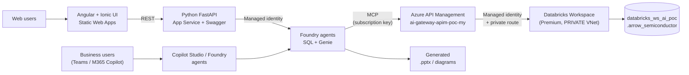

# Azure Databricks (Private VNet) → APIM → Foundry / Copilot Studio Agents

> Secure, lowest-cost POC that lets **business users generate PowerPoint decks and
> diagrams from Databricks data** using Copilot Studio agents, Microsoft Foundry
> agents, a purpose-built chat UI, or CoWork — while Databricks stays **fully
> private** inside an Azure VNet.
>
> Sample dataset: a chip-manufacturing / semiconductor company (Arrow-style).

[](https://green-forest-06861ca1e.7.azurestaticapps.net)
[](https://databricks-agents-api-my.azurewebsites.net/docs)
[](infra/terraform)
[](apim)
[](databricks)
[](LICENSE)

---

## Table of contents
1. [Overview & goal](#1-overview--goal)
2. [Architecture diagrams](#2-architecture-diagrams)
3. [Four alternative architectures (design doc summary)](#3-four-alternative-architectures-design-doc-summary)
4. [Folder structure](#4-folder-structure)
5. [What gets deployed](#5-what-gets-deployed)
6. [Prerequisites](#6-prerequisites)
7. [Quick start](#7-quick-start)
8. [Live URLs & endpoints](#8-live-urls--endpoints)
9. [Sample data & how to query it](#9-sample-data--how-to-query-it)
10. [Sample APIM calls](#10-sample-apim-calls)
11. [Visualization prompts and agent integration choices](#11-visualization-prompts-and-agent-integration-choices)
12. [Foundry agents](#12-foundry-agents)
13. [Chat UI — Angular / Ionic](#13-chat-ui--angular--ionic)
14. [Agents API — Python / FastAPI](#14-agents-api--python--fastapi)
15. [Microsoft 365 agent packages](#15-microsoft-365-agent-packages)
16. [Cost — keeping it lowest-cost](#16-cost--keeping-it-lowest-cost)
17. [Security & networking](#17-security--networking)
18. [Genie agent & MCP server enablement](#18-genie-agent--mcp-server-enablement)
19. [CI/CD — GitHub Actions](#19-cicd--github-actions)
20. [References](#20-references)
21. [License](#21-license)

---

## 1. Overview & goal

Business users want to *"make me a deck of last quarter's yield and revenue"* in
Teams / M365 Copilot. The data lives in **Azure Databricks**, which — for security
and compliance — must **never be exposed publicly**. This POC implements the
pattern where **Azure API Management (APIM)** is the single, governed front door
that exposes Databricks as:

- a **REST API** (run SQL, list tables),
- an **AI/BI Genie** natural-language API, and
- an **MCP server** that Foundry / Copilot Studio agents consume as tools.

Databricks is deployed with **VNet injection + Secure Cluster Connectivity (no
public IP) + back-end Private Link**, so all compute and data-plane traffic stays
inside the customer VNet. This is **Option 2** of the four architectures below.



---

## 2. Architecture diagrams

### 2.1 Secure access patterns — APIM gateway or fully private connectivity


This diagram groups the solution into an **APIM-based gateway model** and two
**non-APIM, fully private options**. In every path, the Databricks workspace stays
inside its private VNet with no public access:

- The **APIM-based model** lets Microsoft Foundry, Copilot Studio / M365 agents,
  and CoWork call Databricks MCP, SQL, and Genie capabilities through one secure
  gateway. APIM provides authentication and authorization, throttling and rate
  limiting, monitoring and logging, and request transformation and routing;
  APIM-to-Databricks traffic uses private VNet connectivity.
- **Non-APIM option 1** uses Microsoft Foundry with VNet injection so private
  agents and flows connect directly to the Databricks VNet.
- **Non-APIM option 2** uses Copilot Studio with a Power Automate Managed
  Environment that has VNet support, plus a custom or Databricks connector.

The arrows distinguish data/API traffic, private VNet connectivity, and
control/authentication flows. The right rail summarizes the implementation
skills required across agent design, Databricks integration, Power Platform,
and security and networking.

### 2.2 APIM operational process & policy enforcement


This diagram shows **how an API is onboarded and governed** in APIM: an app team
requests exposure, the enterprise team creates the API and grants **managed
identity** access, ownership is handed to the app team who adds project-specific
policies, and the API is consumed by internal teams. At runtime, requests pass
through **global (enterprise) policies → APIM → project-specific policies →
backend**, which is exactly how this POC secures the Databricks/Genie APIs
(managed-identity auth, rate-limiting, subscription keys).

---

## 3. Four alternative architectures (design doc summary)

📄 **Design document:** [docs/Agents-Databricks-Private.pdf](docs/Agents-Databricks-Private.pdf)

The PDF is the source design deck (by *Michael Yaacoub — Sr Solution Engineer,
Microsoft*). It evaluates four ways to let Copilot Studio / M365 agents securely
read a **private** Databricks workspace and turn the results into PowerPoint decks
and diagrams. The common principle: **Databricks never gets a public endpoint** —
only the connectivity layer changes. Summary of the four options it compares:

| # | Option | Connectivity layer | Agent surface | Best for | Trade-offs |
|---|--------|--------------------|--------------|----------|------------|
| 1 | **Managed Environment with VNet support (No APIM)** | Power Platform **Managed Environment** + Power Automate VNet integration | Copilot Studio | Power Platform-centric orgs already licensed for Managed Environment | Requires Managed Environment licensing; no central API governance; per-connector security |
| 2 | **No Managed Environment — APIM exposes Databricks APIs / MCP** ⟵ *this POC* | **Azure API Management** → private VNet | Copilot Studio / Foundry via REST + **MCP** | Central governance, reuse across many agents, MCP tools | You run/patch APIM policies; APIM cost |
| 3 | **Foundry with Private VNet Injection** | **Microsoft Foundry** agents/flows with VNet injection | Foundry (fronted by Copilot Studio) | Teams standardizing on Foundry agents/flows | Foundry networking setup; less API reuse outside Foundry |
| 4 | **CoWork with Genie Plugin via APIM** | **CoWork** Genie/Databricks connector → **APIM** → private VNet | CoWork + Genie | Natural-language "chat with your data" for business users | Depends on CoWork + Genie availability; APIM still required |

**Why this POC picks Option 2:** APIM gives one **governed, reusable** front door
(rate-limits, managed-identity auth, subscription keys, observability) that can be
consumed by *both* Copilot Studio and Foundry agents as REST **and** MCP — without
storing any Databricks secrets in the agent. Options 3 and 4 can layer on top
(Foundry/CoWork simply call the same APIM endpoints).

---

## 4. Folder structure

```
Azure-Databricks-Private-Agent-APIM/
├─ .github/workflows/
│  ├─ provision-databricks.yml     # CI: Terraform provision (+ optional data load)
│  ├─ provision-foundry-agent.yml  # CI: upsert + smoke-test both Foundry agents
│  ├─ deploy-api.yml               # CI: build, validate M365 packages, deploy the API
│  └─ deploy-ui.yml                # CI: build the Angular/Ionic UI, deploy to Static Web Apps
├─ infra/terraform/                # Private VNet + Databricks Premium (VNet injection, NPIP, Private Link)
│  ├─ providers.tf  variables.tf  network.tf  databricks.tf
│  ├─ private-endpoint.tf  outputs.tf  terraform.tfvars.example
├─ databricks/
│  ├─ sql/
│  │  ├─ 01_create_and_load.sql    # Creates catalog/schema + 6 tables + sample data
│  │  └─ 02_sample_queries.sql     # PPT-ready analytics queries (Q1–Q10)
│  └─ notebooks/
│     └─ 01_explore_and_visualize.py  # Interactive charts in Databricks
├─ apim/
│  ├─ main.bicep                   # Databricks SQL + Genie APIs, product, policies
│  ├─ policies/                    # Managed-identity auth + request-shaping XML
│  ├─ deploy-apim.ps1  enable-mcp.ps1
├─ foundry/
│  ├─ common.py                    # Shared MCP connection upsert + PPTX smoke test
│  ├─ provision_agent.py           # Databricks SQL agent (MCP query/tables + Code Interpreter)
│  ├─ provision_genie_agent.py     # Databricks Genie agent (Genie MCP + Code Interpreter)
│  └─ requirements.txt             # Pinned Foundry SDK dependencies
├─ api/                            # Python FastAPI service behind the UI (Swagger at /docs)
│  ├─ app/
│  │  ├─ main.py                   # Routes: agents, chat jobs, files, M365 packages
│  │  ├─ catalog.py                # Agent catalog shared by the UI and the M365 packages
│  │  ├─ foundry.py                # Foundry Responses API client + MCP approval handling
│  │  ├─ jobs.py                   # In-process chat job store (turns outlive HTTP limits)
│  │  ├─ m365.py                   # Declarative agent package builder
│  │  └─ m365_assets/              # Per-agent color.png (192px) and outline.png (32px)
│  └─ requirements.txt
├─ ui/                             # Angular 20 + Ionic 8 chat client
│  └─ src/app/
│     ├─ chat/                     # Agent tabs + WYSIWYG (Quill) chat box
│     ├─ packages/                 # Microsoft 365 package download module
│     └─ core/                     # API client + Markdown render/sanitize helpers
├─ scripts/
│  ├─ deploy.ps1                   # terraform init/plan/apply wrapper
│  ├─ load-sample-data.ps1         # Serverless warehouse + SQL Statement Execution API
│  ├─ create-genie-space.ps1       # Creates the Genie space and points APIM at it
│  ├─ provision-agents.ps1         # Runs both Foundry agent scripts locally
│  ├─ provision-app.ps1            # App Service plan + API web app + Static Web App
│  ├─ deploy-api.ps1  deploy-ui.ps1
│  ├─ setup-github-oidc.ps1        # Entra app + federated credential + repo secrets
│  ├─ build_m365_packages.py       # Builds and validates the M365 packages
│  ├─ generate_agent_icons.py      # Regenerates the agent icons
│  ├─ mcp_tools_probe.py           # Prints the tools an APIM MCP server advertises
│  ├─ debug_agent_response.py      # Dumps the raw shape of one agent response
│  └─ test-endpoints.ps1  test-genie.ps1  test-api.ps1
├─ docs/
│  ├─ Agents-DataBricks-Private-Architecture-Alternatives.png
│  ├─ APIM - Operational Process.png
│  ├─ Agents-Databricks-Private.pdf   # Design doc (4 architectures)
│  ├─ sample-data.md  api-calls.md  Prompts.txt
├─ LICENSE   README.md   .gitignore
```

---

## 5. What gets deployed

| Resource | Name | Notes |
|----------|------|-------|
| Virtual network | `databricks-vnet-ai-poc` (10.179.0.0/16) | Host + container delegated subnets, PE subnet |
| NSG | `databricks-ws-ai-poc-nsg` | Databricks-managed rules |
| Databricks workspace | `databricks-ws-ai-poc` | **Premium**, VNet injection, `no_public_ip=true` |
| Managed RG | `databricks-ws-ai-poc-managed-rg` | Auto-created data plane |
| Private DNS + endpoint | `privatelink.azuredatabricks.net`, `*-pe-uiapi` | Back-end Private Link (`databricks_ui_api`) |
| SQL warehouse | `poc-serverless-2xs` | Serverless 2X-Small, auto-stop 5 min |
| Unity Catalog | `databricks_ws_ai_poc.arrow_semiconductor` | 6 sample tables |
| Genie space | `Arrow Semiconductor Analytics` | Curated over the 6 tables |
| APIM APIs | `Databricks SQL`, `Databricks Genie` | On existing `ai-gateway-apim-poc-my` |
| APIM MCP servers | `databricks-mcp`, `databricks-genie-mcp` | Tools for Foundry / Copilot Studio |
| Foundry agents | `databricks-agent-mcp`, `databricks-genie-agent` | In `002-ai-poc-private/proj-default` |
| App Service plan | `plan-databricks-agents-poc` | Linux **F1 (free)**, West US 2 |
| API web app | `databricks-agents-api-my` | Python 3.12, FastAPI, system-assigned identity |
| Static Web App | `databricks-agents-ui-my` | **Free** tier, Angular 20 + Ionic 8 |

---

## 6. Prerequisites

- **Azure CLI** logged in to subscription `86b37969-9445-49cf-b03f-d8866235171c`
  (`az login`), with Contributor on RG `ai-myaacoub`.
- **Terraform ≥ 1.5**.
- **PowerShell 7+** (scripts) — Windows PowerShell 5.1 also works.
- **Python 3.12+** (Foundry agent scripts and the API) and **Node.js 20+** (the UI).
- Databricks account has **Unity Catalog** auto-enabled (default for new workspaces).
- For Genie/serverless: **serverless SQL** enabled for the account/region.
- Optional, for Microsoft 365 sideloading: the
  [Microsoft 365 Agents Toolkit CLI](https://aka.ms/M365AgentsToolkit)
  (`npm i -g @microsoft/m365agentstoolkit-cli`).

---

## 7. Quick start

```powershell
# 1) Provision the private Databricks + VNet (live)
./scripts/deploy.ps1                       # add -LoadData to also load sample data

# 2) Load the semiconductor sample data (if not done above)
$ws = terraform -chdir="infra/terraform" output -raw workspace_url
./scripts/load-sample-data.ps1 -WorkspaceUrl $ws -UseAzureCli   # prints warehouse id

# 3) Expose Databricks + Genie through APIM
./apim/deploy-apim.ps1 -WorkspaceUrl $ws -WarehouseId "<warehouse-id>" -GenieSpaceId "<genie-space-id>"

# 4) Create the Genie space, grant APIM access, and point APIM at it
./scripts/create-genie-space.ps1

# 5) Expose both APIs as MCP servers
./apim/enable-mcp.ps1
./apim/enable-mcp.ps1 -SourceApiId databricks-genie -McpDisplayName "Databricks Genie MCP" -McpPath databricks-genie-mcp

# 6) Create or update both Foundry agents (with PowerPoint smoke tests)
./scripts/provision-agents.ps1

# 7) Provision and deploy the API and the UI
./scripts/provision-app.ps1
./scripts/deploy-api.ps1
./scripts/deploy-ui.ps1

# 8) Smoke-test everything
./scripts/test-endpoints.ps1 -WorkspaceUrl $ws -WarehouseId "<id>" -UseAzureCli `
    -ApimBaseUrl "https://ai-gateway-apim-poc-my.azure-api.net/databricks" -ApimKey "<subscription-key>"
./scripts/test-genie.ps1
./scripts/test-api.ps1 -BaseUrl https://databricks-agents-api-my.azurewebsites.net
```

One-time CI setup (creates the OIDC app and repository secrets):

```powershell
./scripts/setup-github-oidc.ps1
```

Or provision from CI: run the **Provision Databricks (Private VNet)** GitHub
workflow (see [§19](#19-cicd--github-actions)).

---

## 8. Live URLs & endpoints

> **Live** — deployed to subscription `86b37969-9445-49cf-b03f-d8866235171c`,
> resource group `ai-myaacoub`. Databricks and APIM are in `westus`; the UI and
> API are in `westus2`. Endpoints marked ✅ were tested end-to-end.

### Applications

| What | URL |
|------|-----|
| **Chat UI** (Angular / Ionic) | <https://green-forest-06861ca1e.7.azurestaticapps.net> ✅ |
| **Agents API** | <https://databricks-agents-api-my.azurewebsites.net> ✅ |
| **Swagger UI** (interactive API docs) | <https://databricks-agents-api-my.azurewebsites.net/docs> ✅ |
| **ReDoc** (reference API docs) | <https://databricks-agents-api-my.azurewebsites.net/redoc> ✅ |
| OpenAPI document | <https://databricks-agents-api-my.azurewebsites.net/openapi.json> ✅ |
| Health probe | <https://databricks-agents-api-my.azurewebsites.net/health> ✅ |
| M365 package — Databricks SQL agent | `…/api/m365/packages/databricks-sql` ✅ |
| M365 package — Databricks Genie agent | `…/api/m365/packages/databricks-genie` ✅ |

### Data and gateway

| What | URL |
|------|-----|
| **Databricks workspace** | `https://adb-7405608662655754.14.azuredatabricks.net` |
| Databricks workspace (portal) | [Azure Portal → workspace](https://portal.azure.com/#@MngEnvMCAP829495.onmicrosoft.com/resource/subscriptions/86b37969-9445-49cf-b03f-d8866235171c/resourceGroups/ai-myaacoub/providers/Microsoft.Databricks/workspaces/databricks-ws-ai-poc/overview) |
| SQL warehouse (`poc-serverless-2xs`, id `64777231f8249fdb`) | `https://adb-7405608662655754.14.azuredatabricks.net/sql/warehouses/64777231f8249fdb` |
| **Genie space** `Arrow Semiconductor Analytics` (id `01f19b3c346c1698910416cf7a4c830c`) | `https://adb-7405608662655754.14.azuredatabricks.net/genie/rooms/01f19b3c346c1698910416cf7a4c830c` ✅ |
| **APIM — Databricks SQL API** | `https://ai-gateway-apim-poc-my.azure-api.net/databricks` |
| APIM — `POST /query` | `https://ai-gateway-apim-poc-my.azure-api.net/databricks/query` ✅ |
| APIM — `GET /tables` | `https://ai-gateway-apim-poc-my.azure-api.net/databricks/tables` ✅ |
| **APIM — Genie API** | `https://ai-gateway-apim-poc-my.azure-api.net/databricks-genie` ✅ |
| APIM — `POST /genie/ask` | `https://ai-gateway-apim-poc-my.azure-api.net/databricks-genie/genie/ask` ✅ |
| APIM — `GET /genie/conversations/{c}/messages/{m}` | poll until `status` is `COMPLETED` ✅ |
| APIM — `GET /genie/conversations/{c}/messages/{m}/result` | Genie SQL result rows ✅ |
| **APIM — Databricks MCP server** | `https://ai-gateway-apim-poc-my.azure-api.net/databricks-mcp/mcp` ✅ |
| **APIM — Genie MCP server** | `https://ai-gateway-apim-poc-my.azure-api.net/databricks-genie-mcp/mcp` ✅ |
| APIM instance (portal) | [Azure Portal → APIM](https://portal.azure.com/#@MngEnvMCAP829495.onmicrosoft.com/resource/subscriptions/86b37969-9445-49cf-b03f-d8866235171c/resourceGroups/ai-myaacoub/providers/Microsoft.ApiManagement/service/ai-gateway-apim-poc-my/apim-apis) |

### Agents

| Agent | Foundry name | Tools |
|-------|--------------|-------|
| Databricks SQL Agent | `databricks-agent-mcp` | Databricks MCP (`query`, `tables`) + Code Interpreter ✅ |
| Databricks Genie Agent | `databricks-genie-agent` | Genie MCP (`ask`, `message`, `result`, `follow-up`) + Code Interpreter ✅ |

Foundry project: [`002-ai-poc-private/proj-default`](https://ai.azure.com) —
endpoint `https://002-ai-poc-private.services.ai.azure.com/api/projects/proj-default`.

**APIM managed identity** granted access in Databricks: appId `49ff6000-cfb2-4b1c-94cc-4de99251d5d6`
(workspace service principal, `CAN_USE` on the warehouse, `SELECT` on the schema,
`CAN_RUN` on the Genie space).

---

## 9. Sample data & how to query it

Full reference: **[docs/sample-data.md](docs/sample-data.md)**.

- Catalog/schema: `databricks_ws_ai_poc.arrow_semiconductor`
- 6 tables: `fab_production`, `wafer_yield`, `defect_analysis`, `product_sales`,
  `inventory`, `supply_chain`
- 10 PPT-ready analytics queries in
  [databricks/sql/02_sample_queries.sql](databricks/sql/02_sample_queries.sql)
  (yield trends, revenue by region, defect Pareto, gross margin, supplier risk, KPIs).

---

## 10. Sample APIM calls

Full reference: **[docs/api-calls.md](docs/api-calls.md)**.

```bash
curl -X POST "https://ai-gateway-apim-poc-my.azure-api.net/databricks/query" \
  -H "Ocp-Apim-Subscription-Key: $APIM_KEY" -H "Content-Type: application/json" \
  -d '{ "statement": "SELECT region, ROUND(SUM(revenue_usd)/1e6,2) AS revenue_musd FROM databricks_ws_ai_poc.arrow_semiconductor.product_sales GROUP BY region ORDER BY revenue_musd DESC" }'
```

---

## 11. Visualization prompts and agent integration choices

### 11.1 Ten example prompts for charts and presentations

These prompts work with a Copilot Studio agent, Foundry agent, or Genie Agent
that has access to the sample schema. They deliberately specify the source,
aggregation, chart encoding, and expected deliverable. For reliable results,
configure the agent to use the connected Databricks tool, return the supporting
table with the chart, and never invent missing values.

1. **Yield trend — line chart:** "Using
  `databricks_ws_ai_poc.arrow_semiconductor.wafer_yield`, plot monthly average
  yield percentage by process node as a multi-series line chart. Put month on
  the x-axis and yield percent on the y-axis, label the latest value for each
  node, and summarize the two largest month-over-month changes. Include the
  result table and the date range used."

2. **Regional revenue — clustered columns:** "Query `product_sales` and create
  a clustered column chart of revenue in USD millions by fiscal quarter and
  region. Sort quarters chronologically, use one series per region, show data
  labels, and identify the fastest-growing and largest region without
  extrapolating beyond the data."

3. **Product mix — donut chart:** "Show total revenue and revenue share by
  product family from `product_sales`. Create a donut chart ordered from
  largest to smallest, label each segment with product family and percentage,
  and group no categories into 'Other'. Add a short observation about product
  concentration."

4. **Defect Pareto — combo chart:** "From `defect_analysis`, aggregate defect
  count by category for the full available period. Build a Pareto chart with
  descending bars for defect count and a cumulative-percentage line on a
  secondary axis. Mark the point where cumulative defects first reach 80% and
  list the priority categories."

5. **Fab output — stacked area chart:** "Using `fab_production`, plot monthly
  good dies in millions by fab as a stacked area chart. Show total monthly
  output as labels, call out the highest and lowest production months, and
  include the exact aggregated values used for the graph."

6. **Margin and revenue — horizontal bars:** "Compare product families using
  average gross margin percentage and total revenue from `product_sales`.
  Create a horizontal bar chart sorted by gross margin and add revenue in USD
  millions as data labels. Highlight any family with above-median revenue but
  below-median margin."

7. **Inventory health — heatmap:** "Use only the latest snapshot in `inventory`
  and create a product-family-by-warehouse-region heatmap colored by days of
  supply. Flag stock-out and excess statuses, include on-hand units in the
  tooltip or supporting table, and state the snapshot date prominently."

8. **Supplier risk — bubble chart:** "Plot suppliers from `supply_chain` with
  lead-time days on the x-axis, on-time delivery percentage on the y-axis,
  bubble size based on quality score, and color based on risk level. Label all
  high-risk suppliers and provide a ranked table of the five suppliers needing
  the most attention."

9. **Yield versus target — variance bars:** "For the latest month in
  `wafer_yield`, compare actual average yield with target yield by process
  node. Create a diverging bar or bullet chart of percentage-point gap, use a
  zero reference line, label actual and target values, and rank nodes from
  largest shortfall to largest overperformance."

10. **Executive slide — KPI cards plus two charts:** "Create a one-slide
   executive manufacturing summary using the full available period. Show KPI
   cards for total revenue in USD millions, average production yield, total
   good dies in millions, and number of high-risk suppliers. Add a small
   quarterly revenue-by-region chart and a monthly yield trend chart. Include
   an 'As of' date, three evidence-based takeaways, and a compact source table
   suitable for validation before exporting to PowerPoint."

> **Agent instruction to append when accuracy matters:** "Use the connected
> Databricks tool for every numeric claim. If a requested field or time period is
> unavailable, say so. Return the query or tool name, filters, units, source
> table, and result rows used to build the chart. Do not estimate missing data."

### 11.2 Genie API vs direct Databricks API vs MCP server

The three choices solve different layers of the problem:

- **Genie API** is a semantic, natural-language analytics service. A curated
  Genie Agent supplies business terminology, instructions, metrics, sample
  queries, and verified answers, then Genie generates and runs the query.
- **Direct Databricks API** means a deliberately designed REST action, normally
  SQL Statement Execution or a narrow application endpoint. The caller supplies
  SQL or structured parameters and receives deterministic rows.
- **MCP server** is an agent-tool protocol, not a query engine. An MCP tool still
  invokes a backend such as Genie, Databricks SQL, or a custom API. This POC uses
  APIM to expose the `query` and `tables` REST operations as MCP tools;
  Databricks also provides managed MCP servers for services including Genie,
  Databricks SQL, and Unity Catalog functions.

| Criterion | Genie API through APIM | Direct Databricks SQL/REST API through APIM | MCP server (APIM facade or Databricks managed) |
|---|---|---|---|
| Best fit | Business users asking changing natural-language questions in a curated domain | Known reports, fixed KPIs, parameterized queries, batch extraction, and strict output schemas | Reusable tools shared by multiple Copilot Studio, Foundry, and other MCP-compatible agents |
| Answer quality | **Best for open-ended business Q&A** when the Genie Agent is well curated; quality depends on metadata, instructions, metrics, sample queries, and verified answers | **Best for deterministic accuracy** when approved SQL or typed parameters encode the business rule; poor if an LLM is allowed to invent arbitrary SQL | Depends on the backend tool and its description; MCP by itself does not improve data or SQL quality |
| Chart control | Genie returns grounded answers/data, but the calling agent should still specify and render the final chart | Highest control over columns, ordering, units, chart-ready shape, and repeatability | Good when tools return small, typed, chart-ready payloads; weaker when generic tools return large or ambiguous results |
| Variable cost | SQL/warehouse compute plus Genie usage and calling-agent usage; natural-language interpretation usually costs more than a fixed query | Usually the lowest variable cost for repeated known questions: warehouse/API work plus calling-agent usage, with no second natural-language analytics layer | Protocol has no fixed query cost, but tool discovery/planning can add model tokens and extra calls; backend, APIM, Databricks, and agent charges still apply |
| Latency | Usually highest because question interpretation, query generation/execution, and asynchronous result polling are involved | Usually lowest and most predictable for optimized parameterized queries | Adds a small protocol/gateway hop; end-to-end latency is primarily determined by tool selection and the backend |
| Scale | Good for interactive analytics; apply quotas, timeouts, polling, and concurrency controls | Best for high-volume predictable workloads; cache safe aggregates, constrain result sizes, and use warehouse autoscaling | Best organizational scalability because tools can be discovered and reused; runtime scale still depends on APIM tier, backend warehouse, quotas, and agent call patterns |
| Copilot Studio | Use a custom connector/action for the Genie REST workflow | Use a custom connector or OpenAPI action | Native MCP onboarding with generative orchestration; tools are discovered from the server |
| Microsoft Foundry | Use a custom function/OpenAPI tool that handles start, poll, result, and follow-up calls | Use an OpenAPI/custom function tool, or application code for maximum control | Native remote MCP tool integration; especially useful for portable multi-tool agents |
| Security strengths | Unity Catalog governs source data; a curated domain reduces accidental access and semantic ambiguity | Easiest to constrain to read-only, parameterized, allowlisted operations and stable response schemas | Central tool discovery and least-privilege tool exposure; APIM can add Entra auth, rate limits, logging, quotas, and backend managed identity |
| Security cautions | Do not treat generated SQL as pre-approved merely because Genie produced it; restrict the Genie identity and accessible assets | A generic `statement` endpoint is powerful: prevent write/DDL, enforce row/column controls, cap rows/time, and prefer approved parameterized operations in production | Tool descriptions and outputs are untrusted model input; guard against prompt injection, over-broad tools, excessive chaining, and accidental response-body logging |
| Main trade-off | Highest semantic quality, but requires curation and adds AI cost/latency | Lowest cost and strongest determinism, but each business capability must be designed and maintained | Best portability and reuse, but adds another abstraction and does not replace backend quality, governance, or capacity planning |

### 11.3 Recommendation by priority

| Priority | Recommended choice | Why |
|---|---|---|
| Highest business-question quality | **Genie API behind APIM** | Use a narrow, well-tuned Genie Agent with Unity Catalog governed data, business definitions, metrics, sample queries, and verified answers. |
| Lowest cost and latency at volume | **Direct parameterized Databricks API behind APIM** | Reuse approved SQL for recurring charts and KPIs, return only chart-ready aggregates, and avoid an extra NL-to-SQL step. |
| Best reuse across Copilot Studio and Foundry | **MCP through APIM** | One governed tool contract can serve multiple agent platforms; expose narrow direct-SQL tools for fixed analytics and a Genie tool for exploratory questions. |
| Strongest production security | **APIM front door + Entra OAuth + managed identity + Unity Catalog** | The protocol is secondary to identity, least privilege, data controls, policy enforcement, private networking, and auditability. Subscription keys alone are appropriate only for this POC. |

**Recommended production pattern:** use a **hybrid MCP toolset through APIM**.
Expose narrow, parameterized tools such as `revenue_by_region`,
`yield_trend`, and `supplier_risk` for common graphs, plus one separately named
`ask_genie` tool for exploratory questions. This gives Copilot Studio and Foundry
agents one reusable integration while retaining direct-API cost and determinism
for common workloads and Genie quality for the long tail. Route both paths with
Entra OAuth at the agent-to-APIM boundary, APIM managed identity to Databricks,
Unity Catalog least privilege, read-only operations, result-size limits, rate
limits, and end-to-end tracing.

Before rollout, evaluate all three paths against the same representative prompt
set. Measure answer correctness, chart correctness, p50/p95 latency, Databricks
compute, Genie usage, agent token/tool-call usage, error rate, and denied-access
tests. Pricing and preview/GA status change independently, so confirm the current
Databricks, Copilot Studio, Foundry, and APIM terms for the target region and
tenant rather than using a static cost estimate from this POC.

---

## 12. Foundry agents

Two prompt agents live in the same Foundry project, `002-ai-poc-private/proj-default`.
Both reach Databricks **only** through APIM MCP servers, so neither holds a
Databricks credential, and both have Code Interpreter for charts and PowerPoint.

| | `databricks-agent-mcp` | `databricks-genie-agent` |
|---|---|---|
| Path to data | APIM MCP → Databricks **SQL Statement Execution** | APIM MCP → Databricks **AI/BI Genie** |
| Tools | `query`, `tables` | `ask`, `message`, `result`, `follow-up` |
| Best at | Deterministic, repeatable metrics from known SQL | Open-ended business questions in plain language |
| Provisioned by | [`foundry/provision_agent.py`](foundry/provision_agent.py) | [`foundry/provision_genie_agent.py`](foundry/provision_genie_agent.py) |

### 12.1 The Genie agent's tool loop

Genie is asynchronous, so the agent is instructed to run this loop, matching the
schema APIM generates for the MCP tools:

1. `ask` — one string argument `body`, set to `{"content": "<question>"}`.
2. `message` — `conversationId` + `messageId`; poll until `status` is `COMPLETED`.
3. Read the answer from `attachments[].text.content` and the generated SQL from
   `attachments[].query.query`.
4. `result` — same ids; rows in `statement_response.result.data_array`, columns in
   `statement_response.manifest.schema.columns[].name`.
5. `follow-up` — `conversationId` + `body` to continue the same thread.

> APIM's "expose an API as an MCP server" generates a single `body` string input
> for operations that take a request body. Both agents are told to put **JSON** in
> `body`; a bare question or bare SQL makes the backend policy fail.

### 12.2 Provision and smoke-test

```powershell
# Creates the Genie space, grants the APIM identity CAN_RUN, updates the APIM named value
./scripts/create-genie-space.ps1

# Exposes the Genie API as an MCP server (once)
./apim/enable-mcp.ps1 -SourceApiId databricks-genie -McpDisplayName "Databricks Genie MCP" -McpPath databricks-genie-mcp

# Upserts both agents and runs a PowerPoint smoke test for each
./scripts/provision-agents.ps1
```

Each smoke test asserts that the agent actually called an MCP tool, then downloads
the cited `.pptx` and validates the Office Open XML package.

---

## 13. Chat UI — Angular / Ionic

**Live:** <https://green-forest-06861ca1e.7.azurestaticapps.net>

An Angular 20 + Ionic 8 single-page app hosted on **Azure Static Web Apps (Free)**.

- **Tabs to pick an agent** — one tab per agent, loaded from `GET /api/agents`, each
  showing the agent's own icon, tagline and tool list. Each tab keeps its own
  transcript and its own Foundry conversation, so switching does not lose context.
- **WYSIWYG chat box** — a [Quill](https://quilljs.com/) rich-text editor with bold,
  italic, underline, ordered and bulleted lists, blockquote, code block and links.
  The HTML is converted to Markdown before it is sent, so the agent receives the
  emphasis and structure the user typed.
- **Rendered answers** — agent Markdown (including tables) is rendered with `marked`
  and sanitized with `DOMPurify` before it reaches the DOM, because model output is
  untrusted input.
- **Tool transparency** — each answer lists the tools the agent actually called
  (`query`, `ask`, `code_interpreter_call`, …).
- **File downloads** — generated `.pptx` and chart files appear as download buttons.
- **Microsoft branding** — Microsoft logo in the header, and
  *Michael Yaacoub | Sr Solution Engineer* plus a link to this repository in the footer.
- **Microsoft 365 module** — see [§15](#15-microsoft-365-agent-packages).

```powershell
cd ui
npm ci
npm start            # http://localhost:4200, talks to http://127.0.0.1:8000
npm run build -- --configuration production
```

---

## 14. Agents API — Python / FastAPI

**Live:** <https://databricks-agents-api-my.azurewebsites.net> —
**Swagger:** <https://databricks-agents-api-my.azurewebsites.net/docs> —
**ReDoc:** <https://databricks-agents-api-my.azurewebsites.net/redoc>

A small FastAPI service on Azure App Service (Linux, Python 3.12). It signs in to
Foundry with its **system-assigned managed identity** (`Foundry User` on the
project), so no keys are stored in the UI or the API.

| Method | Route | Purpose |
|--------|-------|---------|
| `GET` | `/health` | Liveness probe used by the deployment workflow |
| `GET` | `/api/agents` | Agent catalog for the UI tabs |
| `GET` | `/api/agents/{id}` | One agent |
| `GET` | `/api/agents/{id}/icon` | The agent's 192×192 icon |
| `POST` | `/api/agents/{id}/chat` | Starts a turn, returns **202** with a `jobId` |
| `GET` | `/api/chat/jobs/{jobId}` | Poll for `running` / `completed` / `failed` |
| `GET` | `/api/files/{containerId}/{fileId}` | Download a Code Interpreter file (`.pptx`) |
| `GET` | `/api/m365/packages` | List the declarative agent packages |
| `GET` | `/api/m365/packages/{id}` | Download a package (`?apiKeyReferenceId=…`) |
| `GET` | `/api/m365/packages/{id}/openapi` | The OpenAPI document the plugin calls |

**Why chat is asynchronous.** A single turn can run for minutes — the Genie agent
polls Genie, then Code Interpreter builds a deck. Azure App Service caps a request
at 230 seconds, so the API starts the turn on a background worker and the client
polls. The job store is in process, so the app runs with **one** gunicorn worker.

Two behaviours worth knowing:

- The service sometimes emits an `mcp_approval_request` even though both agents are
  defined with `require_approval: "never"`. The API auto-approves and continues the
  run, otherwise the turn returns with no answer.
- Code Interpreter output files must be downloaded from the **project-scoped**
  OpenAI client, not the agent-scoped one.

```powershell
cd api
python -m venv ../.venv; ../.venv/Scripts/pip install -r requirements.txt
$env:PUBLIC_API_URL = "http://127.0.0.1:8000"
../.venv/Scripts/python -m uvicorn app.main:app --port 8000

# Full smoke test: health, Swagger, catalog, packages, one chat turn per agent,
# and validation of every generated PowerPoint
./scripts/test-api.ps1 -BaseUrl https://databricks-agents-api-my.azurewebsites.net
```

---

## 15. Microsoft 365 agent packages

The UI's **Microsoft 365 packages** tab downloads each Foundry agent as a
Microsoft 365 **declarative agent** package, ready to upload to the
[Teams Developer Portal](https://dev.teams.microsoft.com/apps).

Each `.zip` contains:

| Entry | Schema |
|-------|--------|
| `manifest.json` | Teams app manifest **v1.29** |
| `declarativeAgent.json` | Declarative agent **v1.8** — name, description, instructions, conversation starters |
| `ai-plugin.json` | API plugin manifest **v2.4** — `OpenApi` runtime over the APIM operations |
| `apiSpecificationFile/openapi.json` | OpenAPI 3.0 description of the APIM operations the agent uses |
| `color.png` | 192×192 colour icon, unique per agent |
| `outline.png` | 32×32 transparent outline icon, unique per agent |

Stable Teams app ids (derived from the agent id, so they never drift):

| Agent | Teams app id | Package |
|-------|--------------|---------|
| Databricks SQL Agent | `6e3a79b1-7a09-5838-8538-9184758ccb25` | `databricks-sql-m365-agent.zip` |
| Databricks Genie Agent | `05b2cf4a-7129-51cd-a581-876ccda974a5` | `databricks-genie-m365-agent.zip` |

### 15.1 Authentication

APIM requires a subscription key, which must never ship inside a package. The
plugin therefore uses the Copilot **plugin vault**:

1. Teams Developer Portal → **Tools → API key registration** → add the APIM
   subscription key, base URL `https://ai-gateway-apim-poc-my.azure-api.net`.
2. Copy the generated **auth config id**.
3. Paste it into the UI's *API key auth config id* box before downloading. The
   package is then built with `"auth": { "type": "ApiKeyPluginVault", "reference_id": … }`.

Leaving the box empty builds the package with `"auth": { "type": "None" }`, which
still uploads and validates but will get `401` from APIM at run time.

### 15.2 How the packages are tested

[`scripts/build_m365_packages.py`](scripts/build_m365_packages.py) builds both
packages and validates them the way the developer portal does on upload:

- every required entry is present, and `manifest → declarativeAgent → ai-plugin →
  openapi.json` cross-references all resolve;
- `manifest.json`, `declarativeAgent.json` and `ai-plugin.json` each validate
  against the **published Microsoft JSON schema they declare**;
- the bundled OpenAPI document validates as OpenAPI 3;
- icons are exactly 192×192 and 32×32, the outline icon has an alpha channel, and
  the Teams manifest respects the published string-length limits.

```powershell
pip install -r scripts/requirements-dev.txt
python scripts/build_m365_packages.py     # writes artifacts/m365/*.zip
```

The [Deploy Agents API](.github/workflows/deploy-api.yml) workflow runs the same
check on every push and publishes the packages as a build artifact.

> `atk validate --package-file <zip>` from the Microsoft 365 Agents Toolkit CLI
> runs the same manifest validation server side, but it requires an interactive
> Microsoft 365 sign-in, so it is not part of CI. Run it locally after
> `atk auth login m365` if you want the service-side check as well.

---

## 16. Cost — keeping it lowest-cost

- **Databricks Premium** tier is required for Unity Catalog, Genie and Private
  Link — but the *tier* only changes the **DBU rate**; you pay only for compute used.
- **Serverless SQL 2X-Small** with **`auto_stop_mins=5`** → bills per-second only
  while queries run; idles to zero within 5 minutes.
- **No always-on clusters**; the sample data is generated with a handful of SQL
  statements (seconds of warehouse time).
- **VNet, NSG, private DNS** are effectively free; a **private endpoint** is a few
  cents/day. Set `enable_private_link=false` to drop even that.
- **APIM** reuses your **existing** `ai-gateway-apim-poc-my` instance (no new cost).
- **UI** runs on **Static Web Apps Free** — $0, including TLS and global CDN.
- **API** runs on a dedicated **Linux F1 (Free)** App Service plan — $0. Free apps
  have a daily CPU quota and cold starts; move to B1 when you need Always On:
  `az appservice plan update -g ai-myaacoub -n plan-databricks-agents-poc --sku B1`.
- **Tear down** anytime: `terraform -chdir=infra/terraform destroy`, then
  `az webapp delete`, `az staticwebapp delete` and `az appservice plan delete`.

---

## 17. Security & networking

- **Databricks is never public**: VNet injection + **Secure Cluster Connectivity**
  (`no_public_ip=true`) means clusters have no public IP; back-end **Private Link**
  keeps cluster↔control-plane traffic on the VNet.
- **APIM → Databricks uses managed identity** (no secrets in the gateway or agents).
- **Agents → APIM** use subscription keys + rate-limiting; add Entra ID validation
  for production.
- **UI → API → Foundry** carries no secrets: the API authenticates with its
  system-assigned managed identity, holding only `Foundry User` on the project.
  The UI never sees an Azure or APIM credential.
- **Agent output is untrusted input.** The UI sanitizes every rendered answer with
  DOMPurify, and the API's CORS policy lists only the deployed UI origin and
  localhost development ports.
- **CI credentials are least-privilege**: the GitHub OIDC principal has
  `Website Contributor` on the API web app only, plus `Foundry User` and
  `Foundry Project Manager` on the Foundry project. The Static Web Apps token is
  scoped to that one site. SCM basic authentication is disabled on the web app.
- For a fully locked-down front end, set `public_network_access_enabled=false` and
  run data-loading from a runner inside the VNet (self-hosted GitHub runner / jumpbox).

---

## 18. Genie agent & MCP server enablement

### 18.1 Genie agent (AI/BI)

**Done in this POC.** The Genie space is created, wired to APIM, and tested
end-to-end. [`scripts/create-genie-space.ps1`](scripts/create-genie-space.ps1)
performs all four steps and is idempotent:

1. Creates the Genie space **`Arrow Semiconductor Analytics`**
   (id `01f19b3c346c1698910416cf7a4c830c`) from a version-2 serialized payload
   covering all six tables in `databricks_ws_ai_poc.arrow_semiconductor`, plus
   sample questions.
2. Grants the APIM managed identity **`CAN_RUN`** on the space
   (`PATCH /api/2.0/permissions/genie/{space_id}`). Catalog grants alone are not
   enough — without this, `/genie/ask` returns `PERMISSION_DENIED`.
3. Points the APIM named value `databricks-genie-space-id` at the new space.
4. Prints the space URL.

```powershell
./scripts/create-genie-space.ps1
./scripts/test-genie.ps1     # ask -> poll -> result, through APIM
```

> Two gotchas the script handles: `serialized_space` is **required** on
> `POST /api/2.0/genie/spaces`, and `data_sources.tables` must be **sorted by
> identifier** or the API rejects the payload as an invalid export proto.

Ask Genie **through APIM**:
```bash
curl -X POST "https://ai-gateway-apim-poc-my.azure-api.net/databricks-genie/genie/ask" \
  -H "Ocp-Apim-Subscription-Key: $APIM_KEY" -H "Content-Type: application/json" \
  -d '{ "content": "Top 3 regions by revenue last quarter?" }'
# -> { "conversation_id": "...", "message_id": "..." }
```

### 18.2 MCP servers (Foundry / Copilot Studio tools)

**Done in this POC.** Both APIM APIs are exposed as **MCP servers** so agents
consume them as tools:

| MCP server | Endpoint | Tools |
|---|---|---|
| Databricks SQL | `https://ai-gateway-apim-poc-my.azure-api.net/databricks-mcp/mcp` | `query`, `tables` |
| Databricks Genie | `https://ai-gateway-apim-poc-my.azure-api.net/databricks-genie-mcp/mcp` | `ask`, `message`, `result`, `follow-up` |

Both are created by [`apim/enable-mcp.ps1`](apim/enable-mcp.ps1) and linked to the
`databricks-agents` product, so the same subscription key works:

```powershell
./apim/enable-mcp.ps1                                     # Databricks SQL -> databricks-mcp
./apim/enable-mcp.ps1 -SourceApiId databricks-genie `
    -McpDisplayName "Databricks Genie MCP" -McpPath databricks-genie-mcp
```

**Auth:** `Ocp-Apim-Subscription-Key: <key>` header.

**Add one as a tool:**
- **Microsoft Foundry / Copilot Studio:** add an MCP (Model Context Protocol) tool →
  URL = an endpoint above → header `Ocp-Apim-Subscription-Key = <key>`.
- **VS Code (GitHub Copilot agent mode):** `MCP: Add Server` → **HTTP** → paste the
  endpoint → add the subscription-key header.

To inspect exactly what a server advertises:
```powershell
$env:APIM_SUBSCRIPTION_KEY = "<key>"
python scripts/mcp_tools_probe.py https://ai-gateway-apim-poc-my.azure-api.net/databricks-genie-mcp/mcp
```

> APIM exposes selected REST operations as MCP **tools** only, not MCP resources
> or prompts. Operations with a request body get a single `body` string input, so
> the agents are instructed to put JSON in it. Global-scope policies run before
> MCP-server-scope policies. Avoid response-body logging in MCP policies because
> response buffering can interfere with streaming.

---

## 19. CI/CD — GitHub Actions

Four workflows, each triggered only by changes to the component it owns.

| Workflow | Triggers on | What it does |
|---|---|---|
| [`provision-databricks.yml`](.github/workflows/provision-databricks.yml) | `infra/**`, manual | Terraform provisions the private VNet + Databricks |
| [`provision-foundry-agent.yml`](.github/workflows/provision-foundry-agent.yml) | `foundry/**` | Upserts **both** agents and runs a PowerPoint smoke test for each |
| [`deploy-api.yml`](.github/workflows/deploy-api.yml) | `api/**`, the package scripts | Import check → builds and **validates the M365 packages** → deploys to App Service → verifies `/health`, `/docs`, `/api/agents` and a package download |
| [`deploy-ui.yml`](.github/workflows/deploy-ui.yml) | `ui/**` | `npm ci` → points the build at the deployed API → `ng build --configuration production` → deploys to Static Web Apps → smoke-tests the site |

All Azure sign-in uses **OIDC federated credentials** — no stored passwords.
[`scripts/setup-github-oidc.ps1`](scripts/setup-github-oidc.ps1) creates the app
registration `gh-databricks-agents-poc`, adds federated credentials for `main` and
pull requests, grants only the roles listed in [§17](#17-security--networking),
and writes the repository secrets.

Repository secrets (**Settings → Secrets and variables → Actions**):

| Secret | Used by | Notes |
|---|---|---|
| `AZURE_CLIENT_ID`, `AZURE_TENANT_ID`, `AZURE_SUBSCRIPTION_ID` | all Azure logins | Federated identity, created by the script above |
| `APIM_SUBSCRIPTION_KEY` | `provision-foundry-agent.yml` | Key for the `databricks-agents` APIM product; stored in a Foundry project connection, never in the agent definition |
| `AZURE_STATIC_WEB_APPS_API_TOKEN` | `deploy-ui.yml` | Deployment token scoped to the one static site |

Optional repository **variable** `UI_HOSTNAME` overrides the host the UI smoke
test checks.

The `provision-databricks.yml` workflow runs Terraform and needs broader rights
than the least-privilege roles above; grant those separately before running it in CI.

---

## 20. References

### Microsoft Learn
- Azure Databricks documentation — https://learn.microsoft.com/azure/databricks/
- VNet injection (deploy Databricks into your VNet) — https://learn.microsoft.com/azure/databricks/security/network/classic/vnet-inject
- Secure cluster connectivity (no public IP) — https://learn.microsoft.com/azure/databricks/security/network/classic/secure-cluster-connectivity
- Azure Private Link for Databricks — https://learn.microsoft.com/azure/databricks/security/network/classic/private-link
- Unity Catalog — https://learn.microsoft.com/azure/databricks/data-governance/unity-catalog/
- AI/BI Genie & Genie Agents — https://learn.microsoft.com/azure/databricks/genie/
- MCPs and agent tools in Azure Databricks — https://learn.microsoft.com/azure/databricks/generative-ai/mcp/
- Azure API Management — https://learn.microsoft.com/azure/api-management/
- Expose a REST API as an MCP server (APIM) — https://learn.microsoft.com/azure/api-management/export-rest-mcp-server
- APIM system-assigned managed identity — https://learn.microsoft.com/azure/api-management/api-management-howto-use-managed-service-identity
- Microsoft Copilot Studio — https://learn.microsoft.com/microsoft-copilot-studio/
- Use MCP tools in Copilot Studio — https://learn.microsoft.com/microsoft-copilot-studio/agent-extend-action-mcp
- Microsoft Foundry — https://learn.microsoft.com/azure/ai-foundry/
- Declarative agents for Microsoft 365 Copilot — https://learn.microsoft.com/microsoft-365-copilot/extensibility/overview-declarative-agent
- Declarative agent manifest schema 1.8 — https://learn.microsoft.com/microsoft-365-copilot/extensibility/declarative-agent-manifest-1.8
- API plugin manifest schema 2.4 — https://learn.microsoft.com/microsoft-365-copilot/extensibility/plugin-manifest-2.4
- Configure API key authentication for plugins — https://learn.microsoft.com/microsoft-365-copilot/extensibility/plugin-authentication-api-key
- Azure Static Web Apps — https://learn.microsoft.com/azure/static-web-apps/
- Azure App Service for Linux (Python) — https://learn.microsoft.com/azure/app-service/quickstart-python
- GitHub Actions OIDC with Azure — https://learn.microsoft.com/azure/developer/github/connect-from-azure-openid-connect

### Databricks references
- SQL Statement Execution API — https://docs.databricks.com/api/azure/workspace/statementexecution
- Genie Conversation API — https://docs.databricks.com/api/azure/workspace/genie
- Create Genie space API — https://docs.databricks.com/api/azure/workspace/genie/createspace
- Serverless SQL warehouses — https://learn.microsoft.com/azure/databricks/compute/sql-warehouse/
- Databricks pricing — https://www.databricks.com/product/pricing

### GitHub repositories
- This project — https://github.com/csdmichael/Azure-Databricks-Private-Agent-APIM
- Databricks Terraform provider — https://github.com/databricks/terraform-provider-databricks
- Terraform AzureRM provider — https://github.com/hashicorp/terraform-provider-azurerm
- Databricks CLI — https://github.com/databricks/cli
- Model Context Protocol (spec + SDKs) — https://github.com/modelcontextprotocol
- Azure API Management policy snippets — https://github.com/Azure-Samples/api-management-policy-snippets
- Microsoft 365 Agents Toolkit — https://github.com/OfficeDev/microsoft-365-agents-toolkit
- Ionic Framework — https://github.com/ionic-team/ionic-framework
- Quill rich-text editor — https://github.com/slab/quill
- FastAPI — https://github.com/fastapi/fastapi

---

## 21. License

[MIT](LICENSE) © 2026 **Michael Yaacoub | Sr Solution Engineer at Microsoft**.
