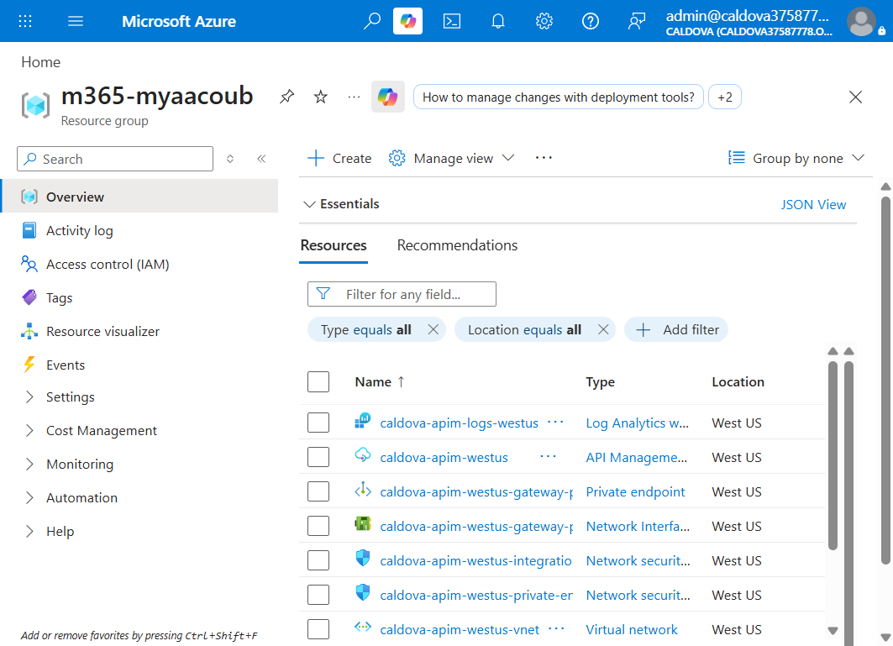
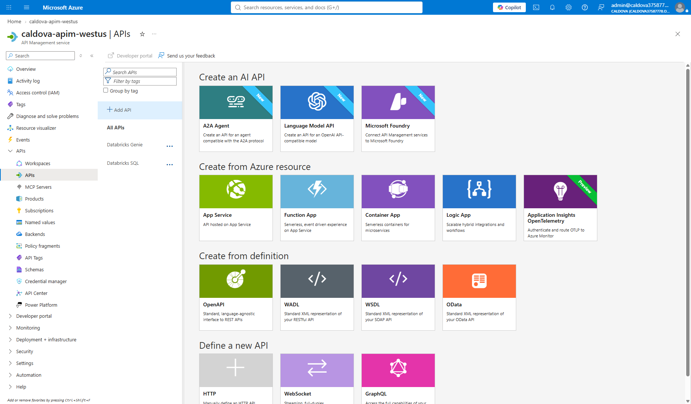
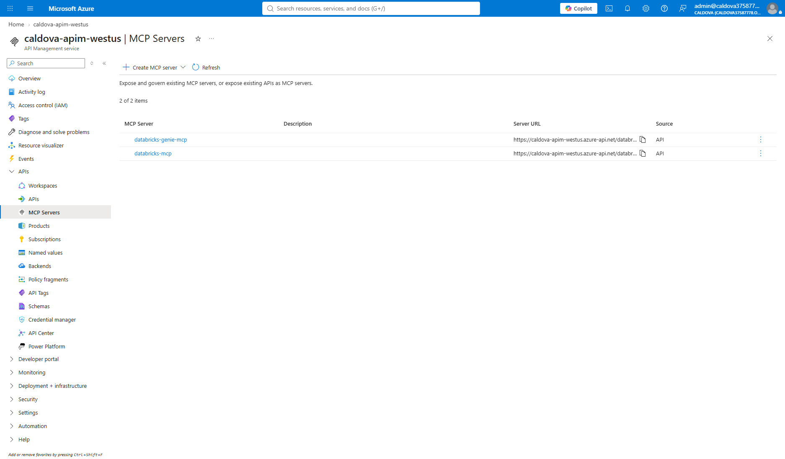
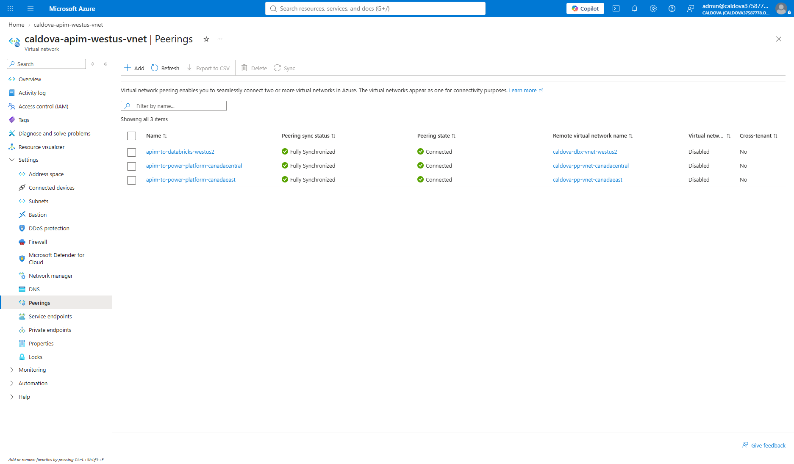
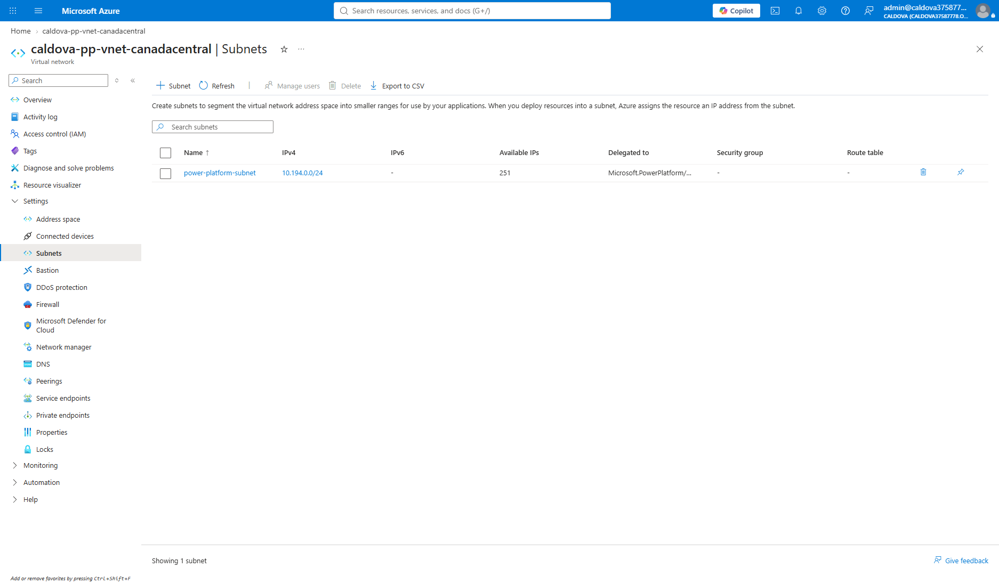
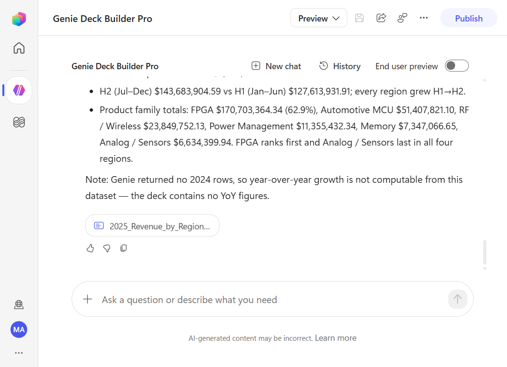
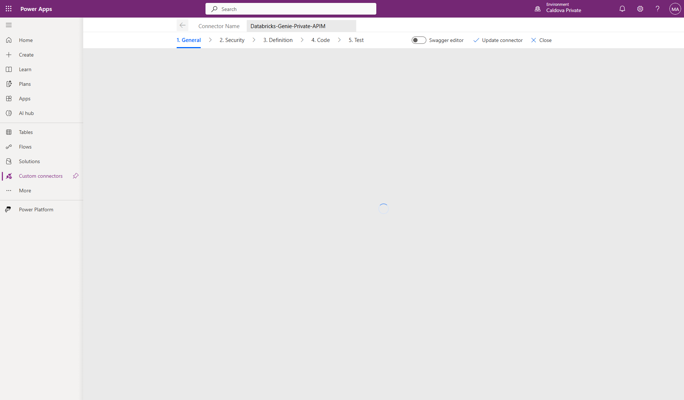

# Azure Databricks Private Agent + APIM

Private Azure Databricks fronted by API Management, surfaced to Copilot Studio and
Microsoft 365 Copilot over a fully private network path. A Copilot Studio agent asks
natural-language questions of Unity Catalog through AI/BI Genie and returns a
high-fidelity, downloadable PowerPoint deck.

Databricks and API Management both have **public network access disabled**. Nothing in
the data path traverses the public internet.

---

## Contents

- [Architecture](#architecture)
- [Current environment](#current-environment)
- [Address plan](#address-plan)
- [Repository layout](#repository-layout)
- [Deploy](#deploy)
- [Deployed resources](#deployed-resources)
  - [Azure resource group](#azure-resource-group)
  - [API Management](#api-management)
  - [Virtual network peerings](#virtual-network-peerings)
  - [Power Platform](#power-platform)
- [The Copilot Studio agent](#the-copilot-studio-agent)
  - [Agent configuration](#agent-configuration)
  - [Deck output](#deck-output)
  - [The deck skill](#the-deck-skill)
- [Why a custom connector and not an MCP server](#why-a-custom-connector-and-not-an-mcp-server)
- [Custom connector](#custom-connector)
- [Observability](#observability)
- [Key design decisions](#key-design-decisions)
- [Setup guide](#setup-guide)
- [Archived environment](#archived-environment)

---

## Architecture

```mermaid
flowchart LR
  subgraph M365["Microsoft 365 Copilot / Teams"]
    USER["User asks for a deck"]
  end

  subgraph CS["Copilot Studio agent (GitHub Copilot harness)"]
    TOOLS["4 connector tools<br/>ask / follow-up / status / result"]
    SKILL["executive-deck-builder skill"]
    PPTX["Real .pptx in sandbox"]
  end

  subgraph PP["Power Platform managed environment (canada)"]
    PPC["Canada Central VNet 10.194.0.0/16<br/>delegated subnet"]
    PPE["Canada East VNet 10.195.0.0/16<br/>delegated subnet"]
  end

  subgraph APIMNET["West US - APIM VNet 10.191.0.0/16"]
    APIMPE["Gateway private endpoint 10.191.1.4"]
    APIM["API Management StandardV2<br/>public access disabled"]
  end

  subgraph DBXNET["West US 2 - Databricks VNet 10.190.0.0/16"]
    DBXPE["databricks_ui_api +<br/>browser_authentication endpoints"]
    DBX["Databricks Premium<br/>VNet injected, SCC, public access disabled"]
    UC["Unity Catalog + SQL warehouse + Genie"]
  end

  USER --> TOOLS --> PP
  SKILL --> PPTX --> USER
  PPC <-->|"peering"| APIMNET
  PPE <-->|"peering"| APIMNET
  APIMNET <-->|"global peering"| DBXNET
  APIMPE --> APIM
  APIM -->|"managed identity"| DBXPE
  DBXPE --> DBX --> UC
```



VNet peering is not transitive, so each Power Platform VNet peers **directly** with the
APIM VNet. APIM is the only application proxy in front of Databricks, and it
authenticates with its managed identity, so no Databricks token or key is ever stored in
Power Platform.

---

## Current environment

| Setting | Value |
|---|---|
| Subscription | `cf824570-a8ba-497a-a184-0a52f1830aa9` |
| Resource group | `m365-myaacoub` |
| Tenant | `12a4b86b-e64c-43f9-af05-d9130a72dfd2` |
| Databricks | `caldova-dbx-westus2` (West US 2), public access **disabled** |
| API Management | `caldova-apim-westus` (West US), StandardV2, public access **disabled** |
| Power Platform | `Caldova Private` (`52456fcd-1d20-ecdb-aa2e-8979e3f794f5`), canada geo |
| Catalog | `caldova_dbx_westus2.arrow_semiconductor` |
| SQL warehouse | `a3c7c9526aa58992` (serverless 2X-Small, auto-stop 5 min) |
| Genie space | `01f1abe9e51e19ddbb15297aee9a5850` |
| Log Analytics | `caldova-apim-logs-westus` |

---

## Address plan

| Purpose | Region | VNet | Subnets |
|---|---|---|---|
| Databricks | West US 2 | `10.190.0.0/16` | host `10.190.1.0/24`, container `10.190.2.0/24`, private endpoints `10.190.3.0/24` |
| API Management | West US | `10.191.0.0/16` | integration `10.191.0.0/24`, private endpoints `10.191.1.0/24` |
| Power Platform | Canada Central | `10.194.0.0/16` | delegated `10.194.0.0/24` |
| Power Platform | Canada East | `10.195.0.0/16` | delegated `10.195.0.0/24` |

Both Power Platform subnets are `/24` because the enterprise policy requires each regional
subnet to expose the same usable address count. The region pair must match the environment
geo: environment `52456fcd-1d20-ecdb-aa2e-8979e3f794f5` is `canada`, so the VNets are
`canadacentral` and `canadaeast`.

---

## Repository layout

| Path | Purpose |
|---|---|
| [terraform](terraform) | VNet-injected Databricks workspace, NSGs, private DNS zone, private endpoints |
| [bicep/apim-private](bicep/apim-private) | APIM StandardV2, VNet, gateway private endpoint, peering to Databricks |
| [bicep/power-platform-private](bicep/power-platform-private) | Regional VNets, delegated subnets, peering, network-injection policy |
| [bicep/power-platform-databricks-direct](bicep/power-platform-databricks-direct) | Peerings and DNS links for the no-APIM path |
| [bicep/apim-diagnostics](bicep/apim-diagnostics) | Log Analytics workspace and APIM diagnostic settings |
| [connector](connector) | Power Platform custom connector definitions (Swagger 2.0) |
| [skills](skills) | Reusable Copilot Studio skills |
| [apim](apim) | Databricks SQL and Genie APIs, policies, MCP projection |
| [api](api) | FastAPI service that calls Databricks through APIM |
| [ui](ui) | Angular + Ionic front end |
| [foundry](foundry) | Microsoft Foundry agent provisioning |
| [databricks](databricks) | Sample dataset SQL and exploration notebook |
| [scripts](scripts) | Deployment, data-load, connector, and test helpers |
| [docs/setup-guide.md](docs/setup-guide.md) | Step-by-step guide for an existing Databricks + APIM estate |
| [old mcaps](old%20mcaps) | Archived MCAPS proof of concept, reference only |

The SQL under [databricks/sql](databricks/sql) deliberately keeps the original catalog
token, because [scripts/load-catalog-data.ps1](scripts/load-catalog-data.ps1) rewrites it
to the target catalog at run time.

---

## Deploy

```powershell
az login --tenant Caldova37587778.onmicrosoft.com
./scripts/deploy-infra.ps1 -Step all
```

Individual steps run with `-Step <name>`:

| Step | What it does |
|---|---|
| `providers` | Registers the required resource providers |
| `databricks` | Terraform apply with `lockdown=false` |
| `data` | Creates the schema and loads the dataset over the public control plane |
| `apim` | APIM with `publicNetworkAccess=Enabled`, plus both peerings |
| `powerplatform` | Power Platform VNets, peerings, DNS links, enterprise policy |
| `link` | `Enable-SubnetInjection` against the managed environment |
| `lockdown` | Terraform `lockdown=true` and APIM `publicNetworkAccess=Disabled` |

**Lockdown must run last.** Data loading and private-endpoint validation both need the
control planes reachable from the deployment host. After `lockdown`, Databricks and APIM
are only reachable from inside the peered VNets, so any later data work must run from a
host in one of those VNets.

`NoAzureDatabricksRules` is only accepted by Azure after the back-end `databricks_ui_api`
private endpoint exists, which is another reason the lockdown flip is a separate apply.

---

## Deployed resources

### Azure resource group

All resources live in a single resource group.



### API Management

Public network access is disabled; the gateway is reachable only through its private
endpoint at `10.191.1.4`.


Two APIs are published, the Databricks SQL API and the Genie API.



Both APIs are also projected as MCP servers. These are used by the Microsoft Foundry
path; they are **not** usable from Copilot Studio over the private network, for the
reason explained [below](#why-a-custom-connector-and-not-an-mcp-server).



### Virtual network peerings

The APIM VNet peers with the Databricks VNet and with both Power Platform VNets.



### Power Platform

The managed environment is linked to the network-injection enterprise policy.


Each regional VNet exposes a subnet delegated to
`Microsoft.PowerPlatform/enterprisePolicies`.




Policy resource ID:

```text
/subscriptions/cf824570-a8ba-497a-a184-0a52f1830aa9/resourceGroups/m365-myaacoub/providers/Microsoft.PowerPlatform/enterprisePolicies/caldova-pp-network-injection-canada
```

---

## The Copilot Studio agent

**`Genie Deck Builder Pro`** runs on the **GitHub Copilot harness**, which natively
creates and edits Word, Excel, PowerPoint, and PDF files in a governed sandbox. That is
what makes a real `.pptx` download possible without any additional Azure compute.

> The harness matters. An agent on the **standard** harness has no sandbox and will tell
> you it cannot create files. Create the agent from the Copilot Studio home page with the
> **New experience** toggle on. Agents on this harness consume Copilot Credits.

### Agent configuration

Four connector tools, one skill, and instructions that delegate all deck work to the
skill.


### Deck output

The agent queries Genie, writes the file, verifies it, and returns a download card.



A representative run produced a nine-slide deck with four native PowerPoint charts, a
data table, a shapes-and-connectors diagram, KPI tiles, and speaker notes on every slide:

| Region | Revenue (USD) | Share | Units | Avg selling price |
|---|---|---|---|---|
| APAC | $101,848,716.61 | 37.5% | 7,634,265 | 13.342 |
| North America | $81,655,029.21 | 30.1% | 6,088,525 | 13.402 |
| EMEA | $59,341,485.76 | 21.9% | 4,374,350 | 13.326 |
| LATAM | $28,452,604.92 | 10.5% | 2,132,707 | 13.351 |
| **Total** | **$271,297,836.50** | 100.0% | 20,229,847 | 13.411 |

The agent queried for 2024 comparatives, found none, and stated that year-over-year
growth is not computable rather than inventing it.

### The deck skill

[skills/executive-deck-builder/SKILL.md](skills/executive-deck-builder/SKILL.md) is a
portable `SKILL.md` — YAML front matter plus Markdown — that can be uploaded to any agent
on this harness. It specifies:

- 16:9 canvas, explicit placement on the blank layout, margins, and overflow caps
- A Microsoft header band, horizontal rule, and footer with slide numbers
- Native chart objects only, with chart type per purpose, axis titles, data labels, and
  number formats per unit
- Table, KPI tile, and diagram construction rules
- The nine-slide structure and assertion-style slide titles
- A verification step that reopens the saved file and asserts its contents

> The header logo is drawn programmatically from four colored squares. Replace it with
> official brand artwork for anything customer-facing; the skill already accepts a
> supplied logo image.

---

## Why a custom connector and not an MCP server

Power Platform virtual network support covers Dataverse plugins and **connectors**,
including custom connectors. It does **not** cover MCP servers.

An MCP tool added to an agent in a VNet-injected environment fails in two distinct ways,
both reproduced here:

- Authoring time: `No tools available.`
- Runtime: `that tool is not available in this chat environment`

The custom connector is the supported path to a private endpoint, so the agent uses it.
The MCP servers in APIM remain published for the Microsoft Foundry path, which reaches
them differently.

---

## Custom connector

`Databricks-Genie-Private-APIM` exposes four operations that map to the Genie
conversation lifecycle.



The connector points at the APIM host with `/databricks-genie` as its base URL.


Authentication is API key in a header. Only the parameter name is stored in the
connector; the key value lives in the connection.


The definition carries the four actions and their path parameters.


| Tool | Operation |
|---|---|
| Ask Genie (start conversation) | `POST /genie/ask` |
| Ask Genie follow-up | `POST /genie/conversations/{conversationId}/messages` |
| Get Genie message status | `GET /genie/conversations/{conversationId}/messages/{messageId}` |
| Get Genie query result | `GET /genie/conversations/{conversationId}/messages/{messageId}/result` |

Definitions live in [connector](connector). The connection uses API key auth with the
`Ocp-Apim-Subscription-Key` header. Store the key only in the connection — never in agent
instructions, environment variables, or source control.

### Connection gotchas

Two failure modes cost real time here, and both present as the same misleading message,
`Let's get you connected first`:

1. **Duplicate connector registrations.** If the agent's tools end up split across two
   connectors, authorizing one group leaves the other `Stale` permanently. The connection
   manager must show a **single** row covering all four tools.
2. **Every new conversation starts `Stale`.** Open the card's connection-manager link,
   choose **Review**, **Submit**, then **Retry in that same conversation**. Starting a new
   conversation resets it.

Neither is a network or key problem. APIM returned `200` throughout.

---

## Observability

APIM diagnostics flow to the `caldova-apim-logs-westus` Log Analytics workspace.

This deployment writes to the legacy **`AzureDiagnostics`** table, not
`ApiManagementGatewayLogs`. Querying the resource-specific table returns zero rows and
looks like there is no traffic. Use:

```kusto
AzureDiagnostics
| where ResourceProvider == "MICROSOFT.APIMANAGEMENT"
| project TimeGenerated, Category, method_s, url_s, responseCode_d, backendResponseCode_d
| order by TimeGenerated desc
```

A full deck run produces 16 calls, 3 `POST` and 13 `GET`, all `200` at both APIM and the
Databricks backend.

---

## Key design decisions

- **Peering is not transitive.** Each Power Platform VNet peers directly with the APIM
  VNet, and separately with the Databricks VNet for the no-APIM path.
- **MCP servers are not covered by Power Platform VNet support.** Reaching a private
  endpoint from Copilot Studio requires a custom connector.
- **The enterprise policy geo must match the environment geo**, which fixes the Azure
  region pair for the delegated subnets.
- **APIM authenticates to Databricks with a managed identity**, so no Databricks token or
  key is stored in Power Platform.
- **The GitHub Copilot harness is required for file creation.** The standard harness has
  no sandbox.
- **There is no server-side PowerPoint Designer API.** Designer is client-side only,
  reachable through the PowerPoint JavaScript add-in API, VBA, or COM. High fidelity comes
  from slide masters, explicit layout, and native chart objects.

---

## Setup guide

[docs/setup-guide.md](docs/setup-guide.md) walks through connecting a Power Platform
managed environment to an **existing** private Databricks and API Management estate:
region and geo validation, delegated VNets, peering, DNS, the enterprise policy, granting
APIM access to Databricks, the custom connector, and the agent.

---

## Archived environment

[old mcaps](old%20mcaps) holds the original `infra`, `docs`, and README from the MCAPS
subscription. Those Azure resources have been deleted; the folder is retained for history
and is not wired into any deployment path.
