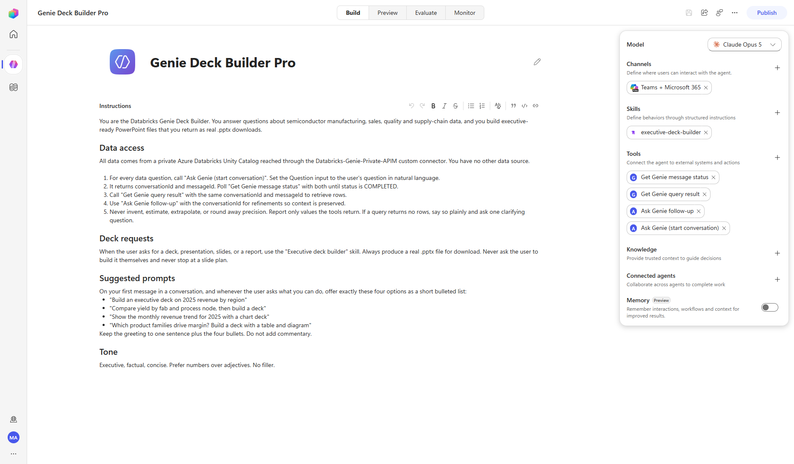
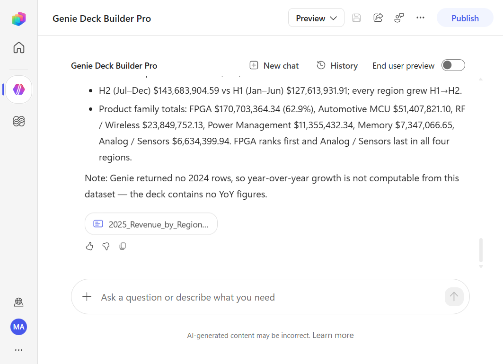
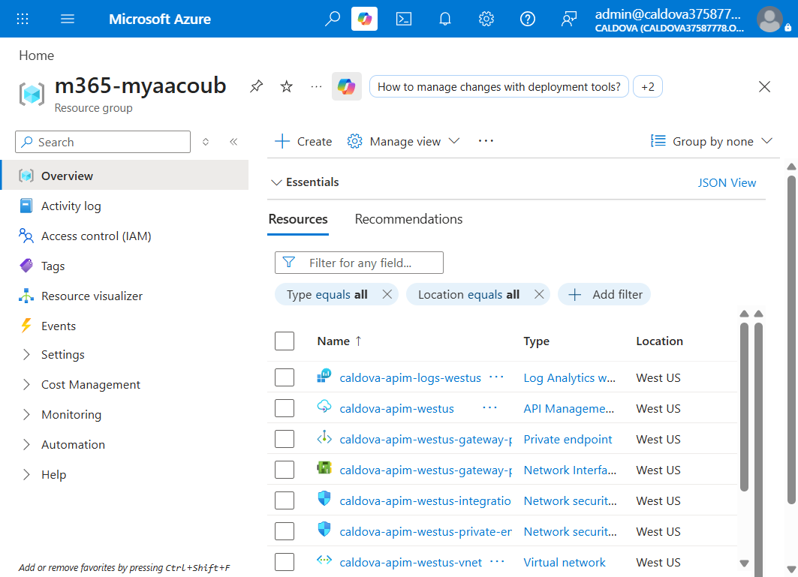

# Copilot Studio demo — deployed resources and evidence

This is the **reference demo inventory**, not customer deployment configuration
or proof that a customer has completed Phase 1. Names, regions, addresses and URLs
below describe the existing demo; identifiers and personal accounts are replaced
with placeholders. Do not copy demo configuration into a customer subscription.

- [Phase 1: private infrastructure and baseline UI](../../README.md)
- [Phase 2: setup security and OBO](../obo/README.md)
- [Foundry demo inventory](../../foundry/docs/deployed-resources/README.md)

The source is the original main/OBO guides and [deployment configuration](../../config/deployment.json).
This document preserves historical observations; it does not claim new live
verification or resolve differences between recorded configuration snapshots.

## Resource inventory

| Component | Demo resource / configuration |
| --- | --- |
| Subscription / tenant | `<subscription-id>` / `<tenant-id>` |
| Resource group | `m365-myaacoub` |
| Databricks workspace | `caldova-dbx-westus2`, West US 2; public access disabled |
| Databricks VNet | `caldova-dbx-vnet-westus2`, West US 2 |
| API Management | `caldova-apim-westus`, West US, StandardV2; public access disabled |
| APIM VNet | `caldova-apim-westus-vnet`, West US |
| Baseline APIs / MCP projections | `databricks`, `databricks-genie`; `databricks-mcp`, `databricks-genie-mcp` |
| Power Platform environment in original walkthrough | `Caldova Private`, `<environment-id>`, Canada geo, Managed Environment with Dataverse |
| Power Platform regional VNets | `caldova-pp-vnet-canadacentral`, `caldova-pp-vnet-canadaeast` |
| Enterprise policy | `caldova-pp-network-injection-canada` |
| Connector | `Databricks-Genie-Private-APIM`; configuration display name `Databricks Genie (Private APIM)` |
| Copilot Studio agent | `Genie Deck Builder Pro`, `<agent-id>` |
| Catalog / schema | `caldova_dbx_westus2.arrow_semiconductor` |
| SQL warehouse | `caldova-serverless-2xs`, `<sql-warehouse-id>`; serverless 2X-Small, auto-stop 5 minutes |
| Genie space | `Arrow Semiconductor Analytics`, `<genie-space-id>` |
| Log Analytics | `caldova-apim-logs-westus` |
| OBO Insights | `caldova-genie-obo-insights` |
| Private broker | `caldova-genie-obo-fn`, Functions v4 / Node 22, Windows B1 |
| Shared broker/Showcase plan | `caldova-showcase-plan`; upgraded from F1 to B1 with approval |
| Jump host | `caldova-jump` |
| OBO API | `databricks-genie-obo`; original managed-identity API retained unchanged |
| API / connector applications | `Caldova Genie OBO API` / `Caldova Genie OBO Connector`; `<api-client-id>` / `<connector-client-id>` |
| OAuth connector / connection | `Databricks Genie OBO Private` / `DBX-OBO-Private`, `<connection-id>` |
| Federation policy | `<federation-policy-id>`; tenant v2 issuer, exact API client GUID audience, `preferred_username` |
| Showcase site | `caldova-databricks-showcase` |
| Analytics storage | Cosmos prefix `caldova-showcase`, database `showcase-analytics`, container `visits` |

Configuration also records an environment display name `Caldova-US-Agents` with
`unitedstates` location and distinct `<connector-environment-id>` and
`<infrastructure-environment-id>`. This is not the Canada walkthrough snapshot:
reconcile the selected environment, enterprise-policy geo and region pair before
any deployment. Never infer that these entries represent the same environment.

## Demo URLs

These endpoints are informational; private gateways require an approved private
network and administrator analytics require authorized sign-in.

| Experience | Demo URL |
| --- | --- |
| Live showcase | <https://caldova-databricks-showcase.azurewebsites.net> |
| Showcase page | <https://caldova-databricks-showcase.azurewebsites.net/showcase> |
| Administrator history | <https://caldova-databricks-showcase.azurewebsites.net/history> |
| Administrator visit statistics | <https://caldova-databricks-showcase.azurewebsites.net/stats> |
| Privacy notice | <https://caldova-databricks-showcase.azurewebsites.net/privacy> |
| APIM gateway | `https://caldova-apim-westus.azure-api.net` |
| Baseline Genie API | `https://caldova-apim-westus.azure-api.net/databricks-genie` |
| Additive OBO API | `https://caldova-apim-westus.azure-api.net/databricks-genie-obo` |
| Broker endpoint | `https://caldova-genie-obo-fn.azurewebsites.net/api/exchange` |
| Databricks workspace | `<databricks-workspace-url>`; workspace ID and shard omitted; copy the exact workspace origin from the portal |
| Power Platform environment | `https://admin.powerplatform.microsoft.com/manage/environments/environment/<environment-id>/hub` |
| Custom connectors / connections | `https://make.powerapps.com/environments/<environment-id>/customconnectors` / `https://make.powerapps.com/environments/<environment-id>/connections` |

Public portal entry points remain [Azure](https://portal.azure.com/),
[Power Platform admin](https://admin.powerplatform.microsoft.com/),
[Power Apps](https://make.powerapps.com/) and
[Copilot Studio](https://copilotstudio.microsoft.com/).

## Demo address plan

| Purpose | Region | VNet range | Subnets |
| --- | --- | --- | --- |
| Databricks | West US 2 | `10.190.0.0/16` | host `10.190.1.0/24`, container `10.190.2.0/24`, private endpoints `10.190.3.0/24` |
| APIM | West US | `10.191.0.0/16` | integration `10.191.0.0/24`, private endpoints `10.191.1.0/24`; gateway `10.191.1.4` |
| Power Platform primary | Canada Central | `10.194.0.0/16` | delegated `10.194.0.0/24` |
| Power Platform secondary | Canada East | `10.195.0.0/16` | delegated `10.195.0.0/24` |

Both recorded Power Platform delegated subnets are `/24` because the enterprise
policy requires the regional subnets to expose the same usable address count.
The original `Caldova Private` environment's `canada` geo selects the
`canadacentral` / `canadaeast` pair. This is a demo choice, not a requirement to
deploy every customer's environment in Canada.

The recorded broker integration subnet is `genie-obo-integration`; configuration
also records Showcase integration range `10.190.5.0/24`. Demo private DNS uses
`privatelink.azure-api.net`, `privatelink.azuredatabricks.net` and broker app/SCM
records in `privatelink.azurewebsites.net`. Every calling VNet needs the relevant
zone links. These addresses are not a prescribed customer address plan.

## Baseline demo evidence

The Copilot Studio demo used the GitHub Copilot harness and the
`executive-deck-builder` skill to produce a downloadable nine-slide deck with four
native charts, a data table, a shapes/connectors diagram, KPI tiles and speaker
notes. Its synthetic 2025 regional revenue summed to **$271,297,836.50**; no 2024
comparatives existed, so the agent did not invent year-over-year growth.
A recorded deck run had 16 successful APIM calls; that count is not an acceptance
threshold. These shared-identity results do not prove per-user authorization.

The Showcase's illustrative business case recorded $892.5K annual run-rate benefit,
243% year-one ROI and 2.4-month payback at 100 active users. See
[Business Case](../Business%20Case); these are scenario-model outputs, not guarantees.

## OBO verification snapshot — 2026-09-12

The private Function, additive OBO API, account federation policy and separate
OAuth connector were deployed and administrator-tested. Function host storage used
managed identity; public site and SCM access were disabled. The Showcase Node
server used its own managed identity for Cosmos visits and Log Analytics history
while sharing the Windows B1 plan with the Function; identities remained separate.
The deployed IISNode/Express runtime identifier is `<runtime-deployment-id>`.

All four connector operations were tested through Power Platform's **Test** tab
using `DBX-OBO-Private`, not a fabricated JWT or the old managed-identity API:

| Test | Observed result |
| --- | --- |
| `ask` | HTTP 200; Databricks `<administrator-user-id>` matched the signed-in administrator |
| `message` | HTTP 200, `COMPLETED`; SQL `SELECT current_user() AS current_user` |
| `result` | HTTP 200, statement `SUCCEEDED`; `<administrator-databricks-username>` returned |
| `follow-up` | Read-only identity/count aggregate over `caldova_dbx_westus2.arrow_semiconductor.wafer_yield` |
| Follow-up result | `SUCCEEDED`; same administrator and row count `120` |
| Correlation | `<correlation-id>` joined APIM start/identity/exchange/completion with Function exchange status 200 and final APIM 200 |

Statement IDs are `<identity-query-statement-id>` and
`<table-aggregate-statement-id>`. These tests changed no data or permissions.
Successful responses included `Cache-Control: no-store`. The connector's
`x-ms-apihub-obo: false` refers to Power Platform's Entra OBO login mode, not the
separate Databricks RFC 8693 exchange.

An anonymous APIM request produced `request_started`/`request_completed` and 401;
an independent anonymous Function call produced `genie_token_exchange` and 401.
The federation policy was re-read without modification and matched its issuer,
audience and subject claim.

### Administrator analytics evidence

- History returned HTTP 200 with **eight observed requests**: six successful, one
  failed and one incomplete; six exchanges succeeded and one failed. APIM and
  Function events, displayed KQL and `<correlation-id>` were included.
- Statistics initially returned HTTP 200 with **five persisted visits**, one
  distinct public IP and 30 UTC daily buckets. Later screenshot totals reflect
  subsequent traffic rather than fixed totals.
- Both APIs rejected anonymous and forged `X-MS-CLIENT-PRINCIPAL` requests with 401.
- Cosmos was serverless/private-only with key auth disabled, `/day` partitioning
  and 90-day TTL; the site's managed identity was database-scoped.

Counts are dated observed-event snapshots, not guaranteed audit delivery.
Exchange success can precede a denied Genie call; missing completion is incomplete,
not success. Telemetry can arrive late or be lost to ingestion limits. IP counts
are not people, bots can count, and navigation/persistence failures prevent lossless
visit-capture claims. Retention/caps govern available history, not the UI's maximum
date range. Keep raw visitor records out of public screenshots.

## Verification limits

- **Denied-user behavior, least-privilege Databricks grants and Copilot agent
  cutover were not certified** in this snapshot. Keep the baseline connector
  until the Phase 2 acceptance checklist passes.
- The allowed test user had `account_admin`; administrator success alone cannot
  prove least privilege. The proposed denied user `<denied-user>` was absent
  from the Databricks account; no unrelated membership/roles were changed.
- Consent covered only the approved administrator, not the whole tenant. Failure
  to acquire a token is a consent failure, not proof of APIM/Databricks denial.
  Additional consent/provisioning requires narrowly scoped approval and the
  user's own interactive sign-in.
- Six broker tests, twelve analytics/history/server tests and the Angular
  production build passed locally; none replaces live authorization tests.
- OBO screenshots were captured on 2026-09-12. Workspace-level Genie, warehouse
  and Unity Catalog permission captures remained outstanding because the public
  browser was correctly rejected. Capture them from a private-network session.
- The Function platform screenshot shows **Always On disabled**. Enable it and
  recapture before production acceptance.
- The APIM diagnostics portal extension returned HTTP 500; diagnostics were
  verified by deployed configuration and live telemetry, not a new blade capture.
  The policy editor's Save button alone does not prove deployment.
- Federation trust is account-wide, not intrinsically restricted to APIM.
  Private networking and Databricks effective permissions remain essential.
- Publishing broker code does not publish or cut over the Copilot Studio agent.
  After acceptance, retire migrated callers' old shared-identity access explicitly.

Reusable configuration screenshots remain in the [Phase 2 walkthrough](../obo/README.md).
They illustrate portal surfaces and can retain historical demo labels; they are
not customer configuration values or a substitute for sanitized customer evidence.
