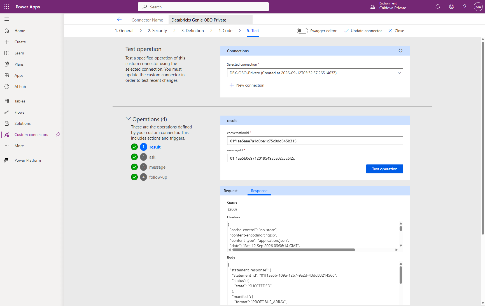
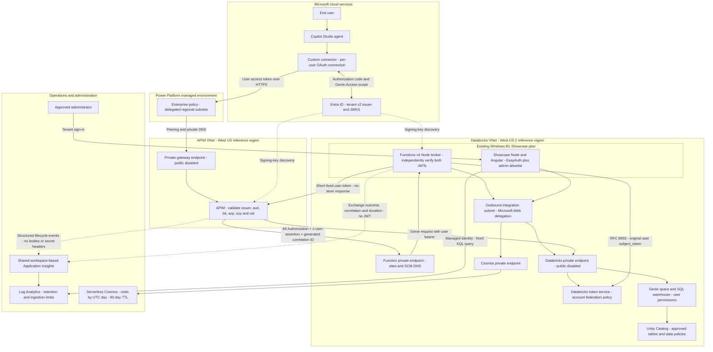
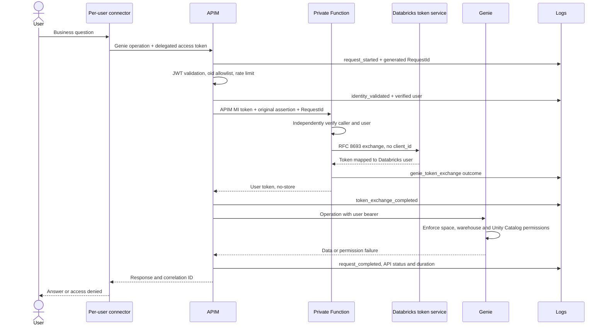
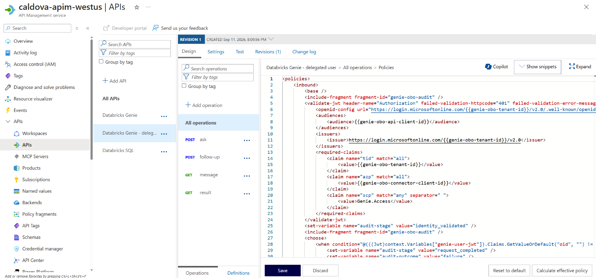

# Private Genie with delegated user identity

This guide explains how to replicate the Copilot Studio -> private APIM -> private Azure Function -> Databricks Genie user-token flow. It covers trust, networking, configuration, permissions, request history and operational verification.

> **Current status:** The private Function, additive APIM OBO API, Databricks account federation policy and separate OAuth custom connector are deployed. All four connector operations passed live tests using the administrator's OAuth connection. Databricks returned the administrator's identity from `current_user()` and a successful table aggregate. APIM and Function success events share correlation IDs in Log Analytics. Showcase statistics and per-request history APIs are now deployed and administrator-tested; anonymous and forged-identity requests return 401. Denied-user behavior, least-privilege Databricks grants and agent cutover are **not yet certified**. The original managed-identity API remains unchanged and does not prove per-user authorization.

## Deployment evidence

Verified on 2026-09-12:

| Component | Configuration or evidence |
| --- | --- |
| Private Function | `caldova-genie-obo-fn`, Functions v4 / Node 22, existing Windows B1 Showcase plan; managed-identity host storage; public site and SCM disabled |
| API resource app | `bdd127ff-fd4c-45f5-b553-ff77a7755161`, v2 access tokens, delegated `Genie.Access` scope |
| OAuth connector app | `8127fb92-0641-4f6e-9d6e-f508e18e9606`, confidential client; consent granted only for the approved administrator |
| Federation policy | `54c34637-fef5-4fbf-8136-8c2aa6b529ea`, tenant v2 issuer, exact API GUID audience, `preferred_username` subject |
| Power Platform connector | `Databricks Genie OBO Private`, environment `52456fcd-1d20-ecdb-aa2e-8979e3f794f5`; generated per-connector redirect registered in Entra |
| Trace ingestion | APIM anonymous request recorded `request_started` and `request_completed` with correlation `83cc15f7-5d18-43ae-ab3b-c8371ef502fa`, final status 401; a separate Function anonymous call recorded `genie_token_exchange`, status 401 |
| Existing Showcase | IISNode/Express runtime deployed as `d973109ccf0e4a8b8494a6dd892f8e96`; statistics and history returned HTTP 200 for the signed-in administrator |

### Live delegated-user test

The `DBX-OBO-Private` connection (`8a725c2c16be49ecbb14a325aadafe11`) authenticated as the approved administrator. Tests ran through Power Platform's custom-connector Test tab, not a locally fabricated token or the existing managed-identity API.

| Test | Observed result |
| --- | --- |
| Start conversation (`ask`) | HTTP 200; Databricks `user_id` was `142225456316102`, matching the administrator's account |
| Poll (`message`) | HTTP 200; `COMPLETED`; generated SQL was `SELECT current_user() AS current_user` |
| Query result (`result`) | HTTP 200; statement `SUCCEEDED`; underlying result row was `admin@caldova37587778.onmicrosoft.com` |
| Follow-up (`follow-up`) | HTTP 200; read-only `SELECT current_user() AS verified_user, COUNT(*) AS row_count FROM caldova_dbx_westus2.arrow_semiconductor.wafer_yield` |
| Follow-up query result | Statement `SUCCEEDED`; underlying row contained administrator username and row count `120` |
| Cross-service correlation | Start request `d9d8436b-e6c6-421b-976e-5c56df09c8d9` has APIM start/identity/exchange/completion events and Function exchange status 200; final APIM status 200 |

The identity query statement was `01f1ae5a-f0bb-10e6-b9eb-77e44bdb2d95`; the table aggregate statement was `01f1ae5b-109a-12b7-9a2d-43dd83214566`. No data or permissions were modified by these tests. Successful responses included `Cache-Control: no-store`. The Power Platform header `x-ms-apihub-obo: false` concerns its own Entra OBO login mode; this connector uses authorization-code login followed by the separate Databricks RFC 8693 exchange in the Function.



Use [provision-genie-obo-identity.ps1](../../scripts/provision-genie-obo-identity.ps1), [provision-genie-federation.ps1](../../scripts/provision-genie-federation.ps1), [deploy-genie-obo-code.ps1](../../scripts/deploy-genie-obo-code.ps1) and [create-genie-obo-connector.ps1](../../scripts/create-genie-obo-connector.ps1) for the corresponding setup steps. The connector script keeps its six-month secret in memory and registers the service-generated redirect; it does not create an authenticated user connection. Track credential expiry and arrange rotation before expiration. The deployment script submits a managed VM run command; verify its final instance-view execution status before treating deployment as complete.

Create OAuth connections in an external browser: VS Code's integrated browser blocks pop-ups by design. Allow Power Apps consent pop-ups in the external browser if needed and complete authentication there. The administrator connection is now verified. A separate denied-user connection and an appropriately scoped non-administrator test are still required before authorization sign-off. Keep agent tools bound to the existing connector until those checks pass. Do not expose access tokens in screenshots or logs.

The allowed administrator already has the Databricks `account_admin` role. A successful administrator request alone cannot prove least-privilege Unity Catalog grants. The denied user `myaacoub@Caldova37587778.onmicrosoft.com` was not found in the Databricks account; no account membership or unrelated roles were changed. Allowed-user identity mapping and table access are verified above, but genuine denied-user behavior and least-privilege grants remain unverified. Account-wide federation trust is not restricted to APIM by itself; network controls and Databricks permissions remain essential.

### Verification limits

- Local verification: six broker tests and twelve analytics/history/server tests pass. The Angular production build passes. These do not replace live authorization tests.
- The account federation policy was re-read without modification and matches the configured issuer, audience and subject claim.
- Consent is currently scoped to the administrator. A second user who cannot acquire the API token demonstrates a consent failure, not APIM or Databricks denial. Any additional consent or account provisioning needs an explicit, narrowly scoped approval and that user's interactive sign-in.
- The connector screenshot above is actual test evidence. The supplied APIM policy-editor screenshot is included below. Other Azure configuration screenshots remain outstanding; configuration tables and source links are not substitutes for those screenshots.
- Publishing this code does not publish a changed Copilot Studio agent. Agent cutover remains blocked on the acceptance checklist below.

## URLs

| Experience | Reference URL |
| --- | --- |
| Showcase | https://caldova-databricks-showcase.azurewebsites.net/showcase |
| Administrator request history | https://caldova-databricks-showcase.azurewebsites.net/history |
| Administrator visit statistics | https://caldova-databricks-showcase.azurewebsites.net/stats |
| Privacy notice | https://caldova-databricks-showcase.azurewebsites.net/privacy |
| New private API | `https://caldova-apim-westus.azure-api.net/databricks-genie-obo` |

Replace reference names, identities, addresses and regions with customer-approved values. See the [existing private network guide](../setup-guide.md) for the baseline deployment.

## Authentication model

"OBO" describes acting for the end user. The actual exchange uses **Databricks OAuth token federation, RFC 8693**, not the Microsoft Entra OBO grant. Power Platform obtains a delegated Entra token for the dedicated API; the Function exchanges it at the Databricks workspace `/oidc/v1/token` endpoint.

APIM's managed identity authenticates APIM **to the Function only**. The original user's assertion determines the Databricks identity. The exchange omits `client_id`, which would select service-principal federation. There is no PAT, application-identity fallback or shared token cache.

## Architecture

The identity path below is deployed and administrator-tested. The Showcase Node server now queries request history and captures visits in Cosmos using its own managed identity. It shares the existing Windows B1 plan with the private Function; these are separate applications and identities.



VNet integration is outbound; private endpoints are inbound. The Function needs both. Entra discovery and Azure Monitor ingestion use their own service endpoints; the diagram does not imply that these are private links. Link private DNS zones to each calling VNet, not just the endpoint VNet.



## Prerequisites

Obtain Azure deployment and role-assignment permissions, Entra registration/consent permissions, Power Platform environment administration, Databricks **account administrator** privileges for federation, and workspace/data-owner privileges for grants. Azure Contributor alone does not confer these other roles.

The reference plan was upgraded from F1 to B1 with explicit approval. Reuse the existing compatible Windows plan in the same region; do not silently create another plan. Budget for private endpoints, Functions storage, Cosmos requests/storage and telemetry. No fixed price is implied.

Power Platform must use a Managed Environment with Dataverse and a linked enterprise policy matching its geo. Custom connectors support the private path described here; do not assume Copilot Studio MCP authoring can access private APIM.

| Parameter | Reference / source |
| --- | --- |
| Tenant UUID | `12a4b86b-e64c-43f9-af05-d9130a72dfd2` |
| Resource group | `m365-myaacoub` |
| API client GUID | Dedicated resource app's application ID, not object ID |
| Connector client GUID | Separate confidential OAuth client |
| APIM principal object ID | APIM > Managed identities > System assigned |
| Allowed user object ID | `715bb744-31d0-4f76-ac85-7193bcf5a4eb` |
| Databricks account UUID | `b8f092a5-ba0e-4e36-b3c7-1f6921fb14c0`, from account console URL |
| Workspace URL | `https://adb-7405616934814750.10.azuredatabricks.net` |
| Genie space | `01f1abe9e51e19ddbb15297aee9a5850` |
| SQL warehouse | `a3c7c9526aa58992` |
| Approved data scope | `caldova_dbx_westus2.arrow_semiconductor`, only required tables |
| Workspace / Insights | `caldova-apim-logs-westus` / `caldova-genie-obo-insights` |

### Deployment order

1. Confirm the existing private network baseline, Windows B1 plan, private-endpoint subnet, and `genie-obo-integration` subnet. The Function template references existing subnets; it does not create them. Verify address space, delegation, peering and DNS before proceeding.
2. Provision the dedicated API and connector registrations with [the identity script](../../scripts/provision-genie-obo-identity.ps1). Record the returned identifiers and retain principal-scoped consent for the approved test user.
3. Deploy [observability](../../bicep/genie-obo/observability.bicep) against the existing workspace, then [the private Function infrastructure](../../bicep/genie-obo/main.bicep). Review the reference parameters and run compilation, ARM validation and what-if before deployment.
4. Publish the broker with [the private deployment script](../../scripts/deploy-genie-obo-code.ps1) from the approved Windows jump VM. `-PrepareOnly` compiles, tests and validates packaging without a cloud deployment. Confirm final run-command execution and Kudu success, private anonymous rejection and public access denial. Deallocate a temporarily started VM afterward.
5. Create or verify the account-wide policy with [the federation script](../../scripts/provision-genie-federation.ps1); `-ReadOnly` verifies an existing trust without changes. Provision and grant only approved users and tables as described below.
6. Validate and deploy [the additive APIM template](../../apim/obo.bicep) using [its reference parameters](../../apim/obo.reference.bicepparam). Existing workspace and Genie named values must already exist. Do not replace the old API.
7. Create [the separate OAuth connector](../../scripts/create-genie-obo-connector.ps1), register its generated redirect, then authenticate the test user's connection in an external browser. `-DefinitionOnly` emits the Swagger without creating credentials or cloud resources. On rerun, the script reuses a connector by display name; it is not a full configuration-drift reconciler or secret-rotation tool.
8. Run the acceptance checklist, retain sanitized correlation evidence, and only then bind and publish all four agent actions with end-user credentials. Deploying the analytics server is a separate operation, not a prerequisite for the OBO exchange or direct Log Analytics queries.

## 1. Entra registrations

1. Create a single-tenant resource application. Under **Expose an API**, use `api://<api-client-id>` and an administrator-consented delegated scope `Genie.Access`.
2. Set `api.requestedAccessTokenVersion` to `2`. The v2 access token audience must equal the API's client **GUID**; the requested scope is `api://<api-client-id>/Genie.Access`.
3. Create a separate single-tenant confidential connector client, add the delegated API permission, and grant administrator consent under customer policy.
4. Add the exact **Web redirect URI generated by the saved custom connector** to this client. Do not assume an older generic redirect URI applies.
5. Put its short-lived client secret directly in the connector configuration, never source/screenshots. Document ownership, expiry and rotation.
6. Confirm access tokens contain `preferred_username` matching the Databricks username. Test B2B guests explicitly; email, UPN and guest usernames can differ. Never use an ID token in place of the API access token.

## 2. Databricks account policy and permissions

In the account console, open **Security > Authentication > Federation policies > Create policy**. Configure:

| Field | Value |
| --- | --- |
| Issuer | `https://login.microsoftonline.com/<tenant-id>/v2.0` |
| Audiences | Dedicated API client GUID |
| Subject claim | `preferred_username` |
| Signature validation | Issuer discovery; explicit JWKS only if required |

This is an account-wide federation policy, **not** a service principal's Credentials & secrets policy. Trust only an IdP controlled by the organization. The trust can permit matching tokens to be exchanged outside APIM wherever network access allows; APIM's allowlist is not the only authorization boundary.

Provision the allowed user in the account/workspace, grant required SQL entitlements, **CAN USE** on the warehouse and minimum Genie-space access. Grant only `USE CATALOG`, `USE SCHEMA`, and `SELECT` on approved tables. Audit inherited groups, ownership and administrator rights before claiming a second user is denied. Do not revoke unrelated grants blindly.

```sql
GRANT USE CATALOG ON CATALOG `<catalog>` TO `<approved-principal>`;
GRANT USE SCHEMA ON SCHEMA `<catalog>`.`<schema>` TO `<approved-principal>`;
GRANT SELECT ON TABLE `<catalog>`.`<schema>`.`<table>` TO `<approved-principal>`;
```

No row filters or column masks are created by the broker. Configure and test them in Unity Catalog where required. OAuth `all-apis` does not grant table privileges. Reference acceptance users: allow `admin@Caldova37587778.onmicrosoft.com`, deny `myaacoub@Caldova37587778.onmicrosoft.com`.

## 3. Private Azure Function configuration

Source: [broker](../../functions/genie-token-exchange/src/broker.ts), [HTTP function](../../functions/genie-token-exchange/src/functions/exchange.ts), [host logging](../../functions/genie-token-exchange/host.json).

1. Create a Windows Function App on the existing compatible plan, Functions v4, Node 22 or supported newer runtime, 64-bit, Always On, HTTPS only, TLS 1.2+, and FTPS disabled.
2. Enable managed identity and configure supported Functions host storage with least privilege. Storage must remain reachable after lockdown; Cosmos is not Functions host storage.
3. Under **Networking**, configure outbound VNet integration with a `Microsoft.Web/serverFarms` delegated subnet. Create an inbound private endpoint for `sites`, with app and SCM DNS records in `privatelink.azurewebsites.net`. Link APIM and deployment VNets. Disable public access.
4. Verify private Databricks resolution plus outbound Entra discovery/JWKS and Monitor reachability.
5. Configure these settings through secured automation. Keep credentials hidden in screenshots.

| Setting | Value |
| --- | --- |
| `FUNCTIONS_EXTENSION_VERSION` | `~4` |
| `FUNCTIONS_WORKER_RUNTIME` | `node` |
| `WEBSITE_NODE_DEFAULT_VERSION` | At least `~22`, compatible with selected runtime |
| `ENTRA_TENANT_ID` | Tenant UUID |
| `ENTRA_API_CLIENT_ID` | Dedicated API client GUID |
| `BROKER_AUDIENCE` | API client GUID for v2 access tokens; APIM requests resource `api://<api-client-id>`, but that URI is not the v2 token's `aud` |
| `APIM_PRINCIPAL_ID` | APIM system-assigned principal object ID |
| `ALLOWED_CLIENT_IDS` | Connector client GUID, explicitly approved list only |
| `DATABRICKS_WORKSPACE_URL` | Fixed `https://adb-<id>.<suffix>.azuredatabricks.net` origin |
| `APPLICATIONINSIGHTS_CONNECTION_STRING` | Shared workspace-based Insights connection string |
| `AzureWebJobsStorage` configuration | Supported identity-based host-storage configuration or secured connection setting |

The Functions HTTP trigger is host-level `anonymous` because application code validates both the APIM MI JWT and the user assertion. It is **not anonymous business access**. Never remove custom validation or expose the broker publicly.

```powershell
npm ci --prefix functions/genie-token-exchange
npm test --prefix functions/genie-token-exchange
```

Publish `host.json`, package metadata, compiled `dist/src` and production dependencies from a machine able to reach private SCM. Exclude local settings and tests. A direct call without both valid tokens must return 401, not a token.

### Function execution, step by step

The Function is a small security broker, not a Genie proxy or an agent. It never receives the question body, runs SQL, chooses tables or grants access. APIM retains the original operation and body while the broker returns a Databricks user access token. The broker uses `jose` for cryptographic JWT verification and the Azure Functions Node programming model for HTTP hosting.

1. **Load configuration once per worker.** The HTTP handler lazily creates the broker from application settings. Missing settings fail closed with `503 broker_unavailable`. The workspace is a fixed HTTPS Azure Databricks origin: embedded credentials, custom ports, query strings, fragments and non-root paths are rejected. No request can select an arbitrary token-service URL.
2. **Require two independent tokens.** `Authorization: Bearer <APIM-MI-token>` authenticates the calling service. `x-user-assertion: <original-Entra-user-token>` carries the delegated user. Empty tokens or tokens longer than 32,768 characters are rejected. A Function key is not substituted for either identity.
3. **Verify the APIM caller.** The broker obtains tenant signing keys from Entra JWKS, with a five-second discovery timeout. It allows RS256 only, verifies the signature, configured audience and tenant issuer, and requires `exp`, `iat`, `nbf`, `tid` and `oid`. The caller object ID must equal `APIM_PRINCIPAL_ID`; a caller token containing a delegated `scp` is rejected. Tenant v1 and v2 caller issuers are supported, but the audience still must match `BROKER_AUDIENCE` exactly.
4. **Independently verify the end user.** The user token must have the tenant v2 issuer, dedicated API GUID audience, valid signature/time claims and required `tid`, `oid`, `azp`, `scp` and `preferred_username`. The authorized client must be in `ALLOWED_CLIENT_IDS`; scope must include `Genie.Access`; application-only tokens and empty usernames/object IDs are rejected. APIM's earlier validation is not taken on trust. The broker does not duplicate APIM's single-user allowlist: APIM enforces that policy, while the broker restricts who may call it and which delegated tokens may be exchanged.
5. **Exchange the unchanged assertion.** The broker POSTs form-encoded RFC 8693 parameters to the private workspace's `/oidc/v1/token`. Redirects are forbidden and the exchange has a ten-second timeout. There is no retry loop, refresh-token flow, PAT, client secret or service-principal fallback in this broker. Databricks independently verifies its federation policy and maps `preferred_username` to the Databricks user.
6. **Validate the token-service response.** The broker requires a nonempty access token without CR/LF, a Bearer token type and a positive finite numeric `expires_in`. It returns only these three fields. Reported expiry is the smaller of the Databricks lifetime and the remaining user assertion lifetime; this does not alter or revoke the lifetime encoded in the Databricks token itself. APIM uses it for the current request and does not cache it.
7. **Finish with a sanitized audit event.** A `finally` block logs the outcome even when validation, configuration or exchange fails. It includes correlation ID, invocation ID, status, code and elapsed milliseconds, but no tokens, username, request body or upstream error text. APIM supplies verified identity in its separate events; the dashboard joins by correlation ID.

The outgoing form has this shape. Angle-bracket values below are placeholders, never log values:

```text
POST https://<workspace>/oidc/v1/token
Content-Type: application/x-www-form-urlencoded

grant_type=urn:ietf:params:oauth:grant-type:token-exchange
subject_token_type=urn:ietf:params:oauth:token-type:jwt
subject_token=<original signed Entra user access token>
scope=all-apis
```

The actual form is URL-encoded by `URLSearchParams`. **`client_id` is intentionally absent**: this is account-wide user federation, not service-principal federation. `all-apis` is an OAuth scope, not a Unity Catalog grant. Genie-space permissions, SQL warehouse access and table/row/column authorization are still enforced for the mapped user by Databricks.

### Errors and operational boundaries

| Function result | Cause | APIM behavior |
| --- | --- | --- |
| `200` with user token | Both JWTs and exchange response passed checks | Replace backend Authorization and call Genie |
| `401 invalid_token` | Missing, malformed, expired or untrusted caller/user token; wrong identity/client/scope | Return 403 for broker identity rejection; do not call Genie |
| `403 exchange_rejected` | Databricks token service returned 400, 401 or 403 | Return 403; no fallback |
| `502 exchange_unavailable` | Timeout, network failure or forbidden redirect | Return 502 |
| `502 exchange_rejected` | Other unsuccessful token-service HTTP status | Return 502 |
| `502 invalid_exchange_response` | Invalid JSON/token metadata or assertion expired during exchange | Return 502 |
| `503 broker_unavailable` | Configuration or unexpected handler failure | Return 502 |

An invalid token rejected directly by APIM is 401, distinct from the broker rejection mapping above. Function responses always set `Cache-Control: no-store` and `Pragma: no-cache`. APIM adds no-store and correlation headers on normal outbound responses; its early `return-response` paths currently do not add those headers. Search Log Analytics for failure evidence rather than assuming every rejection carries a correlation response header.

The Function host timeout is one minute; APIM waits up to 20 seconds for the broker. Two JWT verifications can require signing-key discovery before the ten-second Databricks call, so a slow dependency can exhaust APIM's budget first. The worker may reuse signing keys and the broker object, but it stores no shared user-token cache. Application Insights sampling and dependency tracking are disabled in the host configuration; user-level Function logs remain Information while the default is Warning. This limits accidental telemetry capture, but operators must also keep APIM body/header diagnostics disabled.

The Function's system-assigned identity accesses its private host storage. It is **not** the Databricks user and does not supply the Databricks bearer. Sharing the existing B1 plan avoids a second compute plan but shares capacity with Showcase; private endpoints, storage and monitoring still have costs. Inbound private endpoint access, outbound VNet integration and storage/DNS reachability are separate prerequisites. A healthy public Showcase is not proof that the private broker is reachable.

## 4. APIM configuration

Source: [API template](../../apim/obo.bicep), [API policy](../../apim/policies/genie-obo-api-policy.xml), [audit fragment](../../apim/policies/genie-obo-audit-fragment.xml).

1. Enable the system-assigned MI and supply its object ID to the Function.
2. Preserve private gateway/public-disabled settings. Confirm outbound DNS/routing to private Function and Databricks endpoints.
3. Create the shared Application Insights logger. Set diagnostic sampling to 100%, verbosity Information, request/response body bytes **0**, empty header lists and client IP logging disabled.
4. Deploy `databricks-genie-obo` with `apiClientId`, `connectorClientId`, `allowedUserId`, `brokerUrl` (`https://<function>.azurewebsites.net/api/exchange`) and `insightsName`. Existing Databricks workspace/Genie named values must already exist.
5. Verify all operation policies inherit `<base />`. JWT checks cover issuer, audience, tenant, connector `azp`, delegated scope and signature/expiry; verified `oid` is allowlisted and rate-limited.
6. APIM sends its MI token in Authorization, the user token in `x-user-assertion`, and its generated `RequestId` in `x-correlation-id`. It replaces backend Authorization with the returned user token. Do not cache tokens or log either token-bearing message.
7. Deploy against the service to validate policy expressions. XML parsing/Bicep compilation alone cannot certify APIM C# syntax.

### Policy excerpt and walkthrough



The supplied screenshot shows **caldova-apim-westus > APIs > Databricks Genie - delegated user > All operations > Policies**. It exposes named-value references, not secret values. This is the editor view before the explanatory comments were added; the visible Save button alone does not prove the editor contents were deployed. The source policy and deployment verification are the configuration authority.

The following excerpt corresponds to the JWT checks visible in the APIM policy editor. It is followed by the broker-call block from the same inbound policy. These are **excerpts**, not a replacement for the complete [commented API policy](../../apim/policies/genie-obo-api-policy.xml), which also includes the user allowlist, rate limit, response handling and failure paths.

```xml
<!-- Require this tenant's API token, issued to the connector with delegated Genie.Access. -->
<validate-jwt header-name="Authorization" require-scheme="Bearer"
              require-expiration-time="true" require-signed-tokens="true"
              failed-validation-httpcode="401"
              failed-validation-error-message="A valid delegated Genie token is required."
              output-token-variable-name="genie-user-jwt">
  <openid-config url="https://login.microsoftonline.com/{{genie-obo-tenant-id}}/v2.0/.well-known/openid-configuration" />
  <audiences><audience>{{genie-obo-api-client-id}}</audience></audiences>
  <issuers><issuer>https://login.microsoftonline.com/{{genie-obo-tenant-id}}/v2.0</issuer></issuers>
  <required-claims>
    <claim name="tid" match="all"><value>{{genie-obo-tenant-id}}</value></claim>
    <claim name="azp" match="all"><value>{{genie-obo-connector-client-id}}</value></claim>
    <claim name="scp" match="any" separator=" "><value>Genie.Access</value></claim>
  </required-claims>
</validate-jwt>

<!-- After the verified-user allowlist and per-user rate limit: -->
<send-request mode="new" response-variable-name="genie-exchange" timeout="20" ignore-error="true">
  <set-url>{{genie-obo-broker-url}}</set-url>
  <set-method>POST</set-method>
  <set-header name="x-correlation-id" exists-action="override">
    <value>@(context.RequestId.ToString())</value>
  </set-header>
  <set-header name="x-user-assertion" exists-action="override">
    <value>@(context.Request.Headers.GetValueOrDefault("Authorization", "").Substring(7))</value>
  </set-header>
  <authentication-managed-identity resource="api://{{genie-obo-api-client-id}}" />
</send-request>
```

Named values resolve deployment-specific configuration; they are not literal JWT claim values. The API **GUID** is the validated v2 audience, while `api://<GUID>` identifies the resource requested for APIM's managed-identity token. `azp` identifies the approved OAuth connector application; `oid` identifies the user and is checked in the next allowlist block. A valid signature alone does not establish either application authorization or data permission.

After the broker succeeds, APIM replaces Authorization with the returned Databricks user token and removes `x-user-assertion`, `Ocp-Apim-Subscription-Key` and the `subscription-key` query parameter before forwarding the original Genie operation. The policy emits `request_started`, `identity_validated`, `token_exchange_completed` and `request_completed` through the [audit fragment](../../apim/policies/genie-obo-audit-fragment.xml). The first event has no trusted identity. The Function contributes a separate exchange event with the same generated request ID; the final API outcome remains independent of exchange success.

| Operation | Method and API-relative path |
| --- | --- |
| Ask | `POST /genie/ask`, body `{ "content": "<question>" }` |
| Follow up | `POST /genie/conversations/{conversationId}/messages` |
| Poll | `GET /genie/conversations/{conversationId}/messages/{messageId}` |
| Result | `GET /genie/conversations/{conversationId}/messages/{messageId}/result` |

## 5. Power Platform connector

Create a Swagger 2.0 custom connector in the linked Managed Environment, using the new APIM base path and OAuth instead of a subscription key. Configure tenant-specific Entra authorization/token endpoints, connector client ID/secret and delegated API scope. Register its generated redirect URI in Entra. Provide real body schemas with required `content`, not examples alone.

Bind all four Copilot Studio actions to the same new connector and use **end-user credentials**, not a shared maker connection. Authenticate the agent with Microsoft, publish it, and create a separate connection for each test user. Complete connection consent before diagnosing network failures.

## 6. Correlated request history

**Live verification:** the administrator history API returned HTTP 200 with eight observed requests: six successful, one failed and one incomplete. Six exchanges succeeded and one failed. The response contained both APIM and Function events, the displayed KQL, and known correlation `d9d8436b-e6c6-421b-976e-5c56df09c8d9`. Counts are a 2026-09-12 snapshot, not fixed totals. Anonymous and forged `X-MS-CLIENT-PRINCIPAL` requests returned 401.

The [history page](https://caldova-databricks-showcase.azurewebsites.net/history) defaults to 30 UTC dates, newest first. Choose an inclusive date range (maximum 90 days), API outcome and verified username/object-ID filter. Expand a parent request for its APIM and Function events. Correlation uses the generated request ID, never user/time alone.

API and exchange outcomes are separate: exchange success can precede a denied Genie call. Duplicate APIM/Function exchange reports count once. Missing completion is **incomplete**, not success. Unverified tokens supply no displayed identity. Broker-only events remain visible. Telemetry can arrive late or be lost to ingestion limits; these are observed-event counts, not guaranteed audit delivery.

The server generates the displayed KQL and rejects arbitrary query input. It filters `AppTraces` to the configured OBO Insights resource. More than 10,000 events and partial query results fail explicitly; shorten the range. Existing gateway diagnostics use `AzureDiagnostics`, not this structured trace contract.

```kusto
AppTraces
| where TimeGenerated >= ago(30d)
| where _ResourceId =~ '<obo-insights-resource-id>'
| extend audit = parse_json(Message)
| where tostring(audit.event) in ('genie_request', 'genie_token_exchange')
| project TimeGenerated, correlationId=tostring(audit.correlationId),
          source=tostring(audit.source), stage=tostring(audit.stage),
          userId=tostring(audit.userId), outcome=tostring(audit.outcome),
          status=toint(audit.status), durationMs=todouble(audit.durationMs)
| order by TimeGenerated desc
```

[Observability Bicep](../../bicep/genie-obo/observability.bicep) grants Showcase MI workspace-scoped Log Analytics Reader. Application query filtering is not an RBAC boundary: use a dedicated workspace if customer isolation requires it. Workspace/table retention and daily caps control actual availability, even though the UI accepts 90-day ranges.

## 7. Visitor statistics

**Live verification:** the administrator statistics API returned HTTP 200 with five persisted visits, one distinct public IP and 30 UTC daily buckets at initial verification on 2026-09-12. It records document GETs with normalized public IP, UTC timestamp, path without query parameters, and local GeoIP country/state/city. IPs are not sent to a geolocation vendor. Cosmos is serverless, private-only, key authentication disabled, `/day` partitioned with 90-day TTL. The site's MI is scoped to its database. Requests without a usable public address remain Unknown rather than being assigned an invented location.

Statistics and history require tenant EasyAuth plus an explicit admin object-ID allowlist. Unique IPs are distinct across the selected range, not summed across days or locations; they are not people. Month/year aggregation covers retained records, not all-time history. Bots may count; client-side navigation and persistence failures prevent a claim of lossless visit capture.

Use [analytics infrastructure](../../bicep/showcase-analytics/main.bicep) and the [deployment script](../../scripts/deploy-showcase-analytics.ps1), replacing reference defaults and fixed workspace settings. `-SkipInfrastructure -ResumeConfiguration` resumes configuration after successful infrastructure deployment without another secret rotation. A full infrastructure run creates a six-month EasyAuth secret; track rotation.

For code-only updates to the configured site, use `-SkipInfrastructure`; skip the build only after separately building and testing the current code. The script downloads and checks the currently mounted rollback ZIP, validates archive paths, uploads without changing the existing run-from-package setting, and verifies health, the SPA and anonymous API denial. It restores the previous package on failure. Kudu upload success alone is insufficient. IISNode requires the dedicated `iisnode.js` entry point because its interceptor requires the module rather than executing it as the main module. Keep raw visitor records out of public screenshots and repository evidence.

## Acceptance and cutover

| Check | Required evidence |
| --- | --- |
| Invalid/expired/wrong audience or scope token | APIM rejection, no exchange |
| Non-APIM broker caller | 401, no exchange |
| Allowed user | Federated SCIM `/api/2.0/preview/scim/v2/Me` returns that user; Genie returns approved data |
| Second genuine user | Distinct Databricks identity, not the same application identity |
| Denied user | Gateway rejection and a separate Databricks permissions test; APIM 403 alone is insufficient |
| Data policy | Denied tables and any row/column restrictions tested |
| History | Matching correlation ID, verified user, complete parent/detail events |
| Private network | Authenticated public Databricks call denied; APIM/Function public endpoints denied |
| Admin pages | Anonymous 401, unauthorized principal 403, forged identity header rejected |
| Secret hygiene | No JWT, tokens, Genie prompts/data or keys in logs/screenshots |

After these checks pass, move all agent tools to the new connector and retire intended callers' access to the old MI API/subscription. Leaving the old key-based path available can bypass per-user authorization. Keep deliberate rollback procedures, never automatic MI fallback after a user denial.

For a genuine denied-user test, obtain that user's token through their own approved OAuth connection, never by editing JWT claims or reusing the administrator's connection. Verify gateway 403 and no broker exchange for that request. Separately, use an approved non-administrator Databricks test identity to show successful access to an allowed table and failure on a denied table. Record effective groups and grants as well as the response. Do not remove the administrator's unrelated roles to manufacture a least-privilege test.

### Configuration capture checklist

Capture these actual portal views during customer acceptance, hiding secrets and unrelated identities:

| View | Evidence to capture |
| --- | --- |
| Function > Networking | Public access disabled, inbound private endpoint and outbound integration subnet |
| Function > App Service plan / Identity | Existing shared Windows B1 plan and enabled system-assigned identity |
| Entra resource app > Expose an API | API URI and delegated `Genie.Access` scope |
| Entra connector app > Authentication / API permissions | Exact connector redirect and delegated API permission; no secret value |
| APIM > New API > Policies / Diagnostics | JWT checks, allowlist and MI broker call; zero body/header capture |
| Databricks account > Federation policies | Exact issuer, API GUID audience and `preferred_username` mapping |
| Databricks permissions | Approved Genie space, warehouse and table grants with effective inherited membership |

## Troubleshooting

- APIM 401: check tenant, audience, connector client, expiry and delegated scope without logging tokens.
- Broker 401: check MI audience, APIM principal object ID and assertion forwarding.
- Exchange 403: check account federation and exact username mapping.
- Genie 403 after exchange: check space, warehouse, table privileges and inherited groups.
- Timeout/502: check private DNS, peering, VNet integration and outbound HTTPS. Broker upstream timeout is 10 seconds; redirects are forbidden.
- Missing logs: verify APIM Information verbosity/logger, Function user Information logs, workspace ID, MI role propagation, retention/caps and ingestion delay. Do not enable secret-bearing payload capture.
- Windows startup 500/503: inspect private IIS/Kudu logs. Successful upload does not prove runtime startup. IISNode must find the selected Node executable; logs must live outside read-only `wwwroot` when running from a package.

## References

- [Databricks account federation](https://learn.microsoft.com/azure/databricks/dev-tools/auth/oauth-federation-policy#account-wide-token-federation)
- [Databricks token exchange](https://learn.microsoft.com/azure/databricks/dev-tools/auth/oauth-federation-exchange#manually-exchange-a-token)
- [APIM JWT validation](https://learn.microsoft.com/azure/api-management/validate-jwt-policy)
- [APIM managed identity](https://learn.microsoft.com/azure/api-management/authentication-managed-identity-policy)
- [APIM trace policy](https://learn.microsoft.com/azure/api-management/trace-policy)
- [Functions networking](https://learn.microsoft.com/azure/azure-functions/functions-networking-options)
- [App Service authenticated identities](https://learn.microsoft.com/azure/app-service/configure-authentication-user-identities)