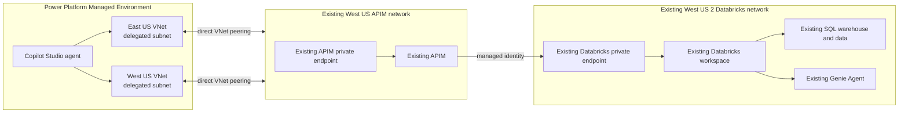

# Customer Integration Runbook: Existing Databricks and APIM

This runbook starts after the customer already has:

- Azure Databricks in **West US 2**, connected to its private network.
- Azure API Management (APIM) in **West US**, connected to its private network.
- Data in Unity Catalog.
- An existing SQL warehouse and Genie Agent configured for that data.

The guide does **not** deploy Databricks, deploy APIM, load sample data, or
revalidate whether either service is private. It only connects the existing
services, exposes the customer's data through governed REST and MCP interfaces,
and adds the Power Platform network-injection path.

> **Do not run** `scripts/deploy.ps1`, `scripts/load-sample-data.ps1`,
> `scripts/create-genie-space.ps1`, the Terraform in `infra/terraform`, or the
> APIM service deployment in `infra/bicep/apim-private`. Those assets provision
> this repository's POC resources or sample data and are outside the customer
> starting point.

For background on the existing APIM network design, see
[API Management virtual-network concepts](https://learn.microsoft.com/azure/api-management/virtual-network-concepts).
The implementation below uses APIM's
[managed-identity authentication policy](https://learn.microsoft.com/azure/api-management/authentication-managed-identity-policy)
for Databricks and projects the resulting REST APIs as
[APIM MCP servers](https://learn.microsoft.com/azure/api-management/mcp-server-overview).

## Architecture



VNet peering is not transitive. Each Power Platform VNet is peered directly
with the APIM VNet. APIM remains the application proxy to Databricks. See the
[Azure VNet peering overview](https://learn.microsoft.com/azure/virtual-network/virtual-network-peering-overview)
and [Azure Private DNS overview](https://learn.microsoft.com/azure/dns/private-dns-overview).

## What this runbook changes

1. Enables or reuses the existing APIM system-assigned managed identity.
2. Adds that identity to the existing Databricks workspace and grants only the
   warehouse, catalog, schema, table, and Genie permissions it needs.
3. Deploys Databricks SQL and Genie REST APIs, an APIM product, and an APIM
   subscription into the existing APIM service.
4. Exposes both REST APIs as streamable HTTP MCP servers.
5. Creates East US and West US Power Platform VNets, delegated subnets, direct
   APIM peerings, APIM private-DNS links, and one U.S. network-injection policy.
6. Associates an existing Power Platform Managed Environment with that policy.

No Databricks tables are created or modified by these steps.

## Customer values

Run commands from the repository root. Replace every placeholder before
continuing. Never reuse the live POC values in the appendix.

```powershell
$SubscriptionId = '<customer-subscription-guid>'
$TenantId = '<customer-tenant-guid>'

$ApimResourceGroup = '<resource-group-containing-apim>'
$ApimName = '<existing-private-apim-name>'
$ApimVnetName = '<existing-apim-vnet-name>'
$ApimPrivateDnsZoneName = 'privatelink.azure-api.net'

$DatabricksWorkspaceUrl = 'https://adb-<workspace-id>.<shard>.azuredatabricks.net'
$DatabricksCatalog = '<existing-unity-catalog>'
$DatabricksSchema = '<existing-schema>'
$WarehouseId = '<existing-sql-warehouse-id>'
$GenieSpaceId = '<existing-genie-space-id>'
$ValidationQuery = 'SELECT COUNT(*) AS row_count FROM <catalog>.<schema>.<table>'

$NetworkResourceGroup = '<resource-group-for-apim-vnet-and-power-platform-network>'
$PowerPlatformEastVnetName = '<power-platform-eastus-vnet>'
$PowerPlatformWestVnetName = '<power-platform-westus-vnet>'
$PowerPlatformSubnetName = '<delegated-subnet-name>'
$EnterprisePolicyName = '<power-platform-network-injection-policy-name>'
$PowerPlatformEnvironmentId = '<managed-environment-guid>'
```

The checked-in Power Platform Bicep currently expects the existing APIM VNet
and `privatelink.azure-api.net` zone in `$NetworkResourceGroup`. If they are in
different resource groups, add explicit `scope` values to the existing-resource
declarations before deployment.

## Prerequisites

- Azure CLI and PowerShell 7 or Windows PowerShell 5.1.
- Permission to update the existing APIM APIs, policies, products,
  subscriptions, and managed identity.
- Databricks workspace-admin access, `CAN MANAGE` or ownership on the selected
  SQL warehouse, and authority to grant Unity Catalog privileges.
- Azure Network Contributor (or equivalent) on the APIM VNet and the resource
  group that receives the Power Platform VNets.
- Power Platform Administrator and a
  [Managed Environment](https://learn.microsoft.com/power-platform/admin/managed-environment-overview).
- A workstation or runner that already has network access to the private APIM
  gateway for functional REST and MCP tests.

For the permission model behind the Databricks calls, read
[Statement Execution API security](https://learn.microsoft.com/azure/databricks/dev-tools/sql-execution-tutorial#security-best-practices),
[Unity Catalog privilege management](https://learn.microsoft.com/azure/databricks/data-governance/unity-catalog/manage-privileges/),
and [AI/BI Genie setup](https://learn.microsoft.com/azure/databricks/genie-agents/set-up).

Authenticate without placing tokens or keys in scripts or files:

```powershell
az login --tenant $TenantId
az account set --subscription $SubscriptionId
az account show --query '{subscription:id, tenant:tenantId, user:user.name}' -o table
```

## 1. Select existing Databricks objects

This step only lists data-plane objects so the customer can populate
`$WarehouseId` and `$GenieSpaceId`. It creates nothing. The SQL warehouse must
be usable by the customer admin. The Genie Agent must already reference the
customer's existing Unity Catalog data. Databricks formerly called Genie Agents
"Genie Spaces," and its REST API still returns a `space_id`.

```powershell
$DatabricksResourceId = '2ff814a6-3304-4ab8-85cb-cd0e6f879c1d'
$DatabricksToken = $null
$DatabricksHeaders = $null

try {
  $DatabricksToken = az account get-access-token `
    --resource $DatabricksResourceId `
    --query accessToken -o tsv

  if ($LASTEXITCODE -ne 0 -or -not $DatabricksToken) {
    throw 'Unable to acquire an Azure Databricks Entra token.'
  }

  $DatabricksHeaders = @{ Authorization = "Bearer $DatabricksToken" }

  $Warehouses = Invoke-RestMethod -Method GET `
    -Uri "$DatabricksWorkspaceUrl/api/2.0/sql/warehouses" `
    -Headers $DatabricksHeaders
  $Warehouses.warehouses |
    Select-Object name, id, state, enable_serverless_compute |
    Format-Table

  $Spaces = Invoke-RestMethod -Method GET `
    -Uri "$DatabricksWorkspaceUrl/api/2.0/genie/spaces?page_size=100" `
    -Headers $DatabricksHeaders
  $Spaces.spaces | Select-Object title, space_id | Format-Table
}
finally {
  $DatabricksHeaders = $null
  $DatabricksToken = $null
}
```

If the customer needs to create a Genie Agent over the existing data, follow
[Create and manage a Genie Agent](https://learn.microsoft.com/azure/databricks/genie-agents/set-up).
Do not load this repository's sample dataset.

## 2. Configure the existing APIM identity

APIM uses a system-assigned managed identity to obtain a Databricks Entra token.
Microsoft documents the policy behavior and token caching in
[Authenticate with managed identity](https://learn.microsoft.com/azure/api-management/authentication-managed-identity-policy).

```powershell
$ApimPrincipalId = az apim show `
  --resource-group $ApimResourceGroup `
  --name $ApimName `
  --query identity.principalId -o tsv

if (-not $ApimPrincipalId) {
  az apim update `
    --resource-group $ApimResourceGroup `
    --name $ApimName `
    --set identity.type=SystemAssigned | Out-Null

  $ApimPrincipalId = az apim show `
    --resource-group $ApimResourceGroup `
    --name $ApimName `
    --query identity.principalId -o tsv
}

$ApimApplicationId = az ad sp show `
  --id $ApimPrincipalId `
  --query appId -o tsv

if (-not $ApimApplicationId) {
  throw 'The APIM managed-identity service principal could not be resolved.'
}

Write-Host "APIM principalId: $ApimPrincipalId"
Write-Host "APIM applicationId: $ApimApplicationId"
```

Restrict APIM policy-editing rights because an editor can cause the managed
identity token to be forwarded to another backend. See Microsoft's
[APIM managed-identity security considerations](https://learn.microsoft.com/azure/api-management/api-management-howto-use-managed-service-identity#security-considerations-for-managed-identities).

## 3. Grant Databricks access to APIM

The repository script performs three idempotent operations against the existing
workspace: register the APIM identity as a Databricks service principal, grant
`CAN_USE` on the selected warehouse, and grant `USE CATALOG`, `USE SCHEMA`, and
`SELECT` on the selected schema.

```powershell
./apim/grant-databricks-access.ps1 `
  -WorkspaceUrl $DatabricksWorkspaceUrl `
  -WarehouseId $WarehouseId `
  -ResourceGroup $ApimResourceGroup `
  -ApimName $ApimName `
  -Catalog $DatabricksCatalog `
  -Schema $DatabricksSchema
```

The grants follow the hierarchy described in
[Unity Catalog permissions](https://learn.microsoft.com/azure/databricks/data-governance/unity-catalog/access-control/permissions-concepts)
and the SQL API's requirement for warehouse `CAN_USE` plus data-object access.
If schema-wide `SELECT` is broader than the customer's policy permits, edit the
script to grant `SELECT` only on approved views or tables before running it.

Grant `CAN_RUN` on the existing Genie Agent:

```powershell
$DatabricksToken = $null
$DatabricksHeaders = $null

try {
  $DatabricksToken = az account get-access-token `
    --resource '2ff814a6-3304-4ab8-85cb-cd0e6f879c1d' `
    --query accessToken -o tsv
  $DatabricksHeaders = @{
    Authorization = "Bearer $DatabricksToken"
    'Content-Type' = 'application/json'
  }
  $GenieAcl = @{
    access_control_list = @(
      @{
        service_principal_name = $ApimApplicationId
        permission_level = 'CAN_RUN'
      }
    )
  } | ConvertTo-Json -Depth 5

  Invoke-RestMethod -Method PATCH `
    -Uri "$DatabricksWorkspaceUrl/api/2.0/permissions/genie/$GenieSpaceId" `
    -Headers $DatabricksHeaders `
    -Body $GenieAcl | Out-Null
}
finally {
  $DatabricksHeaders = $null
  $DatabricksToken = $null
}
```

`CAN_RUN`, warehouse `CAN_USE`, and the underlying Unity Catalog grants are the
minimum capability set described in
[Databricks Genie service-principal permissions](https://learn.microsoft.com/azure/databricks/dev-tools/databricks-apps/genie#add-a-genie-agent-resource).

## 4. Deploy REST APIs into the existing APIM service

The deployment creates APIs and policies inside the existing APIM instance; it
does not deploy or change the APIM service or its network. Use the Bicep command
directly because `apim/deploy-apim.ps1` does not accept customer catalog and
schema parameters.

Review how APIM policies are scoped before deployment:
[Policies in Azure API Management](https://learn.microsoft.com/azure/api-management/api-management-howto-policies).

```powershell
$ApiParameters = @(
  "apimServiceName=$ApimName"
  "databricksWorkspaceUrl=$DatabricksWorkspaceUrl"
  "databricksWarehouseId=$WarehouseId"
  "databricksCatalog=$DatabricksCatalog"
  "databricksSchema=$DatabricksSchema"
  "genieSpaceId=$GenieSpaceId"
)

az deployment group what-if `
  --subscription $SubscriptionId `
  --resource-group $ApimResourceGroup `
  --name customer-databricks-apis `
  --template-file ./apim/main.bicep `
  --parameters $ApiParameters

az deployment group create `
  --subscription $SubscriptionId `
  --resource-group $ApimResourceGroup `
  --name customer-databricks-apis `
  --template-file ./apim/main.bicep `
  --parameters $ApiParameters `
  --query properties.outputs -o json
```

The customer endpoints are:

| Interface | URL |
|---|---|
| Databricks SQL API | `https://<apim-name>.azure-api.net/databricks` |
| Run SQL | `POST https://<apim-name>.azure-api.net/databricks/query` |
| List configured schema tables | `GET https://<apim-name>.azure-api.net/databricks/tables` |
| Genie API | `https://<apim-name>.azure-api.net/databricks-genie` |
| Start Genie question | `POST https://<apim-name>.azure-api.net/databricks-genie/genie/ask` |

The deployment also creates the published `databricks-agents` product and its
`DatabricksSubscription` subscription. For the access model, see
[Subscriptions in Azure API Management](https://learn.microsoft.com/azure/api-management/api-management-subscriptions).

## 5. Expose the APIs as MCP servers

Microsoft documents this conversion in
[Expose a REST API in APIM as an MCP server](https://learn.microsoft.com/azure/api-management/export-rest-mcp-server).
The source API operations become MCP tools and use streamable HTTP at `/mcp`.

The repository scripts default to the original POC APIM. Always pass every
customer value explicitly:

```powershell
./apim/enable-mcp.ps1 `
  -SubscriptionId $SubscriptionId `
  -ResourceGroup $ApimResourceGroup `
  -ApimName $ApimName `
  -SourceApiId databricks `
  -McpDisplayName 'Databricks SQL MCP' `
  -McpPath databricks-mcp `
  -ProductId databricks-agents

./apim/enable-mcp.ps1 `
  -SubscriptionId $SubscriptionId `
  -ResourceGroup $ApimResourceGroup `
  -ApimName $ApimName `
  -SourceApiId databricks-genie `
  -McpDisplayName 'Databricks Genie MCP' `
  -McpPath databricks-genie-mcp `
  -ProductId databricks-agents
```

Resulting URLs:

```text
https://<apim-name>.azure-api.net/databricks-mcp/mcp
https://<apim-name>.azure-api.net/databricks-genie-mcp/mcp
```

Apply rate limits, authentication, and monitoring according to
[Secure access to MCP servers in APIM](https://learn.microsoft.com/azure/api-management/secure-mcp-servers).

## 6. Functionally test REST and MCP

These are application tests, not private-network verification. Run them from a
workstation or runner that already reaches the customer's APIM gateway. Keep the
APIM subscription key only in process memory.

```powershell
$GatewayUrl = "https://$ApimName.azure-api.net"
$ListSecretsUrl = "https://management.azure.com/subscriptions/$SubscriptionId/resourceGroups/$ApimResourceGroup/providers/Microsoft.ApiManagement/service/$ApimName/subscriptions/DatabricksSubscription/listSecrets?api-version=2024-06-01-preview"
$ApimKey = $null

try {
  $ApimKey = az rest --method post --url $ListSecretsUrl `
    --query primaryKey -o tsv
  if ($LASTEXITCODE -ne 0 -or -not $ApimKey) {
    throw 'Unable to read the APIM subscription key.'
  }

  $Headers = @{
    'Ocp-Apim-Subscription-Key' = $ApimKey
    'Content-Type' = 'application/json'
  }

  Invoke-RestMethod -Method GET `
    -Uri "$GatewayUrl/databricks/tables" `
    -Headers $Headers

  Invoke-RestMethod -Method POST `
    -Uri "$GatewayUrl/databricks/query" `
    -Headers $Headers `
    -Body (@{ statement = $ValidationQuery } | ConvertTo-Json)

  ./scripts/test-genie.ps1 `
    -Question '<question answerable from the customer Genie Agent>' `
    -ApimBaseUrl "$GatewayUrl/databricks-genie" `
    -ApimKey $ApimKey `
    -SubscriptionId $SubscriptionId `
    -ResourceGroup $ApimResourceGroup `
    -ApimName $ApimName

  $env:APIM_SUBSCRIPTION_KEY = $ApimKey
  python ./scripts/mcp_tools_probe.py "$GatewayUrl/databricks-mcp/mcp"
  python ./scripts/mcp_tools_probe.py "$GatewayUrl/databricks-genie-mcp/mcp"
}
finally {
  Remove-Item Env:APIM_SUBSCRIPTION_KEY -ErrorAction SilentlyContinue
  $Headers = $null
  $ApimKey = $null
}
```

Expected MCP tools are `query` and `tables` for SQL, and `ask`, `message`,
`result`, and `follow-up` for Genie. The MCP query tool accepts one `body`
string; the agent must send the value as JSON such as
`{"statement":"SELECT ..."}`, not as bare SQL.

## 7. Deploy the Power Platform network path

Power Platform virtual-network support requires a Managed Environment and, for
the United States geography, two delegated VNets in different regions: East US
and West US. Microsoft documents the region pairing, equal-size subnet rule,
roles, and service-impact considerations in
[Set up virtual-network support for Power Platform](https://learn.microsoft.com/power-platform/admin/vnet-support-setup-configure)
and [Power Platform VNet support overview](https://learn.microsoft.com/power-platform/admin/vnet-support-overview).

The checked-in template creates only these new resources:

| Resource | Default | Region |
|---|---:|---|
| Power Platform VNet | `10.182.0.0/16` | East US |
| Delegated subnet | `10.182.0.0/24` | East US |
| Power Platform VNet | `10.183.0.0/16` | West US |
| Delegated subnet | `10.183.0.0/24` | West US |
| Bidirectional peerings | Power Platform VNet to existing APIM VNet | Both |
| Private DNS links | Both VNets to `privatelink.azure-api.net` | Global |
| Enterprise policy | `NetworkInjection` | `unitedstates` |

Before deployment, edit
[`infra/bicep/power-platform-private/main.bicep`](../../infra/bicep/power-platform-private/main.bicep)
to use customer-approved, non-overlapping address ranges. Also change its
`apimVnetName` value when the existing APIM VNet is not named
`<apim-name>-vnet`. Delegated subnets must have the same available address
count, and a delegated subnet cannot be reused by another enterprise policy.

Register only the providers needed for these new network resources:

```powershell
az provider register --namespace Microsoft.Network --wait
az provider register --namespace Microsoft.PowerPlatform --wait
```

Preview the exact changes before creating anything:

```powershell
$PowerPlatformParameters = @(
  "apimServiceName=$ApimName"
  "apimPrivateDnsZoneName=$ApimPrivateDnsZoneName"
  "eastVnetName=$PowerPlatformEastVnetName"
  "westVnetName=$PowerPlatformWestVnetName"
  "powerPlatformSubnetName=$PowerPlatformSubnetName"
  "enterprisePolicyName=$EnterprisePolicyName"
)

az deployment group what-if `
  --subscription $SubscriptionId `
  --resource-group $NetworkResourceGroup `
  --name power-platform-private-network `
  --template-file ./infra/bicep/power-platform-private/main.bicep `
  --parameters $PowerPlatformParameters
```

The preview should contain only the two new VNets and their subnets, four
peerings, two DNS links, and one enterprise policy. It must not modify the
existing APIM service or Databricks workspace.

```powershell
az deployment group create `
  --subscription $SubscriptionId `
  --resource-group $NetworkResourceGroup `
  --name power-platform-private-network `
  --template-file ./infra/bicep/power-platform-private/main.bicep `
  --parameters $PowerPlatformParameters `
  --query properties.outputs -o json

$PolicyArmId = az deployment group show `
  --subscription $SubscriptionId `
  --resource-group $NetworkResourceGroup `
  --name power-platform-private-network `
  --query properties.outputs.enterprisePolicyResourceId.value -o tsv
```

## 8. Associate the Managed Environment

Install the module described in Microsoft's
[Power Platform VNet PowerShell setup](https://learn.microsoft.com/power-platform/admin/vnet-support-setup-configure#set-up-virtual-network-support).
Version `0.19.3` was used for the live deployment. Its first import can prompt
to install exact versions of `Az.Accounts`, `Az.Resources`, `Az.KeyVault`, and
`Az.Network`.

```powershell
Install-Module Microsoft.PowerPlatform.EnterprisePolicies `
  -Scope CurrentUser -Force -AllowClobber
Import-Module Microsoft.PowerPlatform.EnterprisePolicies -Force
```

Link the existing Managed Environment to the deployed policy:

```powershell
Enable-SubnetInjection `
  -EnvironmentId $PowerPlatformEnvironmentId `
  -PolicyArmId $PolicyArmId `
  -TenantId $TenantId `
  -TimeoutSeconds 900
```

The complete cmdlet contract is documented at
[`Enable-SubnetInjection`](https://learn.microsoft.com/powershell/module/microsoft.powerplatform.enterprisepolicies/enable-subnetinjection?view=pa-ps-latest).
Use `-ForceAuth` when the Power Platform administrator is a different signed-in
account. Do not use `-Swap` unless replacing an existing policy is intentional.

In the [Power Platform admin center](https://admin.powerplatform.microsoft.com/),
open **Manage > Environments > `<environment>` > History** and confirm the
association operation succeeded.

## 9. Connect Copilot Studio

Microsoft's current workflow is documented in
[Connect an agent to an existing MCP server](https://learn.microsoft.com/microsoft-copilot-studio/mcp-add-existing-server-to-agent).
In the associated environment:

1. Open the agent's **Tools** page and select **Add a tool**.
2. Select **New tool > Model Context Protocol**.
3. Enter one of the APIM MCP URLs.
4. Select API-key authentication and use header name
   `Ocp-Apim-Subscription-Key`.
5. Store the APIM key in the connection. Do not place it in agent instructions,
   source control, environment descriptions, or chat messages.
6. Create the connection, add the tool to the agent, and repeat for the Genie
   MCP server.
7. Run one approved SQL question and one Genie question from the agent.

Copilot Studio supports streamable HTTP for MCP; APIM exposes these servers at
the required `/mcp` path. See also
[Add MCP tools and resources to an agent](https://learn.microsoft.com/microsoft-copilot-studio/mcp-add-components-to-agent).

## Troubleshooting

| Symptom | Most likely cause and action |
|---|---|
| APIM returns `401` or `403` to the caller | Confirm the key belongs to `DatabricksSubscription` and that the API/MCP server is linked to `databricks-agents`. |
| Databricks returns `401` | Confirm APIM has a system-assigned identity and the policy requests the Azure Databricks resource ID `2ff814a6-3304-4ab8-85cb-cd0e6f879c1d`. |
| Databricks returns `403` | Recheck workspace service-principal registration, warehouse `CAN_USE`, Unity Catalog grants, and Genie `CAN_RUN`. |
| MCP SQL tool returns `500` | Send the tool's `body` value as a JSON string such as `{"statement":"SELECT 1"}` instead of bare SQL. |
| MCP host cannot be reached | Run from the associated/injected environment or another client with access to the APIM private network; then troubleshoot peering and `privatelink.azure-api.net` links. |
| `Enable-SubnetInjection` rejects the environment | Confirm it is a Managed Environment in the U.S. geography, the caller is Power Platform Administrator, and both equal-size delegated subnets are present. |
| A different policy is already linked | Decide explicitly whether replacement is intended; only then rerun with `-Swap`. |

Microsoft's dedicated Power Platform guide covers additional failures:
[Troubleshoot virtual-network issues](https://learn.microsoft.com/troubleshoot/power-platform/administration/virtual-network).

## Live deployment reference

This section records the completed POC for comparison only. Do not copy these
IDs, names, IP ranges, or URLs into a customer tenant. It intentionally contains
no keys or tokens.

### Scope and service URLs

| Item | Live value |
|---|---|
| Tenant | `b158173c-91f6-4f99-b5e9-aa9bcb463863` |
| Subscription | `/subscriptions/86b37969-9445-49cf-b03f-d8866235171c` |
| Resource group | `/subscriptions/86b37969-9445-49cf-b03f-d8866235171c/resourceGroups/ai-myaacoub` |
| West US 2 Databricks | `https://adb-7405613361932932.12.azuredatabricks.net` |
| West US APIM gateway | `https://ai-gateway-apim-poc-my2.azure-api.net` |
| SQL REST API | `https://ai-gateway-apim-poc-my2.azure-api.net/databricks` |
| SQL query | `https://ai-gateway-apim-poc-my2.azure-api.net/databricks/query` |
| SQL tables | `https://ai-gateway-apim-poc-my2.azure-api.net/databricks/tables` |
| Genie REST API | `https://ai-gateway-apim-poc-my2.azure-api.net/databricks-genie` |
| SQL MCP | `https://ai-gateway-apim-poc-my2.azure-api.net/databricks-mcp/mcp` |
| Genie MCP | `https://ai-gateway-apim-poc-my2.azure-api.net/databricks-genie-mcp/mcp` |
| Power Platform enterprise policy | [Open `power-platform-network-injection-us` in Azure portal](https://portal.azure.com/#@b158173c-91f6-4f99-b5e9-aa9bcb463863/resource/subscriptions/86b37969-9445-49cf-b03f-d8866235171c/resourceGroups/ai-myaacoub/providers/Microsoft.PowerPlatform/enterprisePolicies/power-platform-network-injection-us/overview) |

### Databricks resources

| Resource | Region | Full ARM resource ID |
|---|---|---|
| Workspace `databricks-ws-ai-poc2` | West US 2 | `/subscriptions/86b37969-9445-49cf-b03f-d8866235171c/resourceGroups/ai-myaacoub/providers/Microsoft.Databricks/workspaces/databricks-ws-ai-poc2` |
| VNet `databricks-vnet-ai-poc2` (`10.180.0.0/16`) | West US 2 | `/subscriptions/86b37969-9445-49cf-b03f-d8866235171c/resourceGroups/ai-myaacoub/providers/Microsoft.Network/virtualNetworks/databricks-vnet-ai-poc2` |
| Host subnet (`10.180.1.0/24`) | West US 2 | `/subscriptions/86b37969-9445-49cf-b03f-d8866235171c/resourceGroups/ai-myaacoub/providers/Microsoft.Network/virtualNetworks/databricks-vnet-ai-poc2/subnets/databricks-host` |
| Container subnet (`10.180.2.0/24`) | West US 2 | `/subscriptions/86b37969-9445-49cf-b03f-d8866235171c/resourceGroups/ai-myaacoub/providers/Microsoft.Network/virtualNetworks/databricks-vnet-ai-poc2/subnets/databricks-container` |
| Private-endpoint subnet (`10.180.3.0/24`) | West US 2 | `/subscriptions/86b37969-9445-49cf-b03f-d8866235171c/resourceGroups/ai-myaacoub/providers/Microsoft.Network/virtualNetworks/databricks-vnet-ai-poc2/subnets/private-endpoints` |
| Workspace NSG | West US 2 | `/subscriptions/86b37969-9445-49cf-b03f-d8866235171c/resourceGroups/ai-myaacoub/providers/Microsoft.Network/networkSecurityGroups/databricks-ws-ai-poc2-nsg` |
| UI/API private endpoint (`10.180.3.4`, approved) | West US 2 | `/subscriptions/86b37969-9445-49cf-b03f-d8866235171c/resourceGroups/ai-myaacoub/providers/Microsoft.Network/privateEndpoints/databricks-ws-ai-poc2-pe-uiapi` |
| Databricks to APIM peering | Global | `/subscriptions/86b37969-9445-49cf-b03f-d8866235171c/resourceGroups/ai-myaacoub/providers/Microsoft.Network/virtualNetworks/databricks-vnet-ai-poc2/virtualNetworkPeerings/databricks-poc2-to-apim` |
| Databricks private DNS zone | Global | `/subscriptions/86b37969-9445-49cf-b03f-d8866235171c/resourceGroups/ai-myaacoub/providers/Microsoft.Network/privateDnsZones/privatelink.azuredatabricks.net` |
| APIM VNet Databricks DNS link | Global | `/subscriptions/86b37969-9445-49cf-b03f-d8866235171c/resourceGroups/ai-myaacoub/providers/Microsoft.Network/privateDnsZones/privatelink.azuredatabricks.net/virtualNetworkLinks/ai-gateway-apim-poc-my2-databricks-dns-link` |

### APIM resources

| Resource | Region | Full ARM resource ID |
|---|---|---|
| APIM `ai-gateway-apim-poc-my2` | West US | `/subscriptions/86b37969-9445-49cf-b03f-d8866235171c/resourceGroups/ai-myaacoub/providers/Microsoft.ApiManagement/service/ai-gateway-apim-poc-my2` |
| APIM VNet (`10.181.0.0/16`) | West US | `/subscriptions/86b37969-9445-49cf-b03f-d8866235171c/resourceGroups/ai-myaacoub/providers/Microsoft.Network/virtualNetworks/ai-gateway-apim-poc-my2-vnet` |
| Outbound subnet (`10.181.0.0/24`) | West US | `/subscriptions/86b37969-9445-49cf-b03f-d8866235171c/resourceGroups/ai-myaacoub/providers/Microsoft.Network/virtualNetworks/ai-gateway-apim-poc-my2-vnet/subnets/apim-outbound-integration` |
| Private-endpoint subnet (`10.181.1.0/24`) | West US | `/subscriptions/86b37969-9445-49cf-b03f-d8866235171c/resourceGroups/ai-myaacoub/providers/Microsoft.Network/virtualNetworks/ai-gateway-apim-poc-my2-vnet/subnets/private-endpoints` |
| Outbound NSG | West US | `/subscriptions/86b37969-9445-49cf-b03f-d8866235171c/resourceGroups/ai-myaacoub/providers/Microsoft.Network/networkSecurityGroups/ai-gateway-apim-poc-my2-integration-nsg` |
| Private-endpoint NSG | West US | `/subscriptions/86b37969-9445-49cf-b03f-d8866235171c/resourceGroups/ai-myaacoub/providers/Microsoft.Network/networkSecurityGroups/ai-gateway-apim-poc-my2-private-endpoints-nsg` |
| Gateway private endpoint (`10.181.1.4`, approved) | West US | `/subscriptions/86b37969-9445-49cf-b03f-d8866235171c/resourceGroups/ai-myaacoub/providers/Microsoft.Network/privateEndpoints/ai-gateway-apim-poc-my2-gateway-pe` |
| APIM to Databricks peering | Global | `/subscriptions/86b37969-9445-49cf-b03f-d8866235171c/resourceGroups/ai-myaacoub/providers/Microsoft.Network/virtualNetworks/ai-gateway-apim-poc-my2-vnet/virtualNetworkPeerings/apim-to-databricks-poc2` |
| APIM private DNS zone | Global | `/subscriptions/86b37969-9445-49cf-b03f-d8866235171c/resourceGroups/ai-myaacoub/providers/Microsoft.Network/privateDnsZones/privatelink.azure-api.net` |
| Gateway VNet APIM DNS link | Global | `/subscriptions/86b37969-9445-49cf-b03f-d8866235171c/resourceGroups/ai-myaacoub/providers/Microsoft.Network/privateDnsZones/privatelink.azure-api.net/virtualNetworkLinks/ai-gateway-apim-poc-my2-gateway-dns-link` |
| Databricks VNet APIM DNS link | Global | `/subscriptions/86b37969-9445-49cf-b03f-d8866235171c/resourceGroups/ai-myaacoub/providers/Microsoft.Network/privateDnsZones/privatelink.azure-api.net/virtualNetworkLinks/databricks-vnet-ai-poc2-apim-dns-link` |

The APIM managed identity has principal ID
`9d8fb6ac-b6d5-404d-a0db-b10a869df0dc` and application ID
`e9d66747-e35e-4e57-a7f8-92814c080825`. The APIM public network access state is
`Disabled` in the live deployment.

### Power Platform resources

| Resource | Region | Full ARM resource ID |
|---|---|---|
| East VNet (`10.182.0.0/16`) | East US | `/subscriptions/86b37969-9445-49cf-b03f-d8866235171c/resourceGroups/ai-myaacoub/providers/Microsoft.Network/virtualNetworks/power-platform-vnet-eastus` |
| East delegated subnet (`10.182.0.0/24`) | East US | `/subscriptions/86b37969-9445-49cf-b03f-d8866235171c/resourceGroups/ai-myaacoub/providers/Microsoft.Network/virtualNetworks/power-platform-vnet-eastus/subnets/power-platform-subnet` |
| East to APIM peering | Global | `/subscriptions/86b37969-9445-49cf-b03f-d8866235171c/resourceGroups/ai-myaacoub/providers/Microsoft.Network/virtualNetworks/power-platform-vnet-eastus/virtualNetworkPeerings/power-platform-eastus-to-apim` |
| APIM to East peering | Global | `/subscriptions/86b37969-9445-49cf-b03f-d8866235171c/resourceGroups/ai-myaacoub/providers/Microsoft.Network/virtualNetworks/ai-gateway-apim-poc-my2-vnet/virtualNetworkPeerings/apim-to-power-platform-eastus` |
| East APIM DNS link | Global | `/subscriptions/86b37969-9445-49cf-b03f-d8866235171c/resourceGroups/ai-myaacoub/providers/Microsoft.Network/privateDnsZones/privatelink.azure-api.net/virtualNetworkLinks/power-platform-eastus-apim-dns-link` |
| West VNet (`10.183.0.0/16`) | West US | `/subscriptions/86b37969-9445-49cf-b03f-d8866235171c/resourceGroups/ai-myaacoub/providers/Microsoft.Network/virtualNetworks/power-platform-vnet-westus` |
| West delegated subnet (`10.183.0.0/24`) | West US | `/subscriptions/86b37969-9445-49cf-b03f-d8866235171c/resourceGroups/ai-myaacoub/providers/Microsoft.Network/virtualNetworks/power-platform-vnet-westus/subnets/power-platform-subnet` |
| West to APIM peering | Global | `/subscriptions/86b37969-9445-49cf-b03f-d8866235171c/resourceGroups/ai-myaacoub/providers/Microsoft.Network/virtualNetworks/power-platform-vnet-westus/virtualNetworkPeerings/power-platform-westus-to-apim` |
| APIM to West peering | Global | `/subscriptions/86b37969-9445-49cf-b03f-d8866235171c/resourceGroups/ai-myaacoub/providers/Microsoft.Network/virtualNetworks/ai-gateway-apim-poc-my2-vnet/virtualNetworkPeerings/apim-to-power-platform-westus` |
| West APIM DNS link | Global | `/subscriptions/86b37969-9445-49cf-b03f-d8866235171c/resourceGroups/ai-myaacoub/providers/Microsoft.Network/privateDnsZones/privatelink.azure-api.net/virtualNetworkLinks/power-platform-westus-apim-dns-link` |
| Network-injection policy | United States | `/subscriptions/86b37969-9445-49cf-b03f-d8866235171c/resourceGroups/ai-myaacoub/providers/Microsoft.PowerPlatform/enterprisePolicies/power-platform-network-injection-us` |

The enterprise policy is an ARM control-plane resource and has no public
runtime endpoint. Use its [Azure portal URL](https://portal.azure.com/#@b158173c-91f6-4f99-b5e9-aa9bcb463863/resource/subscriptions/86b37969-9445-49cf-b03f-d8866235171c/resourceGroups/ai-myaacoub/providers/Microsoft.PowerPlatform/enterprisePolicies/power-platform-network-injection-us/overview)
to inspect it. Pass the full ARM resource ID from the table to
`Enable-SubnetInjection -PolicyArmId`.

## Repository files used by this runbook

- [Databricks permission script](../../apim/grant-databricks-access.ps1)
- [APIM REST API Bicep](../../apim/main.bicep)
- [APIM policy files](../../apim/policies/)
- [MCP projection script](../../apim/enable-mcp.ps1)
- [Power Platform network Bicep](../../infra/bicep/power-platform-private/main.bicep)
- [Genie smoke test](../../scripts/test-genie.ps1)
- [MCP tools probe](../../scripts/mcp_tools_probe.py)