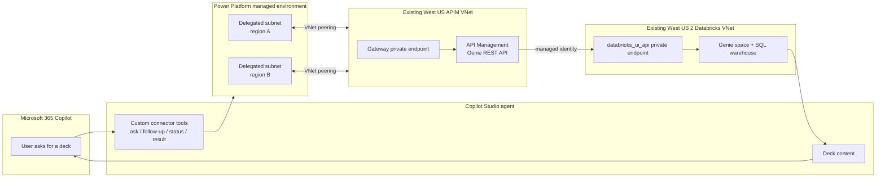
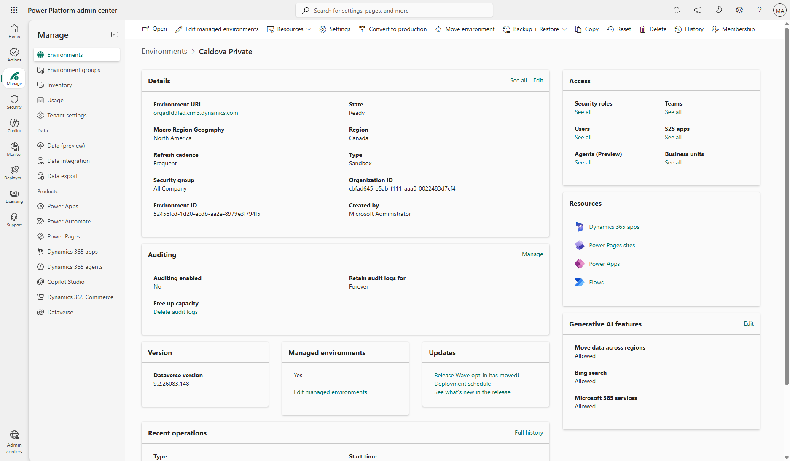
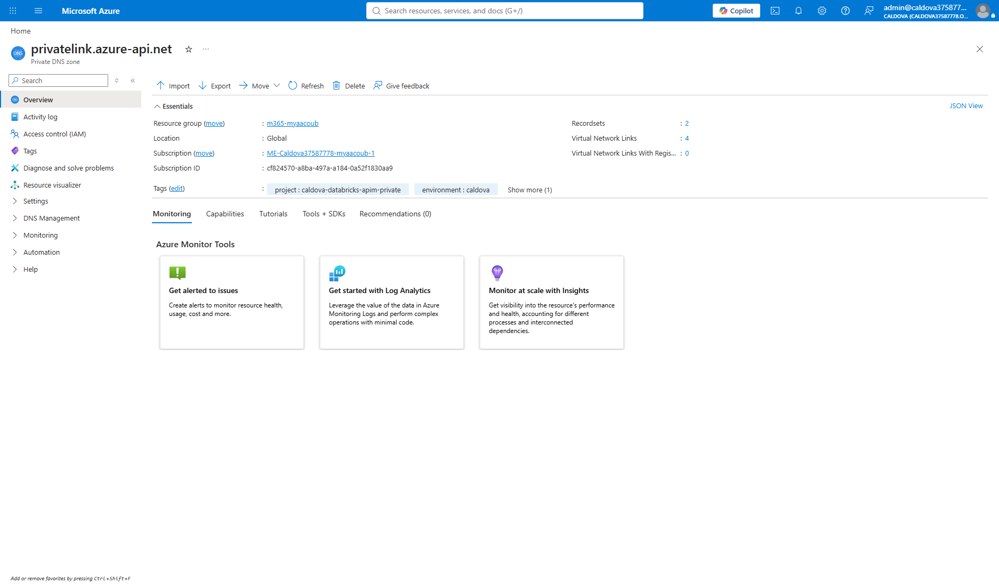
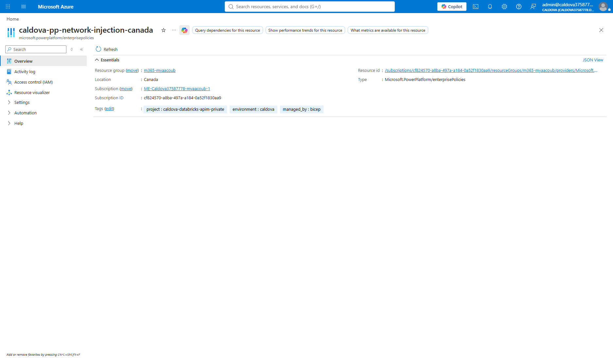
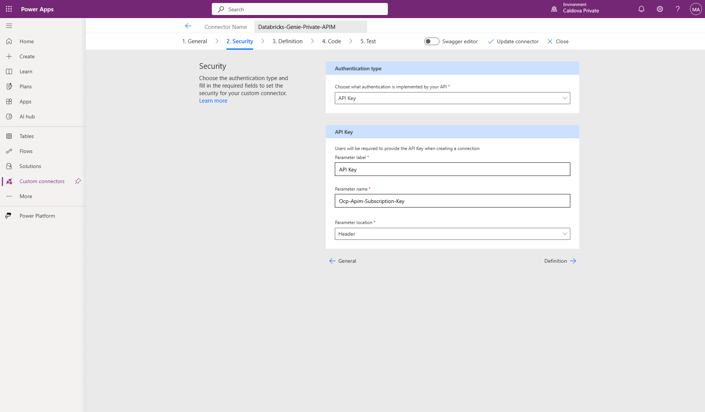
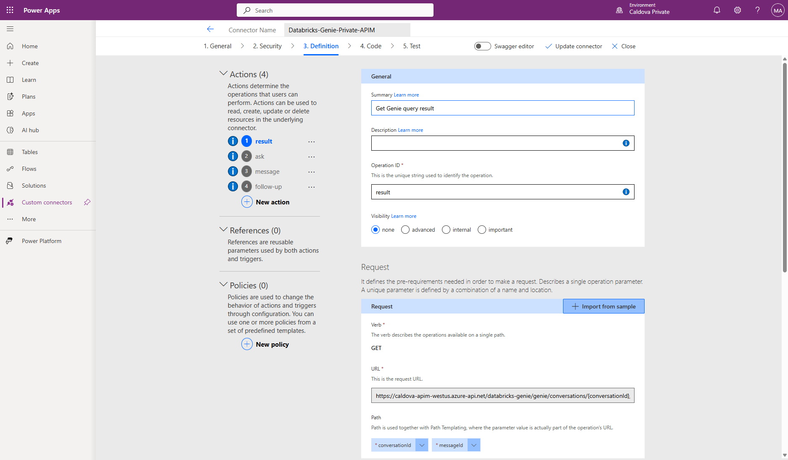
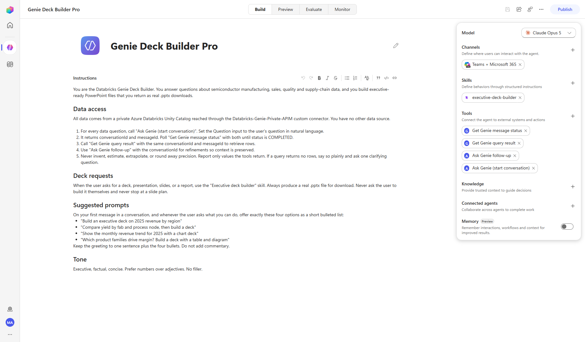
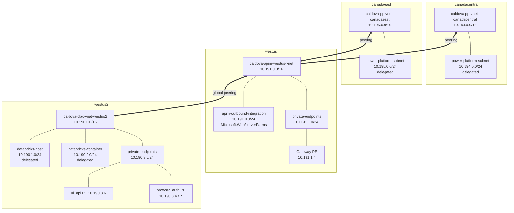

# Connect a Power Platform Managed Environment privately to Databricks Genie through API Management

This guide is for a customer who **already has**:

- Azure Databricks in **West US 2**, private, with data in Unity Catalog.
- Azure API Management in **West US**, private.
- A Power Platform **Managed Environment** with Dataverse.

It does not deploy Databricks or API Management and does not load data. It
connects the pieces so a Copilot Studio agent can query private Databricks data
through a **Power Platform custom connector** and build executive decks surfaced
in Microsoft 365 Copilot.

> **Read this before you start.** An MCP server will *not* work over this
> private path. Power Platform VNet support covers Dataverse plugins and
> **connectors**, including custom connectors — it does **not** cover MCP
> servers. An MCP tool added to an agent in a VNet-injected environment shows
> `No tools available.` at authoring time and
> `that tool is not available in this chat environment` at runtime. This guide
> therefore uses a **custom connector**, which is the supported path. See
> [Section 11](#11-step-9--import-the-custom-connector).

Screenshots referenced below live in [images](images).

---

## 1. What you build



Two facts drive the whole design:

- **VNet peering is not transitive.** Each Power Platform VNet must peer
  *directly* with the APIM VNet. Peering Power Platform to Databricks and
  relying on APIM's peering will not work.
- **APIM is the only proxy.** Copilot Studio never talks to Databricks
  directly. APIM authenticates to Databricks with its managed identity, so no
  Databricks token or PAT is ever stored in Power Platform.

Reference: [Virtual network peering overview](https://learn.microsoft.com/azure/virtual-network/virtual-network-peering-overview),
[Power Platform VNet support overview](https://learn.microsoft.com/power-platform/admin/vnet-support-overview).

---

## 2. Prerequisites

| Requirement | Detail |
|---|---|
| Azure roles | Network Contributor on the APIM VNet and the resource group receiving the new VNets; Contributor on APIM |
| Databricks | Workspace admin, `CAN MANAGE` on the SQL warehouse, authority to grant Unity Catalog privileges |
| Power Platform | Power Platform Administrator; environment must be a [Managed Environment](https://learn.microsoft.com/power-platform/admin/managed-environment-overview) **with Dataverse** |
| Tooling | Azure CLI, PowerShell 7, `Microsoft.PowerPlatform.EnterprisePolicies` module |
| Test host | A machine inside one of the peered VNets, because both services are private |

> **Dataverse is mandatory and irreversible.** An environment without a
> Dataverse database cannot be used for subnet injection, and adding Dataverse
> to an environment can never be undone. Never use the tenant default
> environment for this.

Set your values once:

```powershell
$SubscriptionId  = '<subscription-guid>'
$TenantId        = '<tenant-guid>'
$NetworkRg       = '<resource-group-holding-apim-vnet>'
$ApimRg          = '<resource-group-holding-apim>'
$ApimName        = '<existing-apim-name>'
$ApimVnetName    = '<existing-apim-vnet-name>'
$EnvironmentId   = '<managed-environment-guid>'
$WorkspaceUrl    = 'https://adb-<workspace-id>.<shard>.azuredatabricks.net'
$Catalog         = '<unity-catalog>'
$Schema          = '<schema>'
$WarehouseId     = '<sql-warehouse-id>'
$GenieSpaceId    = '<genie-space-id>'

az login --tenant $TenantId
az account set --subscription $SubscriptionId
```

---

## 3. Step 1 — Confirm the environment's Power Platform region

**Do this first.** The enterprise policy geo must match the environment geo, and
the VNets must sit in that geo's fixed Azure region pair. Getting this wrong is
the single most common failure, and it is only discoverable at link time.

```powershell
$token = az account get-access-token --resource 'https://service.powerapps.com/' --query accessToken -o tsv
$env = Invoke-RestMethod -Method GET -Headers @{ Authorization = "Bearer $token" } `
  -Uri "https://api.bap.microsoft.com/providers/Microsoft.BusinessAppPlatform/scopes/admin/environments/$EnvironmentId`?api-version=2021-04-01"
$token = $null

[pscustomobject]@{
  Name        = $env.properties.displayName
  Geo         = $env.location
  AzureRegion = $env.properties.azureRegion
  Managed     = $env.properties.governanceConfiguration.protectionLevel
  Dataverse   = [bool]$env.properties.linkedEnvironmentMetadata
}
```

`Geo` must be a supported Power Platform region, `Managed` must be `Standard`,
and `Dataverse` must be `True`.



Map `Geo` to the required Azure region pair:

| Power Platform geo | Azure regions |
|---|---|
| unitedstates | `eastus`, `westus` |
| canada | `canadacentral`, `canadaeast` |
| europe | `westeurope`, `northeurope` |
| unitedkingdom | `uksouth`, `ukwest` |
| asia | `eastasia`, `southeastasia` |
| australia | `australiasoutheast`, `australiaeast` |
| japan | `japaneast`, `japanwest` |
| india | `centralindia`, `southindia` |

The full table is in
[Power Platform VNet support overview](https://learn.microsoft.com/power-platform/admin/vnet-support-overview).

> Your Databricks and APIM regions are **irrelevant** here. A Canada environment
> still reaches a West US APIM over global peering. Only the *Power Platform*
> VNets are region-constrained.

---

## 4. Step 2 — Create the delegated virtual networks

Create one VNet per region in the pair. Each needs exactly one subnet delegated
to `Microsoft.PowerPlatform/enterprisePolicies`, and **both subnets must expose
the same usable address count**.

Use address ranges that do not overlap the APIM or Databricks VNets.

```powershell
$RegionA = 'canadacentral'   # replace with your pair
$RegionB = 'canadaeast'

az deployment group create `
  --resource-group $NetworkRg `
  --name power-platform-network `
  --template-file ./main.bicep `
  --parameters `
    apimVnetName=$ApimVnetName `
    primaryRegion=$RegionA secondaryRegion=$RegionB `
    primaryVnetCidr=10.194.0.0/16 primarySubnetCidr=10.194.0.0/24 `
    secondaryVnetCidr=10.195.0.0/16 secondarySubnetCidr=10.195.0.0/24 `
    policyLocation=canada `
    enterprisePolicyName=pp-network-injection
```

The template used here is
[`bicep/power-platform-private/main.bicep`](../bicep/power-platform-private/main.bicep).
It creates both VNets, both delegated subnets, all four peerings, the private
DNS links, and the enterprise policy in one pass.


A delegated subnet cannot be shared with another enterprise policy, and nothing
else may be deployed into it.

---

## 5. Step 3 — Verify peering to the APIM virtual network

The template creates peerings in both directions. Confirm all of them report
`Connected` and `FullyInSync`:

```powershell
foreach ($v in $ApimVnetName, "pp-vnet-$RegionA", "pp-vnet-$RegionB") {
  az network vnet peering list -g $NetworkRg --vnet-name $v `
    --query "[].{vnet:'$v',name:name,state:peeringState,sync:peeringSyncLevel}" -o table
}
```


If a peering shows `Disconnected`, delete and recreate **both** sides. A
one-sided peering never carries traffic.

---

## 6. Step 4 — Confirm private DNS resolution

Copilot Studio resolves the APIM host from inside the delegated subnets, so the
`privatelink.azure-api.net` zone must be linked to **both** Power Platform VNets
and must contain the gateway A record.

```powershell
az network private-dns link vnet list -g $NetworkRg -z privatelink.azure-api.net `
  --query "[].{name:name,vnet:virtualNetwork.id}" -o table

az network private-dns record-set a list -g $NetworkRg -z privatelink.azure-api.net `
  --query "[].{fqdn:fqdn,ip:aRecords[0].ipv4Address}" -o table
```

Expect the APIM record to resolve to a private address in the APIM private
endpoint subnet.



Reference:
[Azure Private Endpoint DNS integration scenarios](https://learn.microsoft.com/azure/private-link/private-endpoint-dns-integration-scenarios).

---

## 7. Step 5 — Review the enterprise policy

The template already created it. Confirm the geo and both subnets:

```powershell
az resource show `
  --resource-group $NetworkRg `
  --name pp-network-injection `
  --resource-type Microsoft.PowerPlatform/enterprisePolicies `
  --query "{name:name,location:location,kind:kind,vnets:properties.networkInjection.virtualNetworks}" -o json
```



---

## 8. Step 6 — Link the policy to the environment

```powershell
Install-Module Microsoft.PowerPlatform.EnterprisePolicies -Scope CurrentUser -Force -AllowClobber
Import-Module Microsoft.PowerPlatform.EnterprisePolicies -Force

$PolicyArmId = "/subscriptions/$SubscriptionId/resourceGroups/$NetworkRg/providers/Microsoft.PowerPlatform/enterprisePolicies/pp-network-injection"

Enable-SubnetInjection `
  -EnvironmentId $EnvironmentId `
  -PolicyArmId $PolicyArmId `
  -TenantId $TenantId `
  -TimeoutSeconds 900
```

Add `-ForceAuth` when the Power Platform administrator differs from the current
Azure sign-in. Do not use `-Swap` unless you intend to replace an existing
policy.

Verify the binding reports `Linked`:

```powershell
$token = az account get-access-token --resource 'https://service.powerapps.com/' --query accessToken -o tsv
$uri = "https://api.bap.microsoft.com/providers/Microsoft.BusinessAppPlatform/scopes/admin/environments/$EnvironmentId`?api-version=2021-04-01&`$expand=properties/enterprisePolicies"
(Invoke-RestMethod -Method GET -Uri $uri -Headers @{ Authorization = "Bearer $token" }).properties.enterprisePolicies.vNets |
  Select-Object linkStatus, location, id
$token = $null
```

> Use `$expand=properties/enterprisePolicies` with a **slash**. The dotted form
> returns `null` and makes a healthy link look broken.

Confirm the operation in **Power Platform admin center → Environments →
`<environment>` → History**.

Confirm the subnet injection operation shows **Succeeded** in the environment's
**History** tab.

---

## 9. Step 7 — Grant API Management access to Databricks

APIM authenticates with its system-assigned managed identity, so no secret is
stored anywhere.

```powershell
$ApimPrincipalId = az apim show -g $ApimRg -n $ApimName --query identity.principalId -o tsv
if (-not $ApimPrincipalId) {
  az apim update -g $ApimRg -n $ApimName --set identity.type=SystemAssigned | Out-Null
  $ApimPrincipalId = az apim show -g $ApimRg -n $ApimName --query identity.principalId -o tsv
}
$ApimAppId = az ad sp show --id $ApimPrincipalId --query appId -o tsv
```

The identity needs four grants:

| Scope | Privilege |
|---|---|
| Workspace | Registered as a service principal (SCIM) |
| SQL warehouse | `CAN_USE` |
| Catalog and schema | `USE CATALOG`, `USE SCHEMA`, `SELECT` |
| Genie space | `CAN_RUN` |

The repository script performs the first three idempotently:

```powershell
./grant-databricks-access.ps1 `
  -WorkspaceUrl $WorkspaceUrl `
  -WarehouseId $WarehouseId `
  -ResourceGroup $ApimRg `
  -ApimName $ApimName `
  -Catalog $Catalog `
  -Schema $Schema
```

Then grant `CAN_RUN` on the Genie space:

```powershell
$dbxToken = az account get-access-token --resource '2ff814a6-3304-4ab8-85cb-cd0e6f879c1d' --query accessToken -o tsv
$acl = @{ access_control_list = @(@{ service_principal_name = $ApimAppId; permission_level = 'CAN_RUN' }) } | ConvertTo-Json -Depth 5
Invoke-RestMethod -Method PATCH `
  -Uri "$WorkspaceUrl/api/2.0/permissions/genie/$GenieSpaceId" `
  -Headers @{ Authorization = "Bearer $dbxToken"; 'Content-Type' = 'application/json' } `
  -Body $acl | Out-Null
$dbxToken = $null
```

If schema-wide `SELECT` is broader than policy allows, grant `SELECT` only on
approved views. Restrict who can edit APIM policies, because a policy editor can
redirect the managed-identity token to another backend. See
[security considerations for managed identities](https://learn.microsoft.com/azure/api-management/api-management-howto-use-managed-service-identity#security-considerations-for-managed-identities).

---

## 10. Step 8 — Expose Genie as an MCP server in API Management

Deploy the Genie REST API, then project it as an MCP server.

```powershell
az deployment group create `
  --resource-group $ApimRg --name apim-databricks-apis `
  --template-file ./apim-main.bicep `
  --parameters apimServiceName=$ApimName `
    databricksWorkspaceUrl=$WorkspaceUrl `
    databricksWarehouseId=$WarehouseId `
    databricksCatalog=$Catalog databricksSchema=$Schema `
    genieSpaceId=$GenieSpaceId

./enable-mcp.ps1 -ResourceGroup $ApimRg -ApimName $ApimName `
  -SubscriptionId $SubscriptionId `
  -SourceApiId databricks-genie `
  -McpDisplayName 'Databricks Genie MCP' -McpPath databricks-genie-mcp
```

The MCP endpoint is `https://<apim>.azure-api.net/databricks-genie-mcp/mcp`.


Confirm the tool list from a host inside a peered VNet:

```powershell
$key = (az rest --method post --url "https://management.azure.com/subscriptions/$SubscriptionId/resourceGroups/$ApimRg/providers/Microsoft.ApiManagement/service/$ApimName/subscriptions/DatabricksSubscription/listSecrets?api-version=2024-05-01" | ConvertFrom-Json).primaryKey
$headers = @{
  'Ocp-Apim-Subscription-Key' = $key
  'Content-Type'              = 'application/json'
  'Accept'                    = 'application/json, text/event-stream'
}
Invoke-WebRequest -Method POST `
  -Uri "https://$ApimName.azure-api.net/databricks-genie-mcp/mcp" `
  -Headers $headers -Body (@{ jsonrpc='2.0'; id=1; method='tools/list' } | ConvertTo-Json)
$key = $null; $headers = $null
```

You should see four tools: `ask`, `follow-up`, `message`, `result`.

> **Critical contract detail.** APIM generates a single `body` string input per
> tool rather than a typed schema. The agent must set `body` to the JSON the
> backend expects — `{"content":"<question>"}` for `ask` — not to the bare
> question text. Sending a bare string returns
> `INVALID_PARAMETER_VALUE: Field 'content' is required`.

Reference: [Expose a REST API as an MCP server](https://learn.microsoft.com/azure/api-management/mcp-server-overview).

---

## 11. Step 9 — Import the custom connector

Work inside the environment you linked in Step 6. Agents in any other
environment will not have the private network path.

An MCP server will **not** work here. Power Platform virtual network support
covers connectors, not MCP servers, so the private endpoint is only reachable
through a custom connector.

1. Open [Power Apps](https://make.powerapps.com/) and select the linked
   environment.
2. Go to **Custom connectors → New custom connector → Import an OpenAPI file**
   and upload the Swagger 2.0 definition from
   [../connector](../connector).
3. On **General**, confirm the host is `<apim>.azure-api.net` and the base URL
   is `/databricks-genie`.
4. On **Security**, choose **API Key**, parameter name
   `Ocp-Apim-Subscription-Key`, location **Header**.
5. On **Definition**, confirm the four actions: `ask`, `follow-up`, `message`,
   `result`.
6. Create the connector, then create a connection and paste the APIM
   subscription key. Store the key only in the connection — never in agent
   instructions, environment variables, source control, or chat.





> **Typed request bodies matter.** The APIM export gives `POST` bodies only an
> `example`, which produces a single opaque `body` string input. Replace it with
> a typed schema so the agent gets a real `Question` input:
> `{"type":"object","required":["content"],"properties":{"content":{"type":"string"}}}`.
> Without this the agent sends a bare string and the backend returns
> `INVALID_PARAMETER_VALUE: Field 'content' is required`.

Reference:
[Create a custom connector from an OpenAPI definition](https://learn.microsoft.com/connectors/custom-connectors/define-openapi-definition).

---

## 12. Step 10 — Build the agent and generate the deck

Create the agent from the Copilot Studio home page with the **New experience**
toggle on, so it runs on the **GitHub Copilot harness**. That harness natively
creates Word, Excel, PowerPoint, and PDF files in a governed sandbox, which is
what makes a real `.pptx` download possible with no extra Azure compute.

An agent on the **standard** harness has no sandbox and will tell you it cannot
create files. Agents on the GitHub Copilot harness consume Copilot Credits.

1. Add all four connector tools and select the connection you created.
2. Upload [../skills/executive-deck-builder/SKILL.md](../skills/executive-deck-builder/SKILL.md)
   under **Skills**. It carries the canvas, branding, chart, table, and
   deck-structure rules.
3. Keep the agent instructions short: identity, the Genie call sequence, and a
   line delegating deck work to the skill.



Ask for a deck. The agent runs several Genie queries, writes the file, verifies
it, and returns a download card.


> **Connection state gotcha.** Every new conversation starts `Stale`. Open the
> card's connection-manager link, choose **Review**, **Submit**, then **Retry in
> that same conversation**. Starting a new conversation resets it. Also confirm
> the connection manager shows a **single** row covering all four tools — if the
> tools are split across two connector registrations, authorizing one group
> leaves the other `Stale` permanently.

---

## 13. Step 11 — Publish to Microsoft 365 Copilot

1. In Copilot Studio, select **Publish**.
2. Open **Channels** and enable **Microsoft 365 Copilot** and **Teams**.
3. Submit for admin approval if your tenant requires it.
4. Approve the agent in the Microsoft 365 admin center under
   **Settings → Integrated apps**.
5. Open Microsoft 365 Copilot, select the agent, and ask for a deck. The created
   file card renders natively in every channel the agent runs in.

---

## 14. Validation checklist

| Check | Expected |
|---|---|
| `Get-EnvironmentRegion` geo vs policy location | Identical |
| Environment protection level | `Standard` |
| Environment has Dataverse | `True` |
| Delegated subnets | Same usable size, delegated to `Microsoft.PowerPlatform/enterprisePolicies` |
| Peerings (all four) | `Connected` / `FullyInSync` |
| `privatelink.azure-api.net` links | APIM VNet + both Power Platform VNets |
| Enterprise policy link status | `Linked` |
| APIM public network access | `Disabled`, returns HTTP 403 publicly |
| Databricks public access, authenticated | HTTP 403 `Unauthorized network access to workspace` |
| MCP `tools/list` from inside the VNet | Returns 4 Genie tools |

---

## 15. Troubleshooting

| Symptom | Cause | Fix |
|---|---|---|
| `Enable-SubnetInjection` fails on geo | Policy location does not match environment geo | Recreate the policy and VNets in the correct region pair |
| Link status shows `null` | Wrong expand syntax | Use `$expand=properties/enterprisePolicies` with a slash |
| Environment not eligible | Not a Managed Environment, or no Dataverse | Enable Managed Environment; use an environment that has Dataverse |
| Subnet rejected | Subnets differ in size, or already used by another policy | Resize to match; use a dedicated subnet |
| Agent gets `Field 'content' is required` | Tool sent a bare string | Set `body` to `{"content":"..."}` |
| Agent gets 401 from APIM | Missing or wrong subscription key header | Use `Ocp-Apim-Subscription-Key` |
| Agent gets 403 from APIM | Request left the private path, or public access disabled and DNS not linked | Link `privatelink.azure-api.net` to both Power Platform VNets |
| APIM gets 403 from Databricks | Managed identity missing grants, or Databricks DNS link absent | Re-run the grant script; link `privatelink.azuredatabricks.net` to the APIM VNet |
| Genie returns no rows | Space lacks `CAN_RUN`, or warehouse is stopped | Grant `CAN_RUN`; warm the warehouse |

An unauthenticated public call to Databricks returns **401**, which looks like
the workspace is still open. Always retest with a bearer token — a locked-down
workspace returns **403 `Unauthorized network access to workspace`**.

---

## Appendix A — Reference topology

This is the fully deployed and validated Caldova environment. Use it as the
target-state reference when checking your own build. All resources live in one
resource group; both control planes have public access disabled.

### Network map



### Virtual networks

| Name | Region | Address space | Role |
|---|---|---|---|
| `caldova-dbx-vnet-westus2` | westus2 | `10.190.0.0/16` | Databricks VNet injection + private endpoints |
| `caldova-apim-westus-vnet` | westus | `10.191.0.0/16` | APIM outbound integration + gateway private endpoint |
| `caldova-pp-vnet-canadacentral` | canadacentral | `10.194.0.0/16` | Power Platform subnet injection (primary) |
| `caldova-pp-vnet-canadaeast` | canadaeast | `10.195.0.0/16` | Power Platform subnet injection (paired) |

### Subnets

| Virtual network | Subnet | Prefix | Delegation |
|---|---|---|---|
| `caldova-dbx-vnet-westus2` | `databricks-host` | `10.190.1.0/24` | `Microsoft.Databricks/workspaces` |
| `caldova-dbx-vnet-westus2` | `databricks-container` | `10.190.2.0/24` | `Microsoft.Databricks/workspaces` |
| `caldova-dbx-vnet-westus2` | `private-endpoints` | `10.190.3.0/24` | none, network policies disabled |
| `caldova-apim-westus-vnet` | `apim-outbound-integration` | `10.191.0.0/24` | `Microsoft.Web/serverFarms` |
| `caldova-apim-westus-vnet` | `private-endpoints` | `10.191.1.0/24` | none, network policies disabled |
| `caldova-pp-vnet-canadacentral` | `power-platform-subnet` | `10.194.0.0/24` | `Microsoft.PowerPlatform/enterprisePolicies` |
| `caldova-pp-vnet-canadaeast` | `power-platform-subnet` | `10.195.0.0/24` | `Microsoft.PowerPlatform/enterprisePolicies` |

Both Power Platform subnets are `/24` so they expose an identical usable
address count, which the enterprise policy requires.

### Private endpoints

| Name | Region | Sub-resource | Private IP | Status |
|---|---|---|---|---|
| `caldova-dbx-westus2-pe-uiapi` | westus2 | `databricks_ui_api` | `10.190.3.6` | Approved |
| `caldova-dbx-westus2-pe-browserauth` | westus2 | `browser_authentication` | `10.190.3.4`, `10.190.3.5` | Approved |
| `caldova-apim-westus-gateway-pe` | westus | `Gateway` | `10.191.1.4` | Approved |

`browser_authentication` carries Entra ID SSO callbacks for browser logins over
the private path. Only one may exist per region per private DNS zone. Because
the workspace VNet doubles as the transit VNet, a single `databricks_ui_api`
endpoint serves both front-end and back-end traffic.

### Virtual network peerings

All six are `Connected` and `FullyInSync`. Peering is not transitive, which is
why both Power Platform VNets peer directly with APIM rather than chaining
through it.

| Source VNet | Peering | Remote VNet |
|---|---|---|
| `caldova-apim-westus-vnet` | `apim-to-databricks-westus2` | `caldova-dbx-vnet-westus2` |
| `caldova-dbx-vnet-westus2` | `databricks-westus2-to-apim` | `caldova-apim-westus-vnet` |
| `caldova-apim-westus-vnet` | `apim-to-power-platform-canadacentral` | `caldova-pp-vnet-canadacentral` |
| `caldova-pp-vnet-canadacentral` | `power-platform-canadacentral-to-apim` | `caldova-apim-westus-vnet` |
| `caldova-apim-westus-vnet` | `apim-to-power-platform-canadaeast` | `caldova-pp-vnet-canadaeast` |
| `caldova-pp-vnet-canadaeast` | `power-platform-canadaeast-to-apim` | `caldova-apim-westus-vnet` |

There is deliberately **no** peering between the Power Platform VNets and the
Databricks VNet. APIM is the only proxy.

### Private DNS

| Zone | Record | Resolves to | Linked virtual networks |
|---|---|---|---|
| `privatelink.azure-api.net` | `caldova-apim-westus` | `10.191.1.4` | APIM, Databricks, both Power Platform VNets |
| `privatelink.azuredatabricks.net` | `adb-7405616934814750.10` | `10.190.3.6` | APIM, Databricks |
| `privatelink.azuredatabricks.net` | `westus2.pl-auth` | `10.190.3.4` | APIM, Databricks |
| `privatelink.azuredatabricks.net` | `westus2-c3.pl-auth` | `10.190.3.5` | APIM, Databricks |

The APIM zone is linked to the Power Platform VNets so Copilot Studio resolves
the gateway to its private address from inside the delegated subnets. The
Databricks zone is linked to the APIM VNet so APIM reaches the workspace
privately.

### Power Platform enterprise policy

| Property | Value |
|---|---|
| Name | `caldova-pp-network-injection-canada` |
| Kind | `NetworkInjection` |
| Location (geo) | `canada` |
| Subnets | `caldova-pp-vnet-canadacentral/power-platform-subnet`, `caldova-pp-vnet-canadaeast/power-platform-subnet` |
| Linked environment | `Caldova Private` (`52456fcd-1d20-ecdb-aa2e-8979e3f794f5`) |
| Link status | `Linked`, both subnets `Succeeded` |

### Public access state

| Service | Setting | Public probe result |
|---|---|---|
| Databricks `caldova-dbx-westus2` | `publicNetworkAccess=Disabled`, `requiredNsgRules=NoAzureDatabricksRules` | HTTP 403 `Unauthorized network access to workspace` |
| APIM `caldova-apim-westus` | `publicNetworkAccess=Disabled` | HTTP 403 |

### Reproduce this inventory

```powershell
$rg = '<resource-group>'

az network vnet list -g $rg --query "[].{name:name,location:location,cidr:addressSpace.addressPrefixes[0]}" -o table

foreach ($v in (az network vnet list -g $rg --query "[].name" -o tsv)) {
  az network vnet subnet list -g $rg --vnet-name $v `
    --query "[].{vnet:'$v',subnet:name,prefix:addressPrefix,delegation:delegations[0].serviceName}" -o table
  az network vnet peering list -g $rg --vnet-name $v `
    --query "[].{vnet:'$v',peering:name,state:peeringState,sync:peeringSyncLevel}" -o table
}

az network private-endpoint list -g $rg `
  --query "[].{name:name,location:location,group:privateLinkServiceConnections[0].groupIds[0],status:privateLinkServiceConnections[0].privateLinkServiceConnectionState.status}" -o table

foreach ($z in 'privatelink.azure-api.net','privatelink.azuredatabricks.net') {
  az network private-dns record-set a list -g $rg -z $z --query "[].{fqdn:fqdn,ip:aRecords[0].ipv4Address}" -o table
  az network private-dns link vnet list -g $rg -z $z --query "[].{link:name,vnet:virtualNetwork.id}" -o table
}
```

---

## 16. References

**Power Platform**
- [Virtual network support overview](https://learn.microsoft.com/power-platform/admin/vnet-support-overview)
- [Set up virtual network support](https://learn.microsoft.com/power-platform/admin/vnet-support-setup-configure)
- [Managed Environments overview](https://learn.microsoft.com/power-platform/admin/managed-environment-overview)
- [`Enable-SubnetInjection`](https://learn.microsoft.com/powershell/module/microsoft.powerplatform.enterprisepolicies/enable-subnetinjection)

**API Management**
- [Use a virtual network to secure inbound or outbound traffic](https://learn.microsoft.com/azure/api-management/virtual-network-concepts)
- [Connect privately using an inbound private endpoint](https://learn.microsoft.com/azure/api-management/private-endpoint)
- [Expose a REST API as an MCP server](https://learn.microsoft.com/azure/api-management/mcp-server-overview)
- [Authenticate to a backend with a managed identity](https://learn.microsoft.com/azure/api-management/authentication-managed-identity-policy)

**Azure Databricks**
- [Private Link concepts](https://learn.microsoft.com/azure/databricks/security/network/concepts/privatelink-concepts)
- [Configure inbound Private Link for workspaces](https://learn.microsoft.com/azure/databricks/security/network/front-end/front-end-private-connect)
- [Set up an AI/BI Genie Agent](https://learn.microsoft.com/azure/databricks/genie-agents/set-up)
- [Unity Catalog permissions](https://learn.microsoft.com/azure/databricks/data-governance/unity-catalog/access-control/permissions-concepts)

**Copilot Studio**
- [Connect an agent to an existing MCP server](https://learn.microsoft.com/microsoft-copilot-studio/mcp-add-existing-server-to-agent)
- [Add MCP tools and resources to an agent](https://learn.microsoft.com/microsoft-copilot-studio/mcp-add-components-to-agent)

**Networking**
- [Virtual network peering overview](https://learn.microsoft.com/azure/virtual-network/virtual-network-peering-overview)
- [Azure Private Endpoint DNS integration scenarios](https://learn.microsoft.com/azure/private-link/private-endpoint-dns-integration-scenarios)
