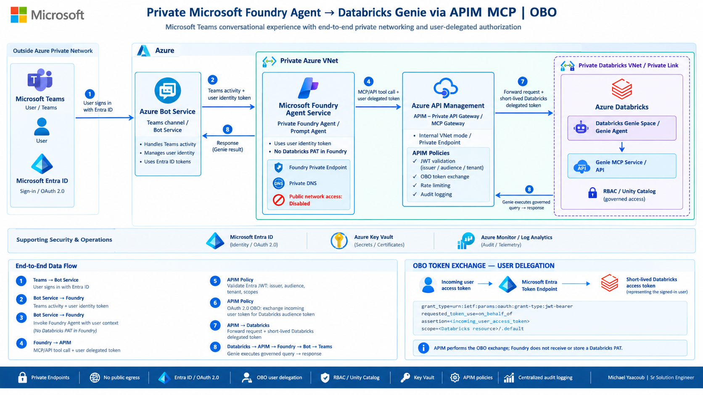

# Microsoft Foundry Agent to Databricks Genie with Teams, APIM, and OBO



This implementation replaces the Copilot Studio front end with a Microsoft Foundry
prompt agent published to Microsoft Teams through Azure Bot Service. It reuses the
repository's existing API Management OBO policy and Databricks Genie API, so every
query runs as the signed-in user rather than as a shared service identity.

> **Published Foundry agent:**  
> [Open `semiconductor-sales-genie` in Microsoft Foundry](https://ai.azure.com/nextgen/r/z4JFcKi6SXqhhApS8YMKqQ,m365-myaacoub,,foundry-myaacoub-private,sales-poc/build/agents/semiconductor-sales-genie/build?tid=12a4b86b-e64c-43f9-af05-d9130a72dfd2)
>
> **Deployed Azure Bot Service:**  
> [Open `caldova-foundry-databricks-bot` in Azure](https://portal.azure.com/#resource/subscriptions/cf824570-a8ba-497a-a184-0a52f1830aa9/resourceGroups/m365-myaacoub/providers/Microsoft.BotService/botServices/caldova-foundry-databricks-bot/overview)
>
> **Bot messaging endpoint:** `https://caldova-foundry-databricks-bot.azurewebsites.net/api/messages`  
> **Bot health endpoint:** <https://caldova-foundry-databricks-bot.azurewebsites.net/health>
>
> **Project endpoint:** `https://foundry-myaacoub-private.services.ai.azure.com/api/projects/sales-poc`
>
> **Teams package:** [`Teams Package/Foundry-Databricks-Agent.zip`](Teams%20Package/Foundry-Databricks-Agent.zip)

## Architecture

The diagram reads left to right:

1. A user opens the app in Teams and signs in with Microsoft Entra ID.
2. Azure Bot Service validates the Teams activity. Its OAuth connection requests the
   delegated `Genie.Access` scope and returns a short-lived user token to the bot.
3. The lightweight Teams bridge invokes `semiconductor-sales-genie` through the
   Foundry Responses API. The bridge authenticates to Foundry with its managed
   identity and supplies the user's token as the agent's required `oboToken`
   structured input.
4. The Foundry agent calls the APIM-hosted MCP server. Its MCP definition sets
   `Authorization: Bearer {{oboToken}}`; the value changes for each invocation and is
   never stored as a project connection secret.
5. APIM validates tenant, audience, authorized client, delegated scope, user identity,
   and rate limit. It then exchanges the assertion for a short-lived Databricks token.
6. Databricks Genie runs under the signed-in user's Unity Catalog and workspace
   permissions. A denied user remains denied.
7. Results return through APIM and Foundry to the originating Teams conversation.

The user-facing Teams/Bot connector endpoint must be reachable by the Bot Framework
service. The **data path** from Foundry to APIM and Databricks is private. For the
target locked-down configuration, Foundry and APIM use private endpoints, private
DNS, and disabled public data-plane access. Use a VNet-connected, self-hosted GitHub
runner for agent publication after that lock-down.

## Security model

| Boundary | Authentication | Authorization |
|---|---|---|
| Teams to Azure Bot Service | Bot Framework activity JWT | Registered bot and Teams channel |
| User to Azure Bot OAuth | Entra delegated sign-in | `Genie.Access` consent |
| Bot bridge to Foundry | App Service managed identity | `Foundry User` on the project |
| Foundry to APIM MCP | Per-request delegated bearer token | APIM JWT claims and per-user rate limit |
| APIM to Databricks | RFC 8693 token exchange | Databricks user, workspace, and Unity Catalog grants |

No Databricks PAT is stored in Teams, Bot Service, the web app, Foundry, APIM, or
GitHub. The bot client secret is a deployment secret and is never committed. APIM
diagnostics must continue to suppress request bodies and `Authorization` headers
because the Foundry structured input contains a short-lived credential.

## Repository layout

| Path | Purpose |
|---|---|
| [`agent/provision_agent.py`](agent/provision_agent.py) | Publishes a prompt-agent version with the OBO MCP header template |
| [`teams-bot/`](teams-bot/) | Teams activity bridge, OAuth prompt, Foundry client, tests, and package builder |
| [`infra/bicep/`](infra/bicep/) | Bicep deployment for Bot Service, App Service, monitoring, RBAC, and OBO MCP facade |
| [`infra/terraform/`](infra/terraform/) | Equivalent Terraform deployment |
| [`Teams Package/`](Teams%20Package/) | Sideloadable Teams app package |
| [`../.github/workflows/deploy-foundry-teams-agent.yml`](../.github/workflows/deploy-foundry-teams-agent.yml) | Build, provision, deploy, publish, and test workflow |
| [`docs/screenshots/`](docs/screenshots/) | Playwright-captured configuration and Teams verification images |

## Prerequisites

- The existing `foundry-myaacoub-private/sales-poc` Foundry project and
  `gpt-6-astra` model deployment.
- The existing `databricks-genie-obo` APIM API and Databricks federation policy.
- A single-tenant Entra app registration for the bot. Its client ID must match
  APIM's `genie-obo-connector-client-id` named value.
- A client secret for that app, supplied only through a secure environment variable,
  GitHub Actions secret, or Key Vault-backed deployment process.
- Teams custom app upload enabled for the test tenant.
- Azure CLI, Bicep, Terraform 1.8 or later, Node.js 20 or later, Python 3.12, and
  the Microsoft 365 Agents Toolkit CLI.

## Setup guide

### 1. Configure the Entra applications

1. In the APIM API application, expose the delegated scope `Genie.Access`.
2. In the bot application, add delegated permission to that scope and grant tenant
   admin consent.
3. Add the Teams SSO application ID URI `api://botid-<bot-client-id>`.
4. Create a client secret and store it as `TEAMS_BOT_CLIENT_SECRET`.
5. Set APIM named value `genie-obo-connector-client-id` to the bot client ID.

The current sample package uses client ID
`8127fb92-0641-4f6e-9d6e-f508e18e9606`; override it during packaging if a different
registration is used.

### 2. Provision with Bicep

```powershell
$env:TEAMS_BOT_CLIENT_SECRET = '<secret-from-key-vault-or-entra>'

az deployment group create `
  --resource-group m365-myaacoub `
  --template-file .\foundry\infra\bicep\main.bicep `
  --parameters `
    location=westus2 `
    foundryAccountName=foundry-myaacoub-private `
    foundryProjectName=sales-poc `
    apimName=caldova-apim-westus `
    tenantId=12a4b86b-e64c-43f9-af05-d9130a72dfd2 `
    botClientId=8127fb92-0641-4f6e-9d6e-f508e18e9606 `
    botClientSecret=$env:TEAMS_BOT_CLIENT_SECRET `
    botName=caldova-foundry-databricks-bot `
    botAppName=caldova-foundry-databricks-bot `
    appServicePlanName=caldova-tokenomics-api-plan `
    delegatedScope='api://bdd127ff-fd4c-45f5-b553-ff77a7755161/Genie.Access' `
    foundryAgentName=semiconductor-sales-genie
```

This creates or updates:

- `databricks-genie-obo-mcp` over the existing OBO API operations;
- the Bot Service registration and Teams channel;
- Bot Service `BotRequest` logs and `AllMetrics` routed to Log Analytics;
- the Bot OAuth connection;
- a Linux App Service on the existing `caldova-tokenomics-api-plan` and Application Insights;
- the bridge managed identity's `Foundry User` assignment.

### 3. Provision with Terraform

Use Terraform instead of Bicep, not in addition to it.

```powershell
Set-Location .\foundry\infra\terraform
Copy-Item .\terraform.tfvars.example .\terraform.tfvars
$env:TF_VAR_bot_client_secret = '<secret-from-key-vault-or-entra>'
terraform init
terraform validate
terraform plan -out main.tfplan
terraform apply main.tfplan
```

Review and replace every example identifier in `terraform.tfvars`. Never commit the
generated file or Terraform state containing a sensitive value.

### 4. Publish the Foundry agent

From a machine that can resolve and reach the private Foundry and APIM endpoints:

```powershell
$env:FOUNDRY_PROJECT_ENDPOINT = 'https://foundry-myaacoub-private.services.ai.azure.com/api/projects/sales-poc'
$env:FOUNDRY_AGENT_NAME = 'semiconductor-sales-genie'
$env:FOUNDRY_MODEL_DEPLOYMENT_NAME = 'gpt-6-astra'
$env:MCP_SERVER_URL = 'https://caldova-apim-westus.azure-api.net/databricks-genie-obo-mcp/mcp'
$env:FOUNDRY_AGENT_PORTAL_URL = 'https://ai.azure.com/nextgen/r/z4JFcKi6SXqhhApS8YMKqQ,m365-myaacoub,,foundry-myaacoub-private,sales-poc/build/agents/semiconductor-sales-genie/build?tid=12a4b86b-e64c-43f9-af05-d9130a72dfd2'

python -m pip install -r .\foundry\agent\requirements.txt
python .\foundry\agent\provision_agent.py
```

The script creates a new immutable agent version and prints the published URL. A
delegated test token can be provided with `--test-token`; do not put that token in a
shell history, source file, workflow log, or persistent environment file.

### 5. Build and deploy the Teams bridge

```powershell
Set-Location .\foundry\teams-bot
npm ci
npm test
npm run build
npm run package:teams
Compress-Archive -Path .\dist,.\package.json,.\package-lock.json -DestinationPath ..\..\foundry-teams-bot.zip -Force
az webapp deploy --resource-group m365-myaacoub --name caldova-foundry-databricks-bot --src-path ..\..\foundry-teams-bot.zip --type zip --clean true --restart true
Invoke-RestMethod https://caldova-foundry-databricks-bot.azurewebsites.net/health
```

### 6. Install and test in Teams

1. Open Teams **Apps** and select **Manage your apps**.
2. Select **Upload an app** and upload
   [`Teams Package/Foundry-Databricks-Agent.zip`](Teams%20Package/Foundry-Databricks-Agent.zip).
3. Open the personal chat and send `What can you help me analyze?`.
4. Complete the Entra sign-in card.
5. Send the prompts below and verify that results match the user's Databricks grants.
6. Test with a denied user. A `403` is the expected result; the solution must not fall
   back to application identity.

### 7. Deploy through GitHub Actions

Run **Deploy Foundry Teams OBO Agent** after configuring:

| Secret | Purpose |
|---|---|
| `AZURE_CLIENT_ID` | GitHub OIDC deployment application |
| `AZURE_TENANT_ID` | Tenant used by Azure and Foundry |
| `AZURE_SUBSCRIPTION_ID` | Target subscription |
| `TEAMS_BOT_CLIENT_ID` | Single-tenant bot application |
| `TEAMS_BOT_CLIENT_SECRET` | Bot and OAuth connection credential |
| `APIM_OBO_CLIENT_ID` | Audience application exposing `Genie.Access` |
| `DELEGATED_SMOKE_TEST_TOKEN` | Optional, short-lived manual-dispatch test only |

The `publish-foundry-agent` job targets
`[self-hosted, Windows, foundry-private]` so publication continues to work when public
Foundry access is disabled.

## Playwright screenshots

The screenshot automation is
[`teams-bot/scripts/capture-screenshots.ts`](teams-bot/scripts/capture-screenshots.ts).
It intentionally uses an interactive browser and an authenticated storage state;
credentials are never automated or committed.

```powershell
Set-Location .\foundry\teams-bot
$env:FOUNDRY_AGENT_PORTAL_URL = 'https://ai.azure.com/nextgen/r/z4JFcKi6SXqhhApS8YMKqQ,m365-myaacoub,,foundry-myaacoub-private,sales-poc/build/agents/semiconductor-sales-genie/build?tid=12a4b86b-e64c-43f9-af05-d9130a72dfd2'
$env:AZURE_BOT_PORTAL_URL = 'https://portal.azure.com/#resource/subscriptions/cf824570-a8ba-497a-a184-0a52f1830aa9/resourceGroups/m365-myaacoub/providers/Microsoft.BotService/botServices/caldova-foundry-databricks-bot/overview'
$env:TEAMS_AGENT_URL = 'https://teams.microsoft.com'
$env:PLAYWRIGHT_STORAGE_STATE = '.\playwright-auth.json'
npm run screenshots
```

The script waits for the expected resource or app name before writing:

| Screenshot | Shows |
|---|---|
| `docs/screenshots/01-foundry-agent.png` | Agent model, instructions, and MCP tool |
| `docs/screenshots/02-bot-service.png` | Bot Service endpoint and Teams channel |
| `docs/screenshots/03-teams-chat.png` | Teams chat with a grounded sample response |

The first browser run requires interactive sign-in. Keep `playwright-auth.json` and
`docs/screenshots/.auth-state.json` out of source control because they contain
authenticated browser state.

## Sample prompts

- `What were total 2025 sales by region, in USD millions?`
- `Compare monthly revenue and gross margin for the top five product families.`
- `Which fabs had the lowest yield by process node last quarter?`
- `Show open shortage risk by customer and requested ship month.`
- `Follow up on that result and explain the largest month-over-month change.`
- `Create an executive summary of the result and cite the returned filters and units.`

## Validation checklist

- `npm test` proves that the delegated token is sent only in
  `structured_inputs.oboToken`, while Foundry uses its own access token.
- `npm run build` type-checks the bot.
- `npm run package:teams` emits a valid zip with manifest and icons.
- `az bicep build --file foundry/infra/bicep/main.bicep` validates Bicep syntax.
- `terraform validate` validates the Terraform module.
- `/health` proves the deployed bridge is running.
- The optional workflow smoke test invokes the published agent with a short-lived
  delegated token.
- The final Teams test must be performed by an authenticated tenant user because
  Teams sideloading and OAuth consent cannot be validated anonymously.

## Troubleshooting

| Symptom | Check |
|---|---|
| Teams repeatedly asks the user to sign in | Bot OAuth connection name, client secret, redirect URL, admin consent |
| APIM returns `401` | Token audience, tenant, signature, expiry, and `Genie.Access` scope |
| APIM returns `403` | `azp` equals the configured bot client and `oid` is authorized |
| Bot activities are missing from logs | Confirm the `bot-service-logs` diagnostic setting and query the `BotRequest` category |
| Foundry returns `403` | App Service managed identity has `Foundry User` on the project |
| MCP call fails before APIM | OBO MCP API exists and Foundry can privately resolve the APIM gateway |
| Agent publishes but Teams cannot reply | Bot endpoint, Teams channel, App Service health, and Bot Framework JWT settings |
| GitHub agent publication times out | Use the VNet-connected `foundry-private` runner and private DNS |

## References

- [Structured inputs in Foundry agents](https://learn.microsoft.com/azure/foundry/agents/how-to/structured-inputs)
- [Connect Foundry agents to MCP servers](https://learn.microsoft.com/azure/foundry/agents/how-to/tools/model-context-protocol)
- [Add authentication to an Azure Bot](https://learn.microsoft.com/azure/bot-service/bot-builder-authentication)
- [Configure private networking for Foundry](https://learn.microsoft.com/azure/foundry/how-to/configure-private-link)
- [Existing OBO implementation](../docs/obo/README.md)
