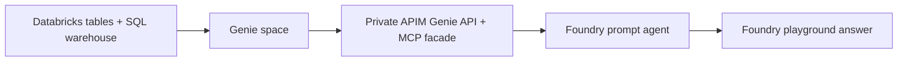

# Phase 1: Databricks Genie to Microsoft Foundry agent UI

Get a grounded Databricks answer in the **Foundry agent playground** first, without
an additional agent sign-in flow, delegated user-token connection, or OBO. No Entra
application registration, OAuth consent, or Databricks user federation setup is
part of this quick start.

**No authentication** here means no added end-user authentication for the agent
tools. Azure, Databricks, and Foundry portals still require the operator's existing
platform access. Foundry uses a stored APIM subscription key, and APIM uses its
backend managed identity. Do not disable these controls or make Databricks anonymous.
All queries run as the shared backend identity, not the person using the playground.
Use approved demo data, not data requiring per-user authorization.

- **Next:** [Phase 2: setup security, Entra ID, OBO, and Teams](docs/obo/README.md).
- **Demo only:** [Foundry deployed resources and evidence](docs/deployed-resources/README.md).
- **Copilot alternative:** [Copilot Studio phase-one setup](../README.md#phase-one-setup).

## Contents

- [Architecture](#architecture)
- [Prerequisites and customer inputs](#prerequisites-and-customer-inputs)
- [Setup guide](#setup-guide)
- [Acceptance checklist](#acceptance-checklist)
- [Troubleshooting](#troubleshooting)
- [Repository layout](#repository-layout)
- [References](#references)

## Architecture

Requests travel in the opposite direction: the playground invokes the agent, the
agent calls APIM's non-OBO MCP server using its stored service connection, and
APIM calls Genie with its managed identity. Genie resolves the question against
Unity Catalog and returns results through APIM to the agent UI.

Foundry-to-APIM and APIM-to-Databricks traffic use private networking. The Foundry
portal can remain accessible to authorized operators while agent egress is private;
public portal access does not require public APIM or Databricks ingress.
The Teams bridge in this repository is OBO-only and is **not** a phase-one UI.

## Prerequisites and customer inputs

- A Databricks workspace, approved Unity Catalog tables, a SQL warehouse, and a
  Genie space that answers a question in the Databricks UI.
- APIM with the existing non-OBO `databricks-genie` API, subscription protection,
  backend managed-identity permissions, and private access to Databricks.
- A Foundry project with a deployed model supporting MCP tools and operator access
  to create connections, publish agents, and use the playground.
- Foundry Agent Service private egress to APIM, peering/routing, and private DNS.
  An existing Foundry account without outbound network injection may require a
  new account; do not assume a private endpoint alone provides private egress.

If shared backend credentials or permissions are not already configured, ask the
resource owner to complete [baseline service security](docs/obo/README.md) first.
This does not require delegated user OAuth.

| Input | Where to obtain it |
|---|---|
| `<resource-group>` / `<apim-name>` | Azure resource overview |
| `<databricks-workspace-url>` | Databricks workspace URL, including the actual shard |
| `<catalog>` / `<schema>` | Unity Catalog |
| `<warehouse-id>` / `<genie-space-id>` | Warehouse and Genie space settings |
| `<foundry-account>` / `<project-name>` | Foundry project overview |
| `<model-deployment-name>` | Your project's deployed model, not a model catalog name |
| `<agent-name>` / `<connection-name>` | Names you choose for this phase-one agent and connection |
| MCP URL | `https://<apim-name>.azure-api.net/databricks-genie-mcp/mcp` |

Replace every placeholder with your environment's values. The checked-in
[deployment configuration](../config/deployment.json), Bicep parameter files,
Terraform examples, and generated definitions describe the demo; review and
replace their environment-specific inputs before deploying. Do not reuse demo IDs.

## Setup guide

### 1. Prepare Databricks

1. Select your catalog/schema and approved tables. Start the SQL warehouse.
2. Create a Genie space over those tables, attach the warehouse, and add business
   descriptions and example questions.
3. Ask a question directly in Genie. Confirm the returned SQL, rows, filters, and
   units before adding the agent layer.
4. Record the workspace URL, warehouse ID, and Genie space ID for APIM.

### 2. Publish the non-OBO Genie API and MCP server

1. In APIM, set `databricks-workspace-url`, `databricks-warehouse-id`, and
   `databricks-genie-space-id` to your values.
2. Publish the non-OBO API and policies from [APIM infrastructure](../apim/main.bicep).
   Use the existing backend identity and subscription; do not select
   `databricks-genie-obo`.
3. Test all four REST operations from a private-network host using the existing
   service connection: `ask`, `message` polling, `result`, and `follow-up`.
4. In APIM **MCP Servers**, expose those four operations from `databricks-genie`
   as a server with path `databricks-genie-mcp`. The repository's
   [MCP helper](../apim/enable-mcp.ps1) supports this projection; review your
   customer configuration before using it, and explicitly set
   `-SourceApiId databricks-genie -McpPath databricks-genie-mcp` because its defaults
   select the SQL API. If the preview management API is unavailable, use the
   APIM portal and select the Genie operations.
5. Confirm the server URL is
   `https://<apim-name>.azure-api.net/databricks-genie-mcp/mcp` and its tools list
   contains all four operations. Keep APIM subscription protection enabled.

Do not use the SQL-only `databricks-mcp` endpoint for a Genie conversation.

### 3. Connect Foundry privately to APIM

1. Use [the Foundry Bicep module](../bicep/foundry-private/main.bicep) or
   [the equivalent Terraform module](../terraform/foundry-private) with your
   own account/project names, model deployment, VNet/subnets, and address ranges.
   Choose one deployment method, not both.
2. Configure the dedicated Agent Service subnet, reachability to the APIM VNet,
   APIM private endpoint, and private DNS. Keep existing APIM/Databricks lockdown.
3. Verify the Foundry agent egress path can resolve the APIM hostname to its private
   address. If Foundry data-plane ingress is also private-only, use the playground
   from an approved private-network browser session.

### 4. Create a shared MCP tool connection

1. In your Foundry project, add a remote MCP tool using the server URL from step 2.
2. Select a **key-based service connection**, not user OAuth or user identity
   passthrough. Store the existing APIM key in the connection's protected
   `Ocp-Apim-Subscription-Key` field. The connection is `RemoteTool` /
   `custom_MCP` with `authType: CustomKeys`.
3. Name the connection `<connection-name>` and attach it to the agent. Do not put
   the key in an agent instruction, prompt, inline tool header, or checked-in file.
   Detailed credential handling belongs to [setup security](docs/obo/README.md).
4. Confirm Foundry discovers the four Genie tools.

This connection authenticates the **service**, not each end user. If the portal
does not expose CustomKeys connection creation, have the operator create the
project connection through the supported ARM connection API described in
[setup security](docs/obo/README.md); do not switch to the OBO provisioning workflow.

### 5. Build the prompt agent

1. Create a prompt agent in the project, using `<agent-name>` and your
   `<model-deployment-name>`.
2. Attach the MCP connection from step 4. Restrict enabled tools to the four Genie
   operations and retain approval settings appropriate to the test.
3. Tell the agent to start with `ask`, retain conversation/message IDs, poll
   `message` until `COMPLETED`, then fetch `result`. Use `follow-up` in the same
   conversation for subsequent questions.
4. Require grounded answers with source, filters, and units. Failed or timed-out
   queries must produce an error explanation, not fabricated numbers.
5. Save/publish the agent version and open its playground.

The Python publisher under [agent/](agent/) and the Teams deployment modules under
[infra/](infra/) configure the **phase-two OAuth/OBO path**. Do not run them for
this key-based quick start.

### 6. Test the end-to-end agent UI

1. Ask a question you already tested in Genie, such as total sales by quarter.
2. Inspect the tool trace: `ask` → `message` polling → `result`.
3. Compare the answer with Databricks and confirm the table, filters, and units.
4. Ask a follow-up and confirm the same Genie conversation is used.
5. Start a new chat and confirm the agent does not request bot sign-in or MCP
   OAuth consent. Your existing Foundry portal session is still required.

The phase-one finish line is a grounded result in this playground, not an
anonymous public web chat or Teams bot. Teams publication, app registration,
OAuth, guest access, user authorization, and denied-user tests are documented
entirely in [Phase 2: setup security](docs/obo/README.md).

## Acceptance checklist

- [ ] Genie answers directly using the selected warehouse and approved tables.
- [ ] APIM's four non-OBO operations work through the private route.
- [ ] Foundry discovers all four tools through the key-based service connection.
- [ ] The playground returns a grounded answer and a same-conversation follow-up.
- [ ] No added sign-in card, OAuth consent request, or delegated user token is used.
- [ ] Credentials are absent from instructions, screenshots, logs, and source.
- [ ] Shared-identity success is not presented as proof of per-user authorization.

## Troubleshooting

| Symptom | Check |
|---|---|
| Genie fails before APIM is involved | Warehouse state, space tables, and backend grants |
| APIM returns `401` | Existing APIM service subscription and protected connection key |
| Databricks rejects the backend call | Backend managed-identity access; ask the resource owner to check setup security |
| MCP tools are missing | Genie MCP facade exists and exposes all four operations |
| SQL tools appear instead of Genie tools | Use `databricks-genie-mcp`, not `databricks-mcp` |
| Tool calls time out | Agent subnet routing, peering, private DNS, and private endpoints |
| An OAuth consent link appears | You attached a phase-two OAuth connection; select the phase-one CustomKeys connection |
| A plausible answer has no tool trace | Require Genie calls and inspect the tool output; do not accept an ungrounded response |

## Repository layout

| Path | Purpose |
|---|---|
| [../apim/](../apim/) | Shared non-OBO Genie API, policies, and MCP projection |
| [../bicep/foundry-private/](../bicep/foundry-private/) | Foundry private Agent Service egress infrastructure |
| [../terraform/foundry-private/](../terraform/foundry-private/) | Terraform alternative |
| [docs/obo/README.md](docs/obo/README.md) | Phase-two security and Teams deployment |
| [docs/deployed-resources/README.md](docs/deployed-resources/README.md) | Demo inventory and historical evidence |
| [agent/](agent/) | Phase-two OAuth prompt-agent publisher |
| [teams-bot/](teams-bot/) | Phase-two Teams OAuth bridge and package builder |
| [infra/](infra/) | Phase-two Bot Service, bridge, OAuth connection, and OBO MCP infrastructure |

## References

- [Connect Foundry agents to MCP servers](https://learn.microsoft.com/azure/foundry/agents/how-to/tools/model-context-protocol)
- [Configure private networking for Foundry](https://learn.microsoft.com/azure/foundry/how-to/configure-private-link)
- [Copilot Studio phase-one setup](../README.md#phase-one-setup)
- [Phase-two Foundry security setup](docs/obo/README.md)
