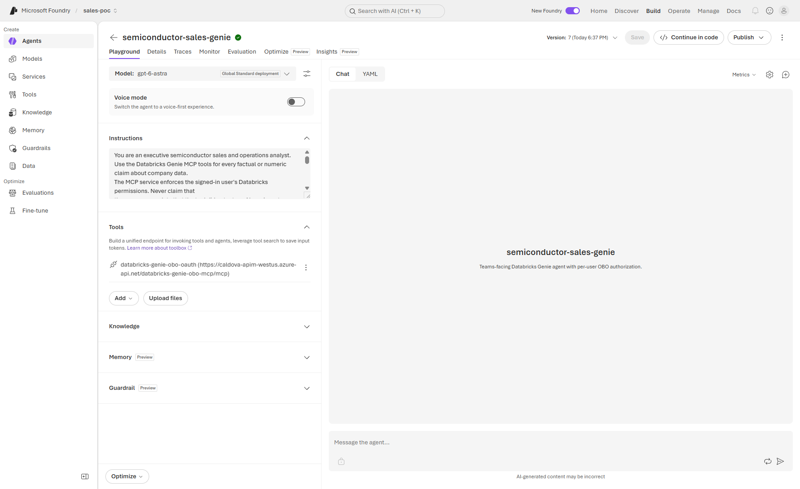

# Microsoft Foundry demo — deployed resources and evidence

This is the **Foundry reference demo inventory**, not customer deployment inputs
or proof of Phase 1 setup. Resource names, regions and endpoints describe the demo;
GUIDs, account/user IDs, warehouse IDs, portal hashes and personal identities are
replaced with placeholders. Private URLs require authorized network access.

- [Phase 1: private Foundry baseline](../../README.md)
- [Phase 2: setup security, OBO, Bot and Teams](../obo/README.md)
- [Shared Copilot/APIM/Databricks inventory](../../../docs/deployed-resources/README.md)

Recorded sources are the original Foundry main/OBO guides and
[deployment configuration](../../../config/deployment.json). This relocation adds
no new live verification; dates below are historical observations.

## Resource inventory

| Component | Demo resource / configuration |
| --- | --- |
| Subscription / tenant | `<subscription-id>` / `<tenant-id>` |
| Resource group | `m365-myaacoub` |
| Foundry account / project | `foundry-myaacoub-private` / `sales-poc`, West US |
| Prompt agent | `semiconductor-sales-genie`, active version 7 in the 2026-10-04 capture |
| Other private agent configuration | `semiconductor-sales` |
| Model deployment | `gpt-6-astra`; config records model version `2026-09-03`, GlobalStandard, capacity 500 |
| Capability host | `caphostproj` |
| Baseline MCP connection | `databricks-mcp` |
| Delegated MCP project connection | `databricks-genie-obo-oauth`, custom `OAuth2`; scope `api://<apim-api-client-id>/Genie.Access` and `offline_access` |
| APIM | `caldova-apim-westus`, West US, StandardV2; public access disabled |
| Underlying OBO API / MCP facade | `databricks-genie-obo` / `databricks-genie-obo-mcp` |
| Token broker | `caldova-genie-obo-fn`, Windows B1 shared `caldova-showcase-plan` |
| Databricks workspace | `caldova-dbx-westus2`, West US 2; public access disabled |
| Catalog / schema | `caldova_dbx_westus2.arrow_semiconductor` |
| Genie space | `Arrow Semiconductor Analytics`, `<genie-space-id>` |
| Warehouse | `caldova-serverless-2xs`, `<sql-warehouse-id>` |
| Bot Service / Linux App Service | `caldova-foundry-databricks-bot`; Teams channel enabled and terms accepted |
| Bot App Service region / existing plan | West US 2 / `caldova-tokenomics-api-plan` in the original Bicep command |
| Bot OAuth connection | `DatabricksGenieOBO`; delegated Foundry resource `https://ai.azure.com/.default` |
| Bot diagnostics | `BotRequest` / `AllMetrics` to `caldova-foundry-databricks-bot-insights-logs` |
| OBO monitoring | `caldova-genie-obo-insights`, `caldova-apim-logs-westus` |
| Bot / MCP OAuth application | `<bot-client-id>` / `<mcp-oauth-client-id>`; separate secrets |
| APIM API application | `<apim-api-client-id>`; v2 audience and delegated `Genie.Access` |
| Teams package | [Foundry-Databricks-Agent.zip](../../Teams%20Package/Foundry-Databricks-Agent.zip) |
| Private operations host | `caldova-jump` |
| Publication runner | `[self-hosted, Windows, foundry-private]` |

Other configuration entries (`002-ai-poc-private/proj-default`, `gpt-4.1`,
`databricks-apim-mcp`, `databricks-apim-genie-mcp`, and
`foundry-myaacoub/proj-default`) are separate application/original configurations,
not the published Teams agent above. Do not confuse them with the selected demo.

## Demo URLs

| Experience | Demo URL |
| --- | --- |
| Foundry project endpoint | `https://foundry-myaacoub-private.services.ai.azure.com/api/projects/sales-poc` |
| Published agent portal template | `https://ai.azure.com/nextgen/r/<portal-resource-token>,m365-myaacoub,,foundry-myaacoub-private,sales-poc/build/agents/semiconductor-sales-genie/build?tid=<tenant-id>` |
| Bot portal template | `https://portal.azure.com/#resource/subscriptions/<subscription-id>/resourceGroups/m365-myaacoub/providers/Microsoft.BotService/botServices/caldova-foundry-databricks-bot/overview` |
| Bot Web Chat template | `https://portal.azure.com/#resource/subscriptions/<subscription-id>/resourceGroups/m365-myaacoub/providers/Microsoft.BotService/botServices/caldova-foundry-databricks-bot/testwebchat` |
| Public Bot messaging endpoint | `https://caldova-foundry-databricks-bot.azurewebsites.net/api/messages` |
| Bot health | <https://caldova-foundry-databricks-bot.azurewebsites.net/health> |
| Private OBO MCP endpoint | `https://caldova-apim-westus.azure-api.net/databricks-genie-obo-mcp/mcp` |
| Private OBO REST API | `https://caldova-apim-westus.azure-api.net/databricks-genie-obo` |
| Baseline MCP endpoint | `https://caldova-apim-westus.azure-api.net/databricks-genie-mcp/mcp` |
| Databricks workspace | `<databricks-workspace-url>`; copy the exact workspace origin from its portal, including its actual shard |

Portal links requiring identifier placeholders are templates, not immediately
usable deep links. Open [Foundry](https://ai.azure.com/) or
[Azure](https://portal.azure.com/) to locate the demo under your authorized context.

## Network snapshot and caveats

The data path is Foundry → private APIM → private Databricks; the Bot Framework
service requires a reachable `/api/messages` endpoint. Public Bot ingress does not
imply public APIM or Databricks ingress.

The shared network configuration places Foundry agent egress on
`caldova-apim-westus-vnet/foundry-agent` (`10.191.2.0/24`), with APIM integration
`10.191.0.0/24`, gateway private endpoint subnet `10.191.1.0/24`, and Databricks
VNet `caldova-dbx-vnet-westus2` (`10.190.0.0/16`). See the
[shared address plan](../../../docs/deployed-resources/README.md#demo-address-plan).

The configuration records Foundry `publicNetworkAccess: Enabled`. The private
Foundry design can retain public portal ingress with private Agent Service egress;
do not turn the target locked-down wording in an older guide into proof that all
Foundry public ingress was disabled. Validate current ingress, private DNS and
tool egress independently. A VNet-connected runner is required after data-plane
lockdown. Databricks/APIM disabled-public-access evidence does not certify Foundry
ingress settings.

## Live verification snapshot — 2026-10-04

The infrastructure and agent were deployed. Azure Bot **Test in Web Chat**
completed Bot OAuth and one-time Foundry MCP consent and returned a grounded
Databricks Genie answer to `sales by qtr`. It showed 2025 quarterly sales,
`product_sales` as source, revenue aggregation, the 2025 filter and the increasing
quarterly trend.

The final Teams screenshot showed grounded quarterly, regional, fab-yield and
product-family results with basis, filters and Databricks source tables. This is
positive-path demo evidence, not proof of production authorization completeness.

### Guest deployment evidence

| Check | Recorded result |
| --- | --- |
| Invited identity / guest object | `<external-user-email>` / `<resource-tenant-guest-object-id>` |
| Guest state / UPN | `Accepted` / `<guest-upn>` |
| Foundry access | `Foundry User` at `foundry-myaacoub-private/sales-poc` only |
| APIM authorization | Existing administrator plus approved guest object |
| Databricks account identity | `<guest-databricks-username>`, `<databricks-account-principal-id>` |
| Workspace assignment | `USER` with workspace and Databricks SQL access |
| Genie permission | `CAN_RUN` on `Arrow Semiconductor Analytics` |
| Warehouse permission | `CAN_USE` on `<sql-warehouse-id>` |
| Unity Catalog grants | `USE CATALOG`, `USE SCHEMA`, `SELECT` on `caldova_dbx_westus2.arrow_semiconductor` |
| Teams validation | Guest completed both OAuth flows and received a grounded quarterly-sales answer |
| Audit evidence | APIM/Function correlated guest `oid`, successful token exchange and HTTP 200 completion |

Direct workspace SCIM administration from the public operator network was rejected
with `Unauthorized network access to workspace`. Account-level assignment used the
Databricks account API. Workspace SCIM, Genie, warehouse and Unity Catalog grants
were applied from private `caldova-jump` using a temporary managed-identity
workspace-admin assignment. The assignment was removed immediately afterwards and
the VM deallocated; workspace public access was never enabled.

The first guest query failed at exchange before workspace assignment/grants
propagated; a retry succeeded. `<guest-success-correlation-id>` joined the
`<resource-tenant-guest-object-id>` APIM events with Function exchange success
and final APIM HTTP 200 result retrieval.

## Screenshots

Historical screenshots preserve deployment/configuration surfaces. They may
retain demo labels or identities in image pixels; do not treat them as customer
inputs or republish authenticated state. All customer captures must be sanitized.

The last three captures were generated from ARM, APIM, Databricks account-policy,
permission and correlated audit APIs. Credentials, bearer tokens, invitation
redemption URLs, request bodies, Authorization headers and authenticated browser
state are excluded from the evidence contract. Capture automation and customer
setup commands belong in [Phase 2](../obo/README.md#screenshot-automation).

## Verification limits and production sign-off

- Guest positive-path grants and correlated APIM/Function success were recorded.
  **A genuine denied-user query and correlated APIM/Databricks audit evidence
  remain required for production sign-off.** Positive guest or administrator
  results alone do not prove denied access or row/column restrictions.
- Bot health only proves bridge liveness. ARM provisioning does not prove OAuth
  redirects/consent; Web Chat does not prove Teams sideloading or tenant policy.
  Teams installation/consent requires a real authenticated tenant/guest user.
- The earlier Copilot snapshot's unverified least-privilege claims and the later
  Foundry guest success refer to different dates/tests; do not silently broaden
  one snapshot's certification based on the other.
- Account federation is broad trust, not a table grant or an APIM-only boundary.
  Effective workspace, Genie, warehouse and Unity Catalog permissions remain
  authoritative; test restricted tables/rows/columns explicitly.
- Keep the old non-OBO baseline route until acceptance, then retire migrated
  callers' shared-identity access. Never use it as automatic fallback after denial.
- The bridge uses in-memory conversation state; production multi-instance use
  needs a supported durable store.
- Local tests/builds and workflow smoke tests do not certify live authorization,
  network lockdown or complete cross-service audit correlation. Telemetry schema,
  ingestion delay and retention/caps affect evidence availability.
- Rotate bot/MCP secrets separately. Keep `playwright-auth.json` and
  `docs/screenshots/.auth-state.json` out of source control; omit live tokens and
  personal identities from future captures.
