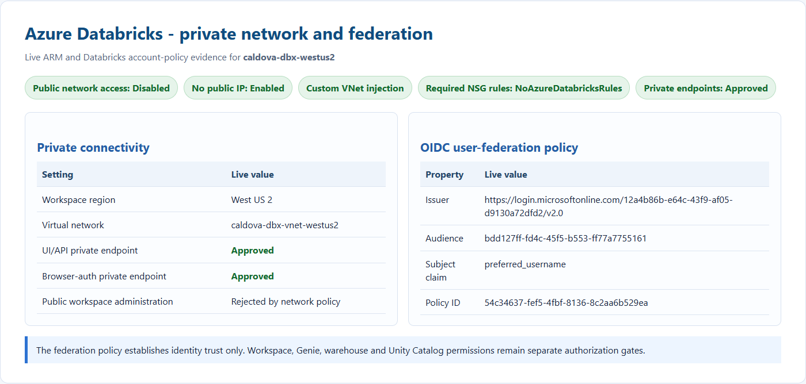
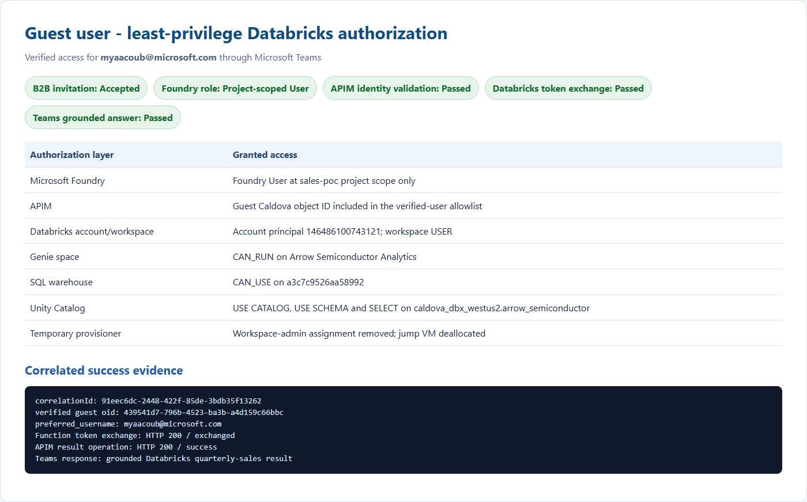
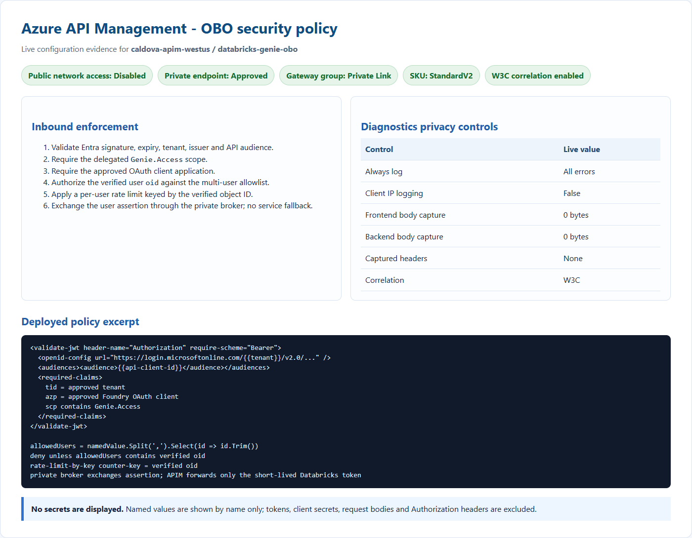
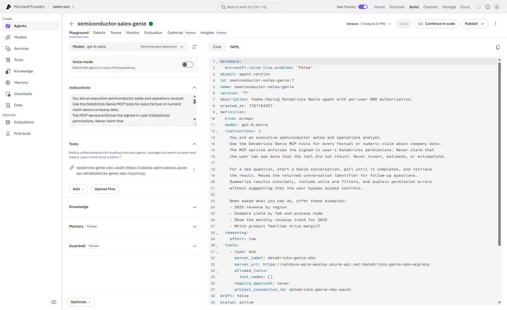
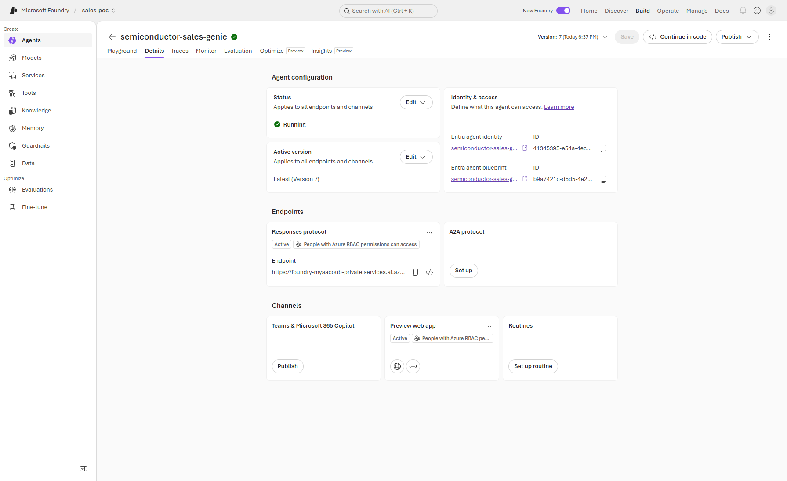
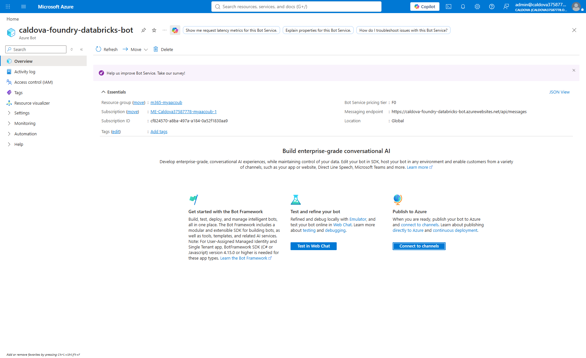
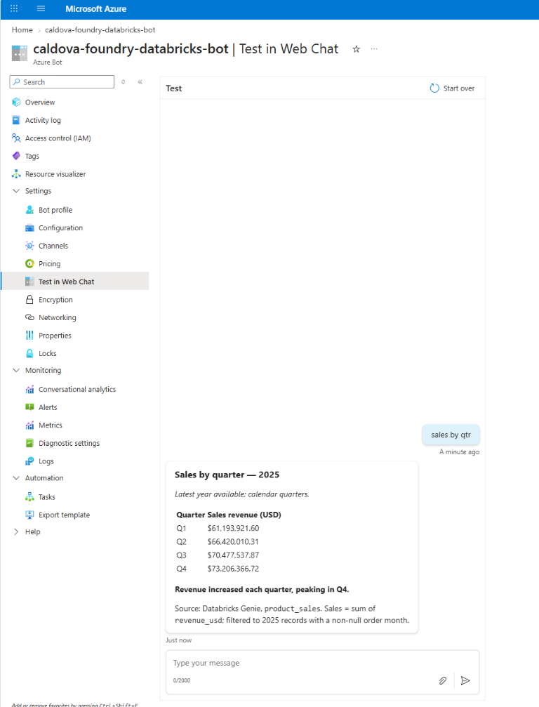
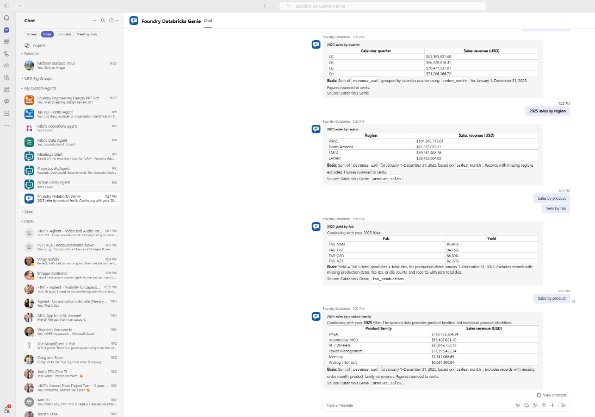

# Phase 2: Setup security — Microsoft Foundry

This guide explains how to reproduce the Microsoft Teams → Azure Bot Service →
Microsoft Foundry → private API Management → native Azure Databricks Genie MCP
on-behalf-of (OBO) flow in this repository. It covers the identity chain, Entra
registrations, Foundry user identity passthrough, APIM validation, Databricks
federation, private networking, deployment, logging, live verification, and
failure diagnosis.

The preferred MCP target is the Databricks-native Genie MCP route proxied by APIM:

```text
https://<apim-name>.azure-api.net/dbx-native-genie-mcp/api/2.0/mcp/genie/<genie-space-id>
```

Do not point Foundry directly at the Databricks workspace URL. APIM remains the
private policy enforcement and OBO token-exchange boundary.

Begin with the [Phase 1 main guide](../../README.md): deploy and validate the
private Foundry → APIM → Databricks baseline without end-user authentication,
Entra app registrations, OBO or Teams/Bot deployment. The [Foundry demo inventory](../deployed-resources/README.md)
contains actual demo names, URLs and dated evidence, not customer deployment inputs
or proof of Phase 1 setup.

**Phase 1 means no additional agent sign-in, not anonymous portal access.**
Keep existing authenticated Azure, Foundry and Databricks sessions, platform RBAC,
APIM subscription protection and backend identity authorization. Do not expose
an anonymous public agent or disable platform controls to avoid OAuth.

This migration is **additive**. Keep the non-OBO MCP/API route available to the
existing baseline until allowed-user, denied-user and least-privilege acceptance
passes. Do not overwrite it while adding the OBO facade, and never automatically
fall back to a shared identity after a user denial.

## Shared baseline backend authorization

Private networking is not authorization. For the Phase 1 shared backend, enable
APIM's managed identity, provision its service principal in Databricks, assign it
to the workspace, and grant only required warehouse/Genie access, SQL entitlements
and Unity Catalog catalog/schema/table privileges. Configure the existing APIM
managed-identity backend policy and protect any APIM subscription keys in approved
secret storage/connections. Foundry's baseline caller must also be authorized for
APIM by the configured gateway policy. None of this requires a new end-user UI
app registration or proves user-specific data permissions. See the
[shared backend security guidance](../../../docs/obo/README.md#shared-baseline-backend-authorization).

### Existing Foundry project access

The operator needs existing Azure permission to manage the selected Foundry project
and its connections; use `Foundry Project Manager` or the equivalent permissions
approved by the resource owner. Playground callers need existing `Foundry User`
project access. Scope assignments to the project where supported, not the whole
subscription. Private-network access and model access must also be available.
These existing platform permissions do not require a new agent app registration,
Teams sign-in or delegated APIM OAuth consent. Connection access remains subject
to project RBAC; do not share a subscription key with individual users.

### Baseline CustomKeys MCP connection

Use this section only for Phase 1's **non-OBO** Genie MCP facade:

1. Confirm `databricks-genie` and `databricks-genie-mcp` use the intended APIM
   subscription/product, preserve subscription protection, and grant APIM's backend
   managed identity only the required Databricks access described above.
2. In the customer Foundry project, add a remote MCP tool targeting
   `https://<apim-name>.azure-api.net/databricks-genie-mcp/mcp`.
3. Select a key-based service connection with `category: RemoteTool`,
   `metadata.type: custom_MCP`, and `authType: CustomKeys`. Store the existing
   subscription key as protected `credentials.keys.Ocp-Apim-Subscription-Key`.
   Do **not** select OAuth2, user identity passthrough, or the OBO MCP facade.
4. Name it `<connection-name>`, retain `isSharedToAll: false`, and attach the
   connection to the baseline agent using its `project_connection_id`.
5. Verify all four Genie operations are discovered and a grounded playground query
   succeeds without an additional agent sign-in. This uses the shared backend
   identity, not each caller's Databricks permissions.

If the portal does not expose CustomKeys creation, an authorized operator can use
the project ARM connections API. The following PowerShell obtains the existing
APIM key and ARM token in process memory, submits them over HTTPS, prints only
nonsecret connection metadata and clears local references. Run in a secured
operator session with PowerShell transcription/debug tracing and CLI HTTP logging
disabled; do not capture command responses containing secrets. No secret is
written to a file or entered as a literal command argument.
The operator needs permission to list secrets on that APIM subscription and write
connections on that Foundry project; ordinary playground callers do not need
either administrative permission.

```powershell
$subscriptionId = '<subscription-id>'
$resourceGroup = '<resource-group>'
$apimName = '<apim-name>'
$apimSubscriptionName = '<apim-subscription-resource-name>'
$foundryAccount = '<foundry-account>'
$projectName = '<foundry-project>'
$connectionName = '<connection-name>'
$mcpUrl = "https://$apimName.azure-api.net/databricks-genie-mcp/mcp"

az account set --subscription $subscriptionId
if ($LASTEXITCODE -ne 0) { throw 'Unable to select customer subscription.' }
$keyUri = "https://management.azure.com/subscriptions/$subscriptionId/resourceGroups/$resourceGroup/providers/Microsoft.ApiManagement/service/$apimName/subscriptions/$apimSubscriptionName/listSecrets?api-version=2024-05-01"
$connectionUri = "https://management.azure.com/subscriptions/$subscriptionId/resourceGroups/$resourceGroup/providers/Microsoft.CognitiveServices/accounts/$foundryAccount/projects/$projectName/connections/${connectionName}?api-version=2025-06-01"

try {
    $secretResult = az rest --method post --url $keyUri -o json --only-show-errors | ConvertFrom-Json
    if ($LASTEXITCODE -ne 0 -or -not $secretResult.primaryKey) {
        throw 'Unable to obtain approved APIM subscription key.'
    }
    $armToken = az account get-access-token --resource https://management.azure.com --query accessToken -o tsv --only-show-errors
    if ($LASTEXITCODE -ne 0 -or -not $armToken) { throw 'Unable to obtain ARM token.' }
    $body = @{
        properties = @{
            category = 'RemoteTool'
            target = $mcpUrl
            authType = 'CustomKeys'
            credentials = @{
                keys = @{ 'Ocp-Apim-Subscription-Key' = $secretResult.primaryKey }
            }
            metadata = @{ type = 'custom_MCP' }
            isSharedToAll = $false
        }
    } | ConvertTo-Json -Depth 8
    $connection = Invoke-RestMethod -Method Put -Uri $connectionUri `
        -Headers @{ Authorization = ('Bearer ' + $armToken) } `
        -ContentType 'application/json' -Body $body
    [pscustomobject]@{
        name = $connection.name
        target = $connection.properties.target
        authType = $connection.properties.authType
    }
} finally {
    $secretResult = $null
    $armToken = $null
    $body = $null
    $connection = $null
}
```

Project connections are not an alternative to RBAC. Restrict connection management
and invocation to approved operators/callers, verify the private MCP target and
avoid broad project sharing. Rotate APIM primary/secondary keys using the owner's
approved staged procedure, update the protected connection, test it, then retire
the old key. Never put a key in agent instructions, prompts, inline tool headers,
screenshots, source, workflow logs or checked-in configuration.

All subsequent delegated identity, Entra, Bot and Teams steps are **Phase 2**.
The Phase 1 CustomKeys connection is separate from the OAuth2 connection below.


## Table of contents

- [Architecture](#architecture)
- [Shared baseline backend authorization](#shared-baseline-backend-authorization)
- [Demo inventory and verification caveats](../deployed-resources/README.md)
- [What OBO means in this solution](#what-obo-means-in-this-solution)
- [Identity and token chain](#identity-and-token-chain)
- [Trust boundaries](#trust-boundaries)
- [Prerequisites](#prerequisites)
- [B2B guest access for external users](#b2b-guest-access-for-external-users)
- [1. Configure the APIM API application](#1-configure-the-apim-api-application)
- [2. Configure the Teams bot application](#2-configure-the-teams-bot-application)
- [3. Configure Databricks user federation](#3-configure-databricks-user-federation)
- [4. Expose the OBO API as an APIM MCP server](#4-expose-the-obo-api-as-an-apim-mcp-server)
- [5. Create the Foundry OAuth2 MCP connection](#5-create-the-foundry-oauth2-mcp-connection)
- [6. Publish the Foundry prompt agent](#6-publish-the-foundry-prompt-agent)
- [7. Configure Azure Bot Service](#7-configure-azure-bot-service)
- [8. Deploy the Teams bridge](#8-deploy-the-teams-bridge)
- [9. Package and install the Teams app](#9-package-and-install-the-teams-app)
- [10. Configure private networking](#10-configure-private-networking)
- [Logging and correlated request history](#logging-and-correlated-request-history)
- [GitHub Actions deployment](#github-actions-deployment)
- [Screenshot automation](#screenshot-automation)
- [Acceptance and cutover](#acceptance-and-cutover)
- [Troubleshooting](#troubleshooting)
- [Security and operational boundaries](#security-and-operational-boundaries)
- [References](#references)

## Architecture

The data and identity flow has eight logical hops:

1. **Teams authenticates the user.** Teams sends a Bot Framework activity to Azure
   Bot Service. The activity contains channel identity, not a Databricks token.
2. **The bot starts OAuth.** The configured Azure Bot OAuth connection obtains a
   delegated token that can call Microsoft Foundry as the signed-in user.
3. **The bridge calls Foundry.** The Node bridge sends the user's prompt to the
   Foundry Responses API with the delegated Foundry token.
4. **Foundry resolves the MCP connection.** The prompt agent references the
   `<mcp-oauth-connection-name>` custom OAuth2 project connection.
5. **The user authorizes the MCP connection.** On first use, Foundry returns an
   `oauth_consent_request`. The bridge surfaces its consent link, then resumes the
   original response after authorization. Foundry sends the resulting APIM bearer
   token with the MCP request.
6. **APIM validates and exchanges the assertion.** APIM validates signature,
   issuer, tenant, audience, delegated scope, authorized client, user identity,
   and rate limit. The existing OBO policy exchanges the assertion through the
   configured Databricks RFC 8693 flow, then forwards the request to the native
   Genie MCP path for the configured space.
7. **Databricks applies user permissions.** Genie executes as the mapped
   Databricks user. Workspace permissions, Genie-space access, warehouse access,
   Unity Catalog grants, row filters, and column masks remain authoritative.
8. **The response returns to Teams.** The result travels back through APIM,
   Foundry, the bridge, Azure Bot Service, and the original Teams conversation.

The Teams messaging endpoint must be reachable by the Bot Framework service. The
Foundry-to-APIM and APIM-to-Databricks data path can remain private. A public Bot
Framework endpoint does not require public APIM or Databricks ingress.

## What OBO means in this solution

There are two delegated transitions. They serve different resources:

1. **Teams user → Foundry.** Azure Bot OAuth supplies a delegated token accepted by
   the Foundry project. The bridge must not replace it with managed identity if the
   goal is end-user authorization.
2. **Foundry user → APIM API → Databricks.** The custom OAuth2 MCP connection
   obtains a delegated `Genie.Access` token after one-time user consent. APIM then
   performs the existing Databricks token exchange.

The flow does **not** pass the original Teams token in a prompt, message body,
structured input, custom MCP header, or agent instruction. Foundry rejects
sensitive `Authorization` values in MCP tool definitions. Custom audiences are not
supported by Foundry's first-party-only `UserEntraToken` broker. The supported
mechanism for this custom APIM API is a project connection with `authType: OAuth2`.

No hop stores a Databricks personal access token. No application-only Databricks
fallback is permitted. When user token acquisition, APIM authorization, federation,
or Databricks authorization fails, the request fails closed.

## Identity and token chain

| Hop | Token audience | Principal represented | Important validation |
| --- | --- | --- | --- |
| Teams → Bot Service | Bot Framework bot application | Bot Framework service and Teams user context | Bot Framework JWT validation |
| Bot OAuth → bridge | Microsoft Foundry | Signed-in Teams user | Tenant, consent, expiry |
| Bridge → Foundry | Microsoft Foundry project | Signed-in Teams user | Foundry RBAC and project access |
| Foundry → APIM MCP | APIM API application | OAuth-consented user | `aud`, `iss`, `tid`, `scp`, `oid`, authorized client |
| APIM → Databricks token endpoint | Original APIM user assertion | Signed-in Teams user | Databricks federation issuer, audience, subject |
| APIM → Genie | Azure Databricks | Mapped Databricks user | Workspace, Genie, warehouse, Unity Catalog |

Do not assume that the `azp` claim of the APIM token is the Teams bot application.
In a multi-tier OBO chain it is normally the confidential service that requested
the downstream token. Capture one real, redacted token in a secure operator session,
inspect its nonsecret claims, and configure APIM's authorized-client allowlist to
the observed and approved Foundry client identity. Never weaken the policy by
removing the authorized-client check.

The private token-exchange Function independently validates the assertion's `azp`.
Add the same approved client ID to its comma-separated `ALLOWED_CLIENT_IDS`
application setting, preserving the existing Copilot connector ID during additive
migration. The broker infrastructure initializes this setting from `connectorClientId`;
retain the approved combined list in deployment parameters so redeployment does
not erase it. Verify both existing Copilot and new Foundry calls before cutover.
Passing APIM validation alone does not prove broker acceptance.

## Trust boundaries

### Teams and Azure Bot Service

- Bot Framework validates incoming channel activities.
- The OAuth connection owns the interactive sign-in card and token retrieval.
- The Teams app manifest binds `botId` and `webApplicationInfo.id` to the registered
  bot application.
- The bot endpoint is public because Bot Framework is an external caller.

### Teams bridge

- The bridge accepts Bot Framework activities only through the SDK adapter.
- It never accepts an arbitrary caller-supplied APIM or Databricks bearer token.
- Conversation IDs are used only to map a Teams conversation to a Foundry
  conversation in process memory.
- Production deployments should replace memory state with a supported durable store
  before enabling multiple instances.

### Microsoft Foundry

- The prompt agent contains business instructions and an MCP tool reference.
- `project_connection_id` is the customer's `<mcp-oauth-connection-name>`.
- The connection stores custom OAuth client configuration; user access and refresh
  tokens remain in the managed Foundry connection service.
- Agent invocations are authorized by the signed-in user's Foundry access.

### API Management

- APIM is the policy enforcement point in front of Databricks.
- JWT, user allowlist/group authorization, per-user rate limits, token exchange,
  backend routing, and sanitized audit logging stay in APIM.
- The `dbx-native-genie-mcp` route transparently proxies the Databricks-native MCP
  protocol after policy enforcement. It must not translate the protocol into the
  repository's legacy `ask`, `follow-up`, `message`, and `result` REST facade.

### Databricks

- Federation maps the Entra subject to a Databricks user.
- Unity Catalog and workspace permissions decide which data that user can read.
- A successful token exchange is not proof that the user is authorized for a table.

## Prerequisites

- Azure subscription and permission to deploy resources and role assignments.
- An existing Microsoft Foundry project and model deployment.
- An APIM API that validates a delegated Entra token and calls Databricks Genie.
- A Databricks account federation policy for the APIM API assertion.
- A Databricks user whose federation subject matches the chosen Entra subject claim.
- A Teams-enabled Microsoft 365 tenant with custom application upload allowed.
- Azure CLI, Bicep, Terraform 1.8+, Node.js 20+, Python 3.12+, and the Microsoft 365 Agents Toolkit CLI.
- `Foundry User` permission for each person who will invoke the project.
- A VNet-connected runner or operator host when Foundry/APIM public access is disabled.

## B2B guest access for external users

The customer deployment is single-tenant to `<customer-tenant>`. An external
`<external-user-email>` cannot authenticate directly as a home-tenant user. Invite
the person into the resource tenant as a Microsoft Entra B2B guest, require
redemption, and authorize the resulting **resource-tenant guest object** at every
downstream boundary.

The external user's home-tenant object ID is not used by this solution. After
redemption, Entra issues resource-tenant tokens with the guest object's resource-tenant `oid`.
Use that object ID for Foundry RBAC and APIM authorization.

### Access required by the setup operator

| System | Minimum access needed | Purpose |
| --- | --- | --- |
| Microsoft Entra ID | `Guest Inviter` or `User Administrator` | Invite the external user and read the guest object |
| Entra app registrations | Application owner or `Application Administrator` | Add delegated API permissions and redirect URIs |
| Tenant consent | A role permitted to grant tenant-wide admin consent, commonly `Cloud Application Administrator` or `Privileged Role Administrator` under tenant policy | Grant Foundry and APIM delegated permissions |
| Azure RBAC | `Owner`, or `User Access Administrator` plus resource write permission at the Foundry project scope | Assign `Foundry User` |
| Microsoft Foundry | `Foundry Project Manager` for connection management; `Foundry User` for invocation | Configure OAuth MCP and run the agent |
| API Management | API Management Service Contributor or equivalent policy/named-value write access | Add the guest object to the authorized-user set |
| Databricks account | Account admin or delegated identity-provisioning administrator | Add the guest user to the Databricks account |
| Databricks workspace | Workspace admin or identity-federation group manager | Assign the user or group to the workspace and Genie space |
| Unity Catalog | Metastore admin, catalog owner, or owner of the securable being granted | Apply least-privilege catalog/schema/table permissions |
| Teams | Tenant policy allowing the app and custom app upload | Install and test the packaged bot |

Do not give the guest a broad tenant directory role, Azure subscription role,
Databricks account-admin role, or APIM administrative role merely to use the agent.
The operator needs the administrative access above; the guest needs only invocation
and data permissions.

### 1. Invite the external user

Portal:

1. Open **Microsoft Entra ID** → **Users** → **New user**.
2. Select **Invite external user**.
3. Enter the external email address.
4. Set the redirect URL to Teams or My Apps.
5. Send the invitation, or securely share the generated redemption URL.

Microsoft Graph:

```powershell
$email = '<external-user-email>'
$invitation = @{
  invitedUserEmailAddress = $email
  inviteRedirectUrl = 'https://teams.microsoft.com'
  sendInvitationMessage = $false
} | ConvertTo-Json

$invitation | Set-Content .\invitation.json -Encoding utf8
az rest `
  --method post `
  --url 'https://graph.microsoft.com/v1.0/invitations' `
  --headers 'Content-Type=application/json' `
  --body '@invitation.json'
Remove-Item .\invitation.json
```

Treat `inviteRedeemUrl` as a short-lived, user-specific value. Do not commit it,
place it in a shared README, or retain it after redemption.

### 2. Redeem the invitation

The guest must open the redemption URL and authenticate with the invited home-tenant
account. A successful invitation creation with `PendingAcceptance` is not sufficient.

Verify redemption:

```powershell
az rest `
  --method get `
  --url "https://graph.microsoft.com/v1.0/users/<guest-object-id>?`$select=id,userPrincipalName,userType,externalUserState,mail"
```

Expected properties:

```text
userType          = Guest
externalUserState = Accepted
```

The guest UPN usually has this form:

```text
<external-user>_<external-domain>#EXT#@<customer-tenant>.onmicrosoft.com
```

Keep the immutable guest object ID. Do not key authorization to the generated UPN.

### 3. Assign Foundry project access

Assign the guest the built-in `Foundry User` role at the project scope, not the
subscription or resource-group scope:

```powershell
$projectScope = '/subscriptions/<subscription>/resourceGroups/<resource-group>/providers/Microsoft.CognitiveServices/accounts/<foundry-account>/projects/<project>'

az role assignment create `
  --assignee-object-id '<guest-object-id>' `
  --assignee-principal-type User `
  --role 'Foundry User' `
  --scope $projectScope
```

Allow several minutes for RBAC propagation. Confirm with:

```powershell
az role assignment list `
  --assignee-object-id '<guest-object-id>' `
  --scope $projectScope `
  --query "[].{role:roleDefinitionName,scope:scope}"
```

### 4. Configure application consent and redirects

The Teams bot application is single-tenant in the customer resource tenant. It needs:

- Azure Machine Learning Services delegated `user_impersonation`;
- the APIM API delegated `Genie.Access` permission;
- tenant admin consent when required by tenant policy;
- `https://token.botframework.com/.auth/web/redirect`;
- the Foundry OAuth MCP connection's generated redirect URL;
- `api://botid-<bot-client-id>` when Teams SSO metadata uses that application URI.

If the app requests `https://ai.azure.com` without the Azure Machine Learning
Services permission, Entra returns `AADSTS650057 Invalid resource`.

If the Bot Framework redirect is missing, Entra returns `AADSTS50011 Redirect URI
mismatch`.

### 5. Add the guest to APIM authorization

APIM must authorize the **guest object's resource-tenant `oid`**. Prefer an Entra group or a
comma-separated allowlist rather than replacing the existing administrator ID.

Example authorized set:

```text
<existing-approved-user-object-id>,<guest-object-id>
```

APIM still validates issuer, tenant, audience, delegated scope, authorized client,
and non-application user identity before evaluating this set. Never remove those
checks to make guest access work.

For production, prefer a security group:

1. Create an agent-users group in the customer resource tenant.
2. Add approved member and guest objects.
3. Emit group claims or perform a controlled group lookup.
4. Validate the exact group ID in APIM.
5. Keep Databricks assignment and Unity Catalog grants group-based where possible.

### 6. Provision the user in Databricks

The Entra guest and Foundry role do not automatically create a Databricks user.
Provision the identity through account SCIM or the configured identity-management
process.

Before adding the user, inspect the actual delegated APIM token's nonsecret claims in
a secure operator session and determine which subject value the federation policy
uses. The reference policy maps `preferred_username`. For a B2B guest this might be
the guest UPN rather than the original email.

Required Databricks layers:

1. User exists in the Databricks account with a subject matching the federation
   claim.
2. User or group is assigned to the workspace.
3. User can access the target Genie space.
4. User has warehouse use permission.
5. User has only the required Unity Catalog `USE CATALOG`, `USE SCHEMA`, and
   `SELECT` grants.
6. Row filters, column masks, or dynamic views apply as designed.

Do not grant `account_admin` or broad catalog ownership to complete a test.

### 7. Install and test as the guest

1. Open Teams using the guest account.
2. Switch to the **<customer-organization>** organization before opening the app.
3. Install the Teams package if tenant policy allows it.
4. Send a prompt.
5. Complete the Bot OAuth sign-in.
6. Open the one-time **Authorize Databricks access** link returned by the agent.
7. Return to chat and send `continue`.
8. Verify `current_user()` or a safe data query returns the guest's Databricks
   identity and permitted rows.

Test both an allowed and denied resource. A successful sign-in alone does not prove
Databricks authorization.

### FIDO and Conditional Access errors

`AADSTS135003: Fido assertion verification failed. Invalid gesture provided` is an
authentication ceremony failure, not an APIM or Databricks error. Common causes:

- the user is authenticating in the home tenant instead of redeeming/switching to
  the customer resource-tenant guest context;
- an embedded browser cannot complete the passkey/WebAuthn gesture;
- the wrong account or security key was selected;
- the passkey challenge expired;
- Conditional Access requires an authentication method unavailable in that browser.

Recovery:

1. Redeem the B2B invitation first.
2. Sign out of conflicting Microsoft sessions.
3. Use an external current Edge/Chrome window or the Teams desktop client.
4. Select the invited `<external-user-email>` account.
5. Switch to the customer resource-tenant organization.
6. Retry the passkey gesture from the beginning; do not reuse an expired page.
7. If policy permits, choose another registered authentication method.
8. If it still fails, provide the request ID, correlation ID, and timestamp to the
   customer Entra/Conditional Access administrator.

Do not weaken tenant Conditional Access, disable MFA, or convert the bot to
multitenant solely to work around a FIDO gesture failure.

### Guest-access acceptance checklist

- [ ] Invitation state is `Accepted`.
- [ ] Guest signs into the customer resource tenant and can switch organizations in Teams.
- [ ] Guest has `Foundry User` only at the project scope.
- [ ] Bot application permissions and both redirect URLs are present.
- [ ] APIM authorizes the guest object's resource-tenant `oid`.
- [ ] Databricks account and workspace contain the mapped identity.
- [ ] Genie, warehouse, and Unity Catalog grants are least privilege.
- [ ] OAuth consent completes and `continue` resumes the original response.
- [ ] Allowed query returns only permitted data.
- [ ] Denied query fails without managed-identity or application-token fallback.
- [ ] Bot, Foundry, APIM, and Databricks audit events can be correlated.

## 1. Configure the APIM API application

Use a dedicated single-tenant Entra application for the delegated Genie API.

1. Set **Access token version** to 2.
2. Set the Application ID URI, normally `api://<api-client-id>`.
3. Expose delegated scope `Genie.Access`.
4. Add only the approved client applications to preauthorized applications when
   preauthorization is required.
5. Grant consent only to the required users or groups during validation.
6. Record the tenant ID, API client ID, scope, and authorized downstream client ID.

The APIM policy validates:

```text
issuer   = https://login.microsoftonline.com/<tenant-id>/v2.0
audience = <API application client ID>
tenant   = <tenant-id>
scope    = Genie.Access
user     = delegated user with nonempty oid and preferred_username
client   = explicitly approved azp value
```

The v2 token `aud` is commonly the API client GUID even when the requested scope URI
uses `api://<guid>/Genie.Access`. Validate the actual token contract rather than
copying a v1-token assumption.

## 2. Configure the Teams bot application

The bot app is a single-tenant confidential application:

1. Create or reuse the bot application registration.
2. Register `https://token.botframework.com/.auth/web/redirect` as shown by the Azure Bot OAuth connection.
3. Add Azure Machine Learning Services delegated `user_impersonation` and the
   APIM API delegated `Genie.Access` permission. Grant admin consent under tenant policy.
4. Set the Teams application ID URI to `api://botid-<bot-client-id>`.
5. Generate separate bot and Foundry MCP OAuth client secrets with owners and
   expiry processes; store as `TEAMS_BOT_CLIENT_SECRET` and
   `FOUNDRY_MCP_OAUTH_CLIENT_SECRET`.
6. Store the value in Key Vault, GitHub Actions secrets, or a secure deployment
   environment. Never place it in `appsettings.json`, source, or documentation.

After provisioning the Foundry OAuth connection, register its generated Web redirect
URI. Set APIM named value `genie-obo-connector-client-id` to the approved OAuth
client ID; check the actual downstream `azp` as described above. Override sample
Teams package application IDs during packaging.

Secret rotation:

1. Create a second credential.
2. Update the GitHub `TEAMS_BOT_CLIENT_SECRET` secret.
3. Redeploy the Bicep template and bridge.
4. Complete an OAuth test in Teams.
5. Remove the expired credential only after verification.

## 3. Configure Databricks user federation

The Databricks account federation policy must trust the Entra assertion that APIM
exchanges:

| Policy field | Required value |
| --- | --- |
| Issuer | Tenant v2 issuer |
| Audience | APIM API application client GUID |
| Subject claim | Stable user claim, such as `preferred_username`, matching the Databricks user |

Account-wide federation creates trust; it does not grant data access. Separately:

- add or synchronize the user into the Databricks account and workspace;
- grant access to the target Genie space;
- grant use of the SQL warehouse;
- grant only required catalog/schema/table privileges;
- apply row filters, column masks, and dynamic views where required.

Validate with `current_user()` through the complete Teams path. An administrator test
alone cannot prove least privilege.





## 4. Proxy the native Genie MCP server through APIM

Create or retain an APIM API with the public path `dbx-native-genie-mcp` and a
backend rooted at the private Databricks workspace. Preserve the remainder of the
native path so each request reaches:

```text
https://<databricks-workspace-host>/api/2.0/mcp/genie/<genie-space-id>
```

The Foundry-facing URL is:

```text
https://<apim-name>.azure-api.net/dbx-native-genie-mcp/api/2.0/mcp/genie/<genie-space-id>
```

Apply the existing OBO controls to this API: validate the APIM audience and
`Genie.Access` scope, authorize the verified user, rate-limit by verified object
ID, exchange the assertion for a short-lived Databricks token, replace the
inbound authorization header with that token, and forward the native streamable
HTTP MCP request without rewriting its JSON-RPC body. The API has no subscription
key requirement because delegated bearer-token validation is mandatory.

The screenshot below uses Copilot Studio to show the same native APIM MCP URL.
In Foundry, enter this URL as the custom OAuth2 project connection target rather
than selecting `None` authentication.




The repository's current Bicep and Terraform OBO modules still create the legacy
`databricks-genie-obo-mcp` four-operation facade. Do not use that generated facade
as the Foundry MCP target for this native route, and do not run those modules
against an existing native proxy without first excluding the legacy APIM MCP
resource. Bot, networking, diagnostics, and connection resources remain reusable.

### Provision with Bicep

Run from the repository root after substituting customer values. Supply secret
values only through secured process environment or a Key Vault-backed deployment;
never commit them or expose them in logs.

```powershell
$env:TEAMS_BOT_CLIENT_SECRET = '<secret-from-key-vault-or-entra>'
$env:FOUNDRY_MCP_OAUTH_CLIENT_SECRET = '<separate-secret-from-key-vault-or-entra>'

az deployment group create `
  --resource-group '<resource-group>' `
  --template-file .\foundry\infra\bicep\main.bicep `
  --parameters `
    location='<bot-app-region>' `
    foundryAccountName='<foundry-account>' `
    foundryProjectName='<foundry-project>' `
    apimName='<apim-name>' `
    tenantId='<tenant-id>' `
    botClientId='<bot-client-id>' `
    botClientSecret=$env:TEAMS_BOT_CLIENT_SECRET `
    botName='<bot-name>' `
    botAppName='<bot-app-name>' `
    appServicePlanName='<existing-linux-plan-name>' `
    delegatedScope='https://ai.azure.com/.default' `
    foundryAgentName='<foundry-agent-name>' `
    foundryMcpConnectionName='<mcp-oauth-connection-name>' `
    foundryMcpOAuthClientId='<mcp-oauth-client-id>' `
    foundryMcpOAuthClientSecret=$env:FOUNDRY_MCP_OAUTH_CLIENT_SECRET `
    apimApiClientId='<apim-api-client-id>'
```

This creates or updates the Bot Service registration, Teams channel, Bot OAuth
connection, `BotRequest`/`AllMetrics` diagnostics, custom OAuth2 MCP project
connection and generated redirect URL, Application Insights, and the Linux bridge
App Service on the selected existing plan. Until the infrastructure modules are
migrated, override their connection target with the native APIM URL and exclude
the generated legacy `databricks-genie-obo-mcp` resource.

### Provision with Terraform

Use Terraform **instead of**, not in addition to, Bicep. From the repository root:

```powershell
Set-Location .\foundry\infra\terraform
Copy-Item .\terraform.tfvars.example .\terraform.tfvars
$env:TF_VAR_bot_client_secret = '<secret-from-key-vault-or-entra>'
$env:TF_VAR_foundry_mcp_oauth_client_secret = '<separate-secret-from-key-vault-or-entra>'
terraform init
terraform validate
terraform plan -out main.tfplan
terraform apply main.tfplan
Set-Location ..\..\..
```

Review and replace **every** example identifier, resource name, scope and region in
`terraform.tfvars`; consult the module's variables for required values. Never
commit generated tfvars, plans or state containing sensitive values.

Verify the native APIM proxy:

```powershell
az rest --method get `
  --url "https://management.azure.com/subscriptions/<subscription>/resourceGroups/<rg>/providers/Microsoft.ApiManagement/service/<apim>/apis/dbx-native-genie-mcp?api-version=2024-05-01"
```

An anonymous MCP initialize or tool call must fail. A valid delegated user call
must complete native MCP initialization and tool discovery without a subscription
key. Confirm the available tool names from the live server; do not hard-code the
legacy facade's four operation names.

## 5. Create the Foundry OAuth2 MCP connection

Create a custom OAuth project connection with the bot/connector application client
ID and a separately rotated secret:

```json
{
  "properties": {
    "authType": "OAuth2",
    "authorizationUrl": "https://login.microsoftonline.com/<tenant>/oauth2/v2.0/authorize",
    "category": "RemoteTool",
    "credentials": {
      "clientId": "<oauth-client-id>",
      "clientSecret": "<secret>"
    },
    "group": "GenericProtocol",
    "isDefault": false,
    "isSharedToAll": false,
    "metadata": { "type": "custom_MCP" },
    "refreshUrl": "https://login.microsoftonline.com/<tenant>/oauth2/v2.0/token",
    "scopes": [
      "api://<APIM-API-client-id>/Genie.Access",
      "offline_access"
    ],
    "target": "https://<apim-name>.azure-api.net/dbx-native-genie-mcp/api/2.0/mcp/genie/<genie-space-id>",
    "tokenUrl": "https://login.microsoftonline.com/<tenant>/oauth2/v2.0/token",
    "useCustomConnector": false,
    "useWorkspaceManagedIdentity": false
  }
}
```

Foundry returns a generated `redirectUrl`. Add it to the OAuth application's **Web**
redirect URIs before testing. Keep `offline_access` so Foundry can refresh the
delegated token. Never commit the client secret or replace OAuth with a PAT/static
bearer token.

## 6. Publish the Foundry prompt agent

The provisioning script is
[`../../agent/provision_agent.py`](../../agent/provision_agent.py). Required
environment variables:

```powershell
$env:FOUNDRY_PROJECT_ENDPOINT = 'https://<foundry-account>.services.ai.azure.com/api/projects/<foundry-project>'
$env:FOUNDRY_AGENT_NAME = '<foundry-agent-name>'
$env:FOUNDRY_MODEL_DEPLOYMENT_NAME = '<model-deployment-name>'
$env:MCP_SERVER_URL = 'https://<apim-name>.azure-api.net/dbx-native-genie-mcp/api/2.0/mcp/genie/<genie-space-id>'
$env:MCP_CONNECTION_ID = '<mcp-oauth-connection-name>'
$env:FOUNDRY_AGENT_PORTAL_URL = '<customer-agent-portal-url>'
python -m pip install -r .\foundry\agent\requirements.txt
python .\foundry\agent\provision_agent.py
```

Run from a host that resolves and reaches private Foundry and APIM. The script
creates a new immutable version and prints the published URL. Optional `--test-token`
uses a short-lived delegated test token: do not retain it in shell history, source,
workflow logs or persistent environment files.

Use the YAML and Details views to verify model, instructions, MCP endpoint,
approval mode, project connection, active version, agent identity, Responses
endpoint and channel surfaces:





The resulting MCP tool must contain:

```json
{
  "type": "mcp",
  "server_label": "databricks-native-genie",
  "server_url": "https://<apim-name>.azure-api.net/dbx-native-genie-mcp/api/2.0/mcp/genie/<genie-space-id>",
  "project_connection_id": "<mcp-oauth-connection-name>",
  "require_approval": "never"
}
```

It must not contain an `Authorization` header, access token, APIM subscription key,
or Databricks PAT.

## 7. Configure Azure Bot Service

The Bicep module creates:

- Azure Bot resource;
- Microsoft Teams channel with accepted terms;
- Azure AD v2 OAuth connection;
- Linux App Service bridge;
- Application Insights and Log Analytics;
- Bot Service `BotRequest` and `AllMetrics` diagnostic settings.

The bot messaging endpoint is:

```text
https://<bot-app-name>.azurewebsites.net/api/messages
```

The OAuth connection name must equal the bridge setting:

```text
OAUTH_CONNECTION_NAME=<bot-oauth-connection-name>
```

The connection requests the delegated Foundry resource (a protocol constant):

```text
https://ai.azure.com/.default
```

After deployment, open the OAuth connection in Azure and run **Test Connection**.
This interactive check is required; ARM provisioning success does not prove consent,
redirect URI, or conditional-access success.



## 8. Deploy the Teams bridge

Build and test:

```powershell
Set-Location .\foundry\teams-bot
npm ci
npm test
npm run build
npm run package:teams
Compress-Archive -Path .\dist,.\package.json,.\package-lock.json -DestinationPath ..\..\foundry-teams-bot.zip -Force
```

The build-only ZIP above preserves the source packaging workflow; deploying it
requires a supported remote dependency-install/build configuration. Prefer the
complete prebuilt production ZIP below when remote Oryx builds are disabled.

Required App Service settings:

| Setting | Purpose |
| --- | --- |
| `MicrosoftAppType` | `SingleTenant` |
| `MicrosoftAppId` | Bot application client ID |
| `MicrosoftAppPassword` | Bot application secret |
| `MicrosoftAppTenantId` | Tenant ID |
| `OAUTH_CONNECTION_NAME` | Azure Bot OAuth connection name |
| `FOUNDRY_PROJECT_ENDPOINT` | Foundry project endpoint |
| `FOUNDRY_AGENT_NAME` | Published prompt-agent name |
| `APPLICATIONINSIGHTS_CONNECTION_STRING` | Bridge telemetry |

The bridge uses the user token returned by the Bot OAuth prompt for Foundry. When
Foundry returns `oauth_consent_request`, the bridge sends the `consent_link` to chat,
stores the response ID in memory, and resumes with `previous_response_id` after the
user sends `continue`.

For reliable App Service deployment, publish a prebuilt ZIP containing `dist/`,
`package.json`, `package-lock.json`, and production `node_modules/`. This avoids a
long remote Oryx build:

```powershell
npm ci --omit=dev
Compress-Archive -Path .\dist,.\package.json,.\package-lock.json,.\node_modules -DestinationPath .\foundry-teams-bot-prebuilt.zip -Force
az webapp config appsettings set `
  --resource-group '<resource-group>' `
  --name '<bot-app-name>' `
  --settings SCM_DO_BUILD_DURING_DEPLOYMENT=false

az webapp deploy `
  --resource-group '<resource-group>' `
  --name '<bot-app-name>' `
  --src-path .\foundry-teams-bot-prebuilt.zip `
  --type zip `
  --clean true `
  --restart true
```

Verify:

```powershell
Invoke-RestMethod 'https://<bot-app-name>.azurewebsites.net/health'
```

Expected response:

```json
{"status":"ok"}
```

## 9. Package and install the Teams app

Build the package:

```powershell
Set-Location .\foundry\teams-bot
$env:TEAMS_APP_ID = '<bot-client-id>'
$env:BOT_ID = '<bot-client-id>'
$env:BOT_HOST_NAME = '<bot-app-name>.azurewebsites.net'
npm run package:teams
```

The ZIP must contain exactly:

```text
manifest.json
color.png
outline.png
```

Install it:

1. Open Teams.
2. Select **Apps** → **Manage your apps**.
3. Select **Upload an app**.
4. Upload `foundry/Teams Package/Foundry-Databricks-Agent.zip`.
5. Open the personal chat.
6. Send a prompt and complete the sign-in card.

Complete the Foundry MCP consent link and send `continue` when requested. Start
with `What can you help me analyze?`, then validate permitted results against
the user's Databricks grants. A genuine denied-user query must fail with no
application-identity fallback. Azure Bot **Test in Web Chat** is a useful intermediate
check, not proof of Teams installation or denied-user behavior.





For group chat or team use, validate tenant policy, consent behavior, mention
handling, and conversation state separately.

## 10. Configure private networking

### Foundry

- Use a Foundry private endpoint and the required private DNS zones.
- Use a delegated agent subnet for private tool egress.
- Disable public access only after a VNet-connected deployment and operations path
  is proven.

### API Management

- Keep the gateway private or reachable only through the approved private network.
- Link `privatelink.azure-api.net` to the Foundry agent VNet.
- Ensure the MCP hostname resolves to the private APIM address from Foundry.

### Databricks

- Keep public network access disabled.
- Preserve the existing APIM-to-Databricks private path and private DNS.
- Confirm APIM can reach the workspace OIDC token endpoint and Genie APIs.

### Bot App Service

The Bot Framework service must reach `/api/messages`. Do not place that endpoint
behind a private-only ingress unless a supported Bot Framework private connectivity
design is implemented. This public ingress does not expose APIM or Databricks.

## Logging and correlated request history

### Bot Service diagnostics

The `bot-service-logs` diagnostic setting sends:

- `BotRequest` logs;
- `AllMetrics`;
- to `<bot-log-analytics-workspace>`.

Verify:

```powershell
$botId = '/subscriptions/<subscription>/resourceGroups/<rg>/providers/Microsoft.BotService/botServices/<bot>'
az monitor diagnostic-settings show `
  --name bot-service-logs `
  --resource $botId
```

### App Service and Application Insights

The bridge logs startup and unhandled errors. It must not log OAuth tokens, Bot
Framework authorization headers, prompt bodies containing sensitive data, or
Foundry response payloads by default.

### APIM audit

Reuse the existing sanitized OBO audit fragment. Keep frontend/backend request and
response body capture at zero bytes and do not enable `Authorization` header capture.

Example Log Analytics query:

```kusto
union isfuzzy=true
    AppTraces,
    traces
| where TimeGenerated > ago(2h)
| where Message has_any ("genie_obo", "request_started", "identity_validated",
                         "token_exchange_completed", "request_completed")
| project TimeGenerated, Message, SeverityLevel, OperationId
| order by TimeGenerated desc
```

Bot request discovery:

```kusto
search in (*) "BotRequest"
| where TimeGenerated > ago(2h)
| order by TimeGenerated desc
```

Schema names can differ by diagnostic mode. Run a broad `search` after the first
Teams request, identify the populated table, and then replace it with a bounded,
column-specific production query.

### Correlation

Preserve:

- Bot Framework activity/conversation ID in bridge telemetry;
- Foundry response or conversation ID;
- APIM `x-correlation-id`;
- Databricks conversation/message/statement IDs.

Do not place any token in a correlation field. A production bridge should add these
nonsecret IDs as structured telemetry properties to make cross-service diagnosis
deterministic.

## GitHub Actions deployment

Run **Deploy Foundry Teams OBO Agent**
([workflow](../../../.github/workflows/deploy-foundry-teams-agent.yml)) after
configuring these GitHub secrets:

| Secret | Purpose |
| --- | --- |
| `AZURE_CLIENT_ID` | GitHub OIDC deployment application |
| `AZURE_TENANT_ID` | Customer tenant used by Azure and Foundry |
| `AZURE_SUBSCRIPTION_ID` | Target subscription |
| `TEAMS_BOT_CLIENT_ID` | Single-tenant bot application |
| `TEAMS_BOT_CLIENT_SECRET` | Bot and OAuth connection credential |
| `FOUNDRY_MCP_OAUTH_CLIENT_SECRET` | Separate Foundry custom OAuth MCP client credential |
| `APIM_OBO_CLIENT_ID` | Audience application exposing `Genie.Access` |
| `DELEGATED_SMOKE_TEST_TOKEN` | Optional short-lived manual-dispatch test only |

Select the workflow in GitHub **Actions**, choose **Run workflow**, select the
customer deployment branch and review its environment inputs before dispatch.
Alternatively, with an authenticated GitHub CLI and reviewed workflow inputs:

```powershell
gh workflow run deploy-foundry-teams-agent.yml --ref '<customer-deployment-branch>'
gh run list --workflow deploy-foundry-teams-agent.yml --limit 5
```

The `publish-foundry-agent` job targets `[self-hosted, Windows, foundry-private]`;
provide a VNet-connected runner with working private DNS so publication works
after public Foundry access is disabled. Override demo defaults in the workflow
and selected deployment configuration before running for a customer.

## Screenshot automation

The [capture script](../../teams-bot/scripts/capture-screenshots.ts) uses an
interactive browser and authenticated storage state; credentials are never
automated or committed. From the repository root:

```powershell
Set-Location .\foundry\teams-bot
$env:FOUNDRY_AGENT_PORTAL_URL = '<customer-agent-portal-url>'
$env:AZURE_BOT_PORTAL_URL = 'https://portal.azure.com/#resource/subscriptions/<subscription-id>/resourceGroups/<resource-group>/providers/Microsoft.BotService/botServices/<bot-name>/overview'
$env:AZURE_BOT_WEB_CHAT_URL = 'https://portal.azure.com/#resource/subscriptions/<subscription-id>/resourceGroups/<resource-group>/providers/Microsoft.BotService/botServices/<bot-name>/testwebchat'
$env:PLAYWRIGHT_STORAGE_STATE = '.\playwright-auth.json'
npm ci
npm run screenshots
```

The script waits for the expected resource/app name before writing. Match its
configuration to your deployment and verify screenshots show the intended tenant.
The first browser run requires interactive sign-in. Keep `playwright-auth.json`
and `docs/screenshots/.auth-state.json` out of source control; both contain
authenticated browser state. Exclude client secrets, bearer tokens, invitation
redemption URLs, personal identities and raw request payloads.

| Screenshot under `foundry/docs/screenshots/` | Capture / configuration authority |
| --- | --- |
| `01-foundry-agent.png` | Model, instructions and MCP tool; agent provisioning script |
| `02-bot-service.png` | Bot endpoint and Teams channel; Bicep/Terraform deployment |
| `03-bot-web-chat.png` | Grounded Web Chat result; Bot diagnostics and correlated APIM events |
| `04-teams-chat.png` | Authenticated Teams multi-turn results; customer package and grants |
| `05-foundry-agent-yaml.png` | Versioned definition and OAuth MCP connection; active customer version |
| `06-foundry-agent-details.png` | Agent status, identity, endpoint and channel surfaces |
| `07-apim-security-policy.png` | Private access, JWT/OBO, rate limit and zero-payload diagnostics; deployed policy/API |
| `08-databricks-network-federation.png` | VNet isolation, private endpoints and federation; ARM/account APIs |
| `09-databricks-guest-permissions.png` | Guest RBAC, workspace, Genie, warehouse, catalog and audit evidence |

Existing deployed screenshots and guest success evidence live in the
[demo inventory](../deployed-resources/README.md#screenshots); capture equivalent
sanitized customer views for acceptance.

### Validation commands and limits

- `npm test` checks that the user's delegated token authenticates both Responses
  API calls and is not copied into the request body.
- `npm run build` type-checks the bridge; `npm run package:teams` emits manifest/icons.
- `az bicep build --file foundry/infra/bicep/main.bicep` validates Bicep syntax.
- `terraform validate` checks the Terraform module.
- `/health` only proves bridge liveness. An optional delegated workflow smoke test,
  Web Chat, authenticated Teams installation and both OAuth flows must be verified
  separately; none replaces allowed/denied data authorization tests.

### Sample prompts

- `What were total 2025 sales by region, in USD millions?`
- `Compare monthly revenue and gross margin for the top five product families.`
- `Which fabs had the lowest yield by process node last quarter?`
- `Show open shortage risk by customer and requested ship month.`
- `Follow up on that result and explain the largest month-over-month change.`
- `Create an executive summary of the result and cite the returned filters and units.`

## Acceptance and cutover

Do not declare the OBO path production-ready until all checks pass:

### Infrastructure

- [ ] Foundry project, model, and agent version are active.
- [ ] `<mcp-oauth-connection-name>` reads back as custom `OAuth2`.
- [ ] Its generated redirect URL is registered on the OAuth application.
- [ ] APIM OBO MCP resolves privately from Foundry.
- [ ] Teams channel is enabled and terms are accepted.
- [ ] Bot OAuth **Test Connection** succeeds.
- [ ] Bridge `/health` returns 200.
- [ ] Bot diagnostics are enabled.

### Allowed user

- [ ] User installs the Teams package.
- [ ] OAuth sign-in succeeds.
- [ ] Agent invokes the OBO MCP tool.
- [ ] `current_user()` returns the same signed-in user.
- [ ] A permitted Genie query completes.
- [ ] APIM identity, exchange, and completion audit events correlate.

### Denied user

- [ ] A real second user can sign in.
- [ ] APIM or Databricks returns 403 for unauthorized access.
- [ ] No managed-identity or application-token fallback occurs.
- [ ] No data rows are returned.
- [ ] The failure is visible in sanitized audit logs.

### Least privilege

- [ ] Test user is not a Databricks account administrator.
- [ ] Only required workspace, Genie, warehouse, and Unity Catalog grants exist.
- [ ] Row/column restrictions produce the expected result.
- [ ] Revoking a grant changes the Teams result without republishing the agent.

After acceptance, explicitly migrate approved callers to OBO, publish the agent
and revoke those callers' access to the old shared-identity route. Otherwise that
route can bypass per-user authorization. Keep a deliberate, controlled rollback,
not automatic fallback.

## Troubleshooting

| Symptom | Likely cause | Resolution |
| --- | --- | --- |
| Sign-in card repeats | OAuth connection mismatch, redirect URI, secret, consent, or conditional access | Test the Azure Bot OAuth connection and verify `OAUTH_CONNECTION_NAME` |
| Foundry returns 401/403 before MCP | User token does not target Foundry or user lacks `Foundry User` | Inspect OAuth scope and project RBAC |
| Foundry agent creation rejects `Authorization` header | Sensitive MCP headers are prohibited | Use the custom OAuth2 project connection |
| `ARA OBO token request failed` | `UserEntraToken` was used with a custom audience | Use custom OAuth identity passthrough for the APIM application |
| Consent link is never shown | Client ignores `oauth_consent_request` output | Surface `consent_link`, then resume with `previous_response_id` |
| MCP returns 401 | Wrong APIM audience, issuer, tenant, scope, or expired token | Decode only nonsecret claims in a secure session and compare to policy |
| MCP returns 401 for authorized user after Foundry OBO | APIM `azp` allowlist still expects the old client | Approve the observed Foundry downstream client; do not remove client validation |
| MCP returns 403 | User allowlist/group policy or Databricks federation rejects the user | Check `oid`, federation subject, user provisioning, and consent |
| Genie returns permission denied | Databricks exchange succeeded but data authorization failed | Fix least-privilege workspace/Unity Catalog grants |
| MCP host cannot be reached | Private DNS, subnet delegation, routing, NSG, or APIM ingress | Resolve APIM hostname from the Foundry network and test TCP/TLS |
| App Service deployment returns 504 | SCM/Oryx build exceeded gateway timeout or SCM restarted | Wait for provisioning, inspect deployment log, deploy a prebuilt production ZIP |
| `/health` times out | App startup failure, missing dependencies/settings, or plan pressure | Enable App Service logs and inspect deployment/container startup |
| Bot requests absent from Log Analytics | Diagnostic setting missing or ingestion delay | Verify `bot-service-logs`, then allow several minutes |
| Teams channel shows `acceptedTerms: false` | Channel was provisioned without accepted terms | Update `MsTeamsChannel` with `acceptedTerms: true` |

## Security and operational boundaries

- Never log, persist, or place access tokens in agent prompts or structured inputs.
- Never store a Databricks PAT as a Foundry connection secret.
- Keep APIM body and authorization-header diagnostics disabled.
- Use explicit tenant, audience, scope, user, and authorized-client checks.
- Use a real denied user; a user who cannot consent tests consent, not downstream
  authorization.
- Rotate bot credentials and audit owners before expiry.
- Use durable conversation state before horizontal scaling.
- Treat Foundry, APIM, Bot Service, App Service, and Databricks logs as separate
  evidence sources; a 200 at one hop does not prove the complete flow.
- Keep the non-OBO API available only when intentionally required. Never silently
  fall back to it from the user-delegated agent.

## References

- [Foundry structured inputs](https://learn.microsoft.com/azure/foundry/agents/how-to/structured-inputs)
- [Foundry MCP tools](https://learn.microsoft.com/azure/foundry/agents/how-to/tools/model-context-protocol)
- [Foundry toolbox authentication](https://learn.microsoft.com/azure/foundry/agents/how-to/tools/tool-authentication)
- [Azure Bot authentication](https://learn.microsoft.com/azure/bot-service/bot-builder-authentication)
- [Foundry private networking](https://learn.microsoft.com/azure/foundry/how-to/configure-private-link)
- [Base Copilot/Power Platform OBO guide](../../../docs/obo/README.md)
- [Foundry solution README](../../README.md)
- [Foundry agent provisioning script](../../agent/provision_agent.py)
- [Bicep deployment](../../infra/bicep/main.bicep)
- [Terraform deployment](../../infra/terraform/main.tf)
