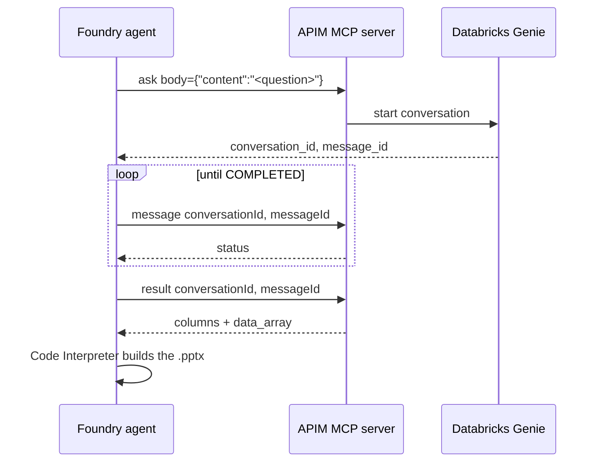

# Microsoft Foundry agents (archived)

Two Microsoft Foundry **prompt agents** that reach the same private Azure Databricks
data as the current solution, but through a different front door: the **MCP servers**
projected by API Management, plus **Code Interpreter** for chart and PowerPoint
generation.

This component is archived. It is kept because it is the only path here that uses the
APIM MCP projection, and because the Code Interpreter smoke test is a useful reference
for validating a generated `.pptx` end to end.

The live solution uses a Power Platform **custom connector** and a Copilot Studio agent
on the GitHub Copilot harness instead. See the [root README](../README.md).

---

## Contents

- [Why this is archived](#why-this-is-archived)
- [The two agents](#the-two-agents)
- [How a question is answered](#how-a-question-is-answered)
- [Files](#files)
- [Environment variables](#environment-variables)
- [Running it](#running-it)
- [Notes and gotchas](#notes-and-gotchas)

---

## Why this is archived

Foundry agents reach the APIM MCP endpoint over the public gateway, authenticated with
an APIM subscription key. That works, but it is not the private path this repository now
demonstrates.

Copilot Studio cannot use those MCP servers at all: Power Platform virtual network
support covers connectors, not MCP servers. So the private path required a custom
connector, and the Foundry MCP agents became a parallel implementation rather than the
main one.

Both approaches call the same APIM APIs and the same Genie space.

---

## The two agents

| | Databricks SQL agent | Databricks Genie agent |
|---|---|---|
| Provisioned by | `provision_agent.py` | `provision_genie_agent.py` |
| Agent name env | `FOUNDRY_AGENT_NAME` | `FOUNDRY_GENIE_AGENT_NAME` |
| MCP server label | `databricks` | `databricks_genie` |
| Allowed tools | `query`, `tables` | `ask`, `message`, `result`, `follow-up` |
| Input | Read-only SQL | Natural language |
| Extra tool | Code Interpreter | Code Interpreter |

Both are created with `project.agents.create_version(...)`, which is idempotent: an
identical definition returns the **same version**, and a changed definition bumps it.

---

## How a question is answered

The Genie agent drives an asynchronous conversation:



The SQL agent is simpler: a single `query` call carrying one read-only statement.

---

## Files

| File | Purpose |
|---|---|
| `provision_agent.py` | Creates or updates the Databricks SQL agent |
| `provision_genie_agent.py` | Creates or updates the Databricks Genie agent |
| `common.py` | Shared helpers: env lookup, MCP connection upsert, PPTX smoke test and validation |
| `provision-agents.ps1` | Runs both provisioners locally, mirroring the CI environment |
| `mcp_tools_probe.py` | Lists the tools an MCP server exposes |
| `debug_agent_response.py` | Dumps an agent response, including tool calls and file annotations |
| `requirements.txt` | `azure-ai-projects` and `azure-identity` |

CI: [`.github/workflows/provision-foundry-agent.yml`](../../.github/workflows/provision-foundry-agent.yml).
It is **manual dispatch only** — the push trigger was removed when this folder was
archived, so it will not fire on commits.

---

## Environment variables

| Variable | Used by |
|---|---|
| `AZURE_SUBSCRIPTION_ID` | MCP connection upsert |
| `AZURE_RESOURCE_GROUP` | MCP connection upsert |
| `FOUNDRY_ACCOUNT_NAME` | MCP connection upsert |
| `FOUNDRY_PROJECT_NAME` | MCP connection upsert |
| `FOUNDRY_PROJECT_ENDPOINT` | `AIProjectClient` |
| `FOUNDRY_MODEL_DEPLOYMENT_NAME` | Agent definition |
| `FOUNDRY_AGENT_NAME` | SQL agent |
| `MCP_CONNECTION_NAME`, `MCP_SERVER_URL` | SQL agent |
| `FOUNDRY_GENIE_AGENT_NAME` | Genie agent |
| `GENIE_MCP_CONNECTION_NAME`, `GENIE_MCP_SERVER_URL` | Genie agent |
| `APIM_SUBSCRIPTION_KEY` | Stored in the project connection, never in the agent definition |

The APIM key is read at run time and kept in-process. It goes into a Foundry **project
connection** (`CustomKeys`, header `Ocp-Apim-Subscription-Key`), not into the agent
definition. Never commit it.

---

## Running it

```powershell
./provision-agents.ps1                      # both agents, with smoke tests
./provision-agents.ps1 -Agent genie -SkipTest
```

The script reads the APIM subscription key from APIM at run time via
`listSecrets`, sets every environment variable above, then invokes both Python
provisioners. Generated `.pptx` artifacts land in `artifacts/` at the repository root.

Direct invocation also works:

```powershell
python provision_genie_agent.py --output-dir ../../artifacts
python provision_genie_agent.py --skip-test
```

---

## Notes and gotchas

- **Two OpenAI client scopes.** `project.get_openai_client(agent_name=...)` is
  agent-scoped and is used for `conversations.create` and `responses.create`. It does
  **not** expose the Containers API. Code Interpreter output files must be downloaded
  with the **project-scoped** client, `project.get_openai_client()`, via
  `containers.files.content.retrieve(file_id, container_id=...)`. Using the wrong client
  returns a silent 404.
- **Freshly created versions can 404 on first invoke** while the version propagates.
  `invoke_agent` in `common.py` retries for this reason.
- **Generated files arrive as annotations**, not attachments. Look for a
  `container_file_citation` carrying `file_id`, `container_id` and `filename`.
- **The sandbox has no outbound internet.** Decks must be built from tool results already
  in the conversation, using `python-pptx`.
- **The MCP `body` argument is a JSON string, not an object.** APIM projects a REST
  operation as a single `body` string input, so the agent must send
  `{"statement": "<SQL>"}` or `{"content": "<question>"}` as a string. A bare value
  returns `INVALID_PARAMETER_VALUE: Field 'content' is required`.
- **`validate_pptx` checks the real package**, asserting the zip signature and the
  presence of `ppt/presentation.xml`, so a truncated or HTML error response fails loudly
  instead of passing as a file.
